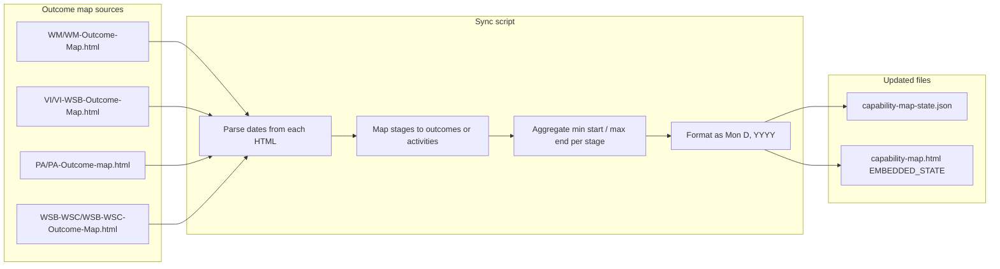

# Capability Map Target Date Updates

This document describes the reusable process that updates stage target dates in the capability map from the various outcome-map HTML files. Running the sync script keeps **capability-map-state.json** and the **Workstream B & C** (and other capability) dates in **capability-map.html** aligned with the outcome maps.

---

## What the process does

1. **Reads outcome-map HTML files** for each capability that has an outcome map:
   - **WM** (Work Management): `WM/WM-Outcome-Map.html`
   - **VI** (Visibility Infrastructure): `VI/VI-WSB-Outcome-Map.html`
   - **PA** (Pipeline Automation): `PA/PA-Outcome-map.html`
   - **WSB-WSC** (Workstream B & C): `WSB-WSC/WSB-WSC-Outcome-Map.html`

2. **Parses dates** from each source (day-level when available for accurate display and sprint indicators):
   - WM: `dateRange` strings (e.g. "Wk 1-2 (Feb 16 - Feb 27)") → start/end day extracted.
   - VI: `dateRange` strings (e.g. "Apr 1 - Apr 25", "Jun 30 - Aug 8") → start/end day extracted.
   - PA: `start`/`end` week numbers (Week 1 = Mar 16, 2026) → week Monday–Friday computed.
   - WSB-WSC: `activities` array with `start`/`end` sprint numbers (24 sprints, 2 weeks each; Sprint 1 assumed Mar 1, 2026).

3. **Maps constraint stages to outcomes/activities** using the same logic as the Constraint-vs-Outcome mapping documents:
   - WM stages 0–6 → WM-OC-xx (with MERGED/SPLIT rules).
   - VI stages 0–5 → VI-OC-xx.
   - PA stages 0–5 → PA-OC-xx (stages 6–8 have no mapping).
   - WSB stages 0–5 → Operational/Environmental activities (O1–O4, E1–E3).
   - WSC stages 0–5 → Environmental/Technological activities (E1–E3, T1–T6).

4. **Computes targetStart and targetEnd** per stage in **"Mon D, YYYY"** format (e.g. "Feb 16, 2026") when the outcome map provides day-level dates, so the capability map and sprint indicators show accurate ranges. For stages that map to multiple outcomes, it uses the earliest start and latest end.

5. **Writes updates** to:
   - **Capability-map/capability-map-state.json**: updates `stages[].targetStart` and `stages[].targetEnd` for wm, vi, pa, wsb, wsc; sets `lastUpdated` to the run date.
   - **Capability-map/capability-map.html**: replaces the `EMBEDDED_STATE` block with the same state, so that opening the HTML file directly (e.g. via file://) shows the same dates without loading the JSON.

Stages for capabilities that do not have an outcome map (pd, ls, wsd) are left unchanged.

---

## Process diagram



**Flow in words:** The script reads the four outcome-map HTML files, parses outcome/activity dates from each, applies the stage→outcome (or stage→activity) mapping, aggregates date ranges for stages that span multiple outcomes, and writes the resulting `targetStart`/`targetEnd` into the state JSON and into the HTML’s embedded state block.

---

## How to run it

**From the project root:**

```bash
node Capability-map/sync-stage-dates-from-outcome-maps.js
```

**Requirements:**

- Node.js (no extra npm packages; uses only `fs` and `path`).
- Project root = directory that contains the `Capability-map`, `WM`, `VI`, `PA`, and `WSB-WSC` folders.

**Example output:**

```
Updated 31 stage dates; lastUpdated set to Mar 16, 2026.
Updated EMBEDDED_STATE in capability-map.html.
```

If `WSB-WSC/WSB-WSC-Outcome-Map.html` is missing, the script still runs and updates only WM, VI, and PA (19 stages). If the EMBEDDED_STATE block cannot be found in the HTML, the script logs a warning and does not modify the HTML.

---

## When to run it

- After changing dates or outcome ranges in any of the outcome-map HTML files (WM, VI, PA, or WSB-WSC).
- When you want the capability map’s “Workstream B & C” tab (and other capability stages) to reflect the latest target dates from those outcome maps.
- As part of a regular refresh before sharing or presenting the capability map.

---

## Script location and source of truth

- **Script:** `Capability-map/sync-stage-dates-from-outcome-maps.js`
- **State file:** `Capability-map/capability-map-state.json`
- **Display file:** `Capability-map/capability-map.html` (uses state from JSON when loaded via HTTP, or from EMBEDDED_STATE when opened as a file)

The outcome-map HTML files are the source of truth for dates. The script does not modify them; it only reads from them and updates the capability map state and embedded state.

---

## Capabilities and stage counts updated

| Capability | ID   | Stages updated | Source outcome map        |
|------------|------|----------------|---------------------------|
| Work Management | wm  | 0–6 (7)  | WM/WM-Outcome-Map.html    |
| Visibility Infrastructure | vi | 0–5 (6)  | VI/VI-WSB-Outcome-Map.html |
| Pipeline Automation | pa  | 0–5 (6)  | PA/PA-Outcome-map.html     |
| Support Operating Model (Workstream B) | wsb | 0–5 (6)  | WSB-WSC/WSB-WSC-Outcome-Map.html |
| Support & Engineering Tooling (Workstream C) | wsc | 0–5 (6)  | WSB-WSC/WSB-WSC-Outcome-Map.html |

pd, ls, and wsd are not updated by this process (no outcome maps in scope).
