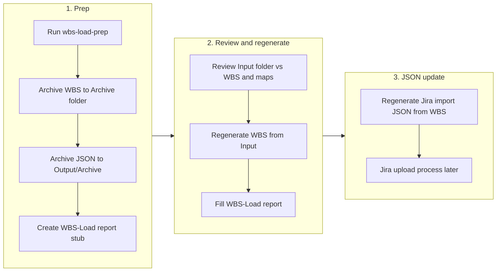
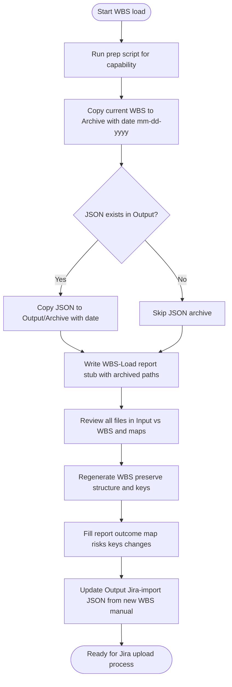

# WBS Update Pattern (with JSON Archive and Jira-Import)

This document describes the reusable process for updating capability WBS documents and the associated Jira-import JSON, including archiving, regeneration, and reporting. Prep script: `Scripts/wbs-load-prep.js`.

---

## Process flow (overview)



**Detailed flow (sequence):**



---

## Folder layout (per capability)

| Path | Purpose |
|------|--------|
| `{Folder}/Input/` | New or updated source files (specs, briefs). Process all files together. |
| `{Folder}/Archive/` | Date-stamped WBS snapshots before each load: `{Prefix}-WSB-mm-dd-yyyy.md`. |
| `{Folder}/Output/` | Current Jira-import JSON: `{Prefix}-WSB-Jira-Import.json`. Canonical artifact for Jira upload. |
| `{Folder}/Output/Archive/` | Date-stamped JSON snapshots: `{Prefix}-WSB-Jira-Import-mm-dd-yyyy.json`. |
| `{Folder}/Update-Reports/` | Load reports: `WBS-Load-mm-dd-yyyy.md`. |
| `{Folder}/{Prefix}-WSB.md` | Current WBS (e.g. `PA/PA-WSB.md`). |

Date format everywhere is **mm-dd-yyyy** (e.g. `03-17-2026`). The same run date is used for WBS archive, JSON archive, and report filename.

---

## Step 1: Run the prep script

**Command (from project root):**

```bash
node Scripts/wbs-load-prep.js <capability>
```

**Examples:** `PA`, `VI`, `WM` (for WM, JSON archive is skipped if no `Output` JSON exists).

**What the script does:**

1. **Archive WBS** — Copies `{Folder}/{Prefix}-WSB.md` to `{Folder}/Archive/{Prefix}-WSB-mm-dd-yyyy.md`.
2. **Archive JSON** — If `{Folder}/Output/{Prefix}-WSB-Jira-Import.json` exists, copies it to `{Folder}/Output/Archive/{Prefix}-WSB-Jira-Import-mm-dd-yyyy.json` (creates `Output/Archive` if needed). If the file does not exist, this step is skipped without error.
3. **Create report stub** — Creates `{Folder}/Update-Reports/WBS-Load-mm-dd-yyyy.md` with:
   - **Summary:** Paths to archived WBS and (when applicable) archived Jira import JSON.
   - Placeholder sections for outcome map changes, risks/decisions/questions, keys added/updated/removed, other changes.
   - **Next steps:** Regenerate WBS and regenerate Jira import JSON (see below).

---

## Step 2: Review Input and regenerate WBS

- **Review** all files in `{Folder}/Input/` against the current WBS and any constraint-vs-outcome and outcome maps.
- **Regenerate** `{Folder}/{Prefix}-WSB.md` so it reflects the updated content. Preserve:
  - Document and key structure (outcome IDs, deliverable IDs, risk/decision/question IDs per capability rules, e.g. `.cursor/rules/pa.mdc`).
  - Section order, outcome map table, per-outcome template, Risks table (with Type 1/Type 2 where applicable), Decisions table, Open Questions.
- **Fill in** the WBS-Load report: outcome map / constraint map changes, risks/decisions/questions changes, keys added/updated/removed, other substantial changes.

---

## Step 3: Regenerate Jira import JSON (manual until a generator exists)

**After** the WBS is regenerated, update `{Folder}/Output/{Prefix}-WSB-Jira-Import.json` from the new WBS. Until an automated generator exists, this is a **manual step**.

**Requirements:**

- **Preserve existing JSON structure:** `metadata`, `work_items` (Epic, Story, Sub-task with `outcome_id`, `parent`, etc.), `action_items` (Action Item with `item_id`, `item_type`, `link_to`, etc.).
- **Use WBS-established keys:** e.g. `outcome_id` (PA-OC-01, PA-OC-01.1, …), `item_id` for risks/decisions/questions (PA-R-*, PA-D-*, PA-Q-*).
- **Reflect current state:** The JSON is the full set that should exist in Jira. A separate Jira upload process (to be built later) will diff this file against Jira (or the archived JSON) to determine what to **add**, **update**, or **delete** by key.

No schema change unless a separate delta format is introduced later.

---

## Summary

| Step | Action |
|------|--------|
| **Archive** | Copy WBS to `Archive/{Prefix}-WSB-mm-dd-yyyy.md`; copy JSON to `Output/Archive/{Prefix}-WSB-Jira-Import-mm-dd-yyyy.json` (if present). |
| **Keys** | Use WBS-established keys (`outcome_id`, `item_id`) in the JSON. |
| **Updates** | Regenerate/update the JSON from the updated WBS so it reflects current `work_items` and `action_items`; add/delete is derived by the future Jira process by diffing on keys. |
| **Logic** | Keep existing JSON schema and structure (`metadata`, `work_items`, `action_items`). |

---

## Related files

- **Prep script:** [Scripts/wbs-load-prep.js](../Scripts/wbs-load-prep.js)
- **Script usage:** [Scripts/README.md](../Scripts/README.md)
