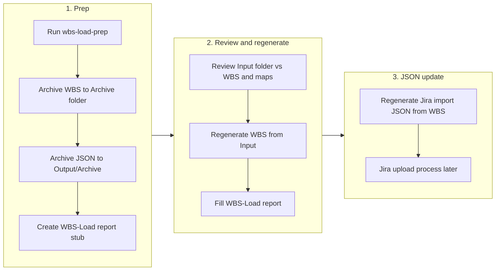

# WBS Update Pattern (with JSON Archive and Jira-Import)

This document describes the reusable process for updating capability WBS documents and the associated Jira-import JSON, including archiving, regeneration, and reporting. Prep script: `Scripts/wbs-load-prep.js`.

## Cursor skill (trigger by phrase)

A project skill is available so you can run this process by saying things like:

- **"Import the latest PA WBS information"** — Loads all files from `WSA/PA/Input/` and follows the full process for Pipeline Automation.
- **"Load PA WBS from Input"** / **"Run WBS load for VI"** / **"Run WBS load for WB"** — Same idea for the given capability (PA, VI, WM, or WB).

The skill lives at `.cursor/skills/wbs-update-pattern/SKILL.md`. When invoked, the agent will run the prep script, then review Input and regenerate the WBS (and remind you to update the Jira import JSON). No need to paste this doc or spell out steps; use the phrase and the skill applies.

---

## Process flow (overview)



**Detailed flow (sequence):**


---

## Folder layout (per capability)

| Path | Purpose |
|------|--------|
| `{Folder}/Input/` | New or updated source files (specs, briefs). Process all files together. |
| `{Folder}/Input/Archive/` | Processed Input files per run: contents of Input/ moved here after processing, one subfolder per date (`Input/Archive/{mm-dd-yyyy}/`). |
| `{Folder}/Archive/` | Date-stamped WBS snapshots before each load: `{Prefix}-WBS-mm-dd-yyyy.md` (PA, VI, WM, WB). |
| `{Folder}/Output/` | Current Jira-import JSON: `{Prefix}-WBS-Jira-Import.json`. Canonical artifact for Jira upload. |
| `{Folder}/Output/Archive/` | Date-stamped JSON snapshots: `{Prefix}-WBS-Jira-Import-mm-dd-yyyy.json`. |
| `{Folder}/Update-Reports/` | Load reports: `WBS-Load-mm-dd-yyyy.md`. |
| `{Folder}/{Prefix}-WBS.md` | Current WBS (`WSA/PA/PA-WBS.md`, `WSA/VI/VI-WBS.md`, `WSA/WM/WM-WBS.md`, `WSB-WSC/WB/WB-WBS.md`). Optional registries: `WSA/PA/pa-outcomes.json`, `WSA/VI/vi-outcomes.json`, `WSA/WM/wm-outcomes.json`, `WSB-WSC/WB/wb-outcomes.json` (populate when outcome ↔ Jira mapping is stable). **PA/VI/WM** on disk live under **`WSA/{PA,VI,WM}/`**; **WB** is **`WSB-WSC/WB/`**. `node Scripts/wbs-load-prep.js <capability>` resolves via `Scripts/wbs-capability-folder.js`. |

Date format everywhere is **mm-dd-yyyy** (e.g. `03-17-2026`). The same run date is used for WBS archive, JSON archive, and report filename.

### Outcome-map dependency edges (JSON)

Interactive **Dependency Flow** diagrams load edge metadata from JSON (timing, prerequisites, Type 1/2 decisions, cross-workstream text). **Authoritative files:**

| Artifact | JSON path | Field |
|----------|-----------|--------|
| PA Outcome Map | `WSA/PA/pa-outcomes.json` | `dependency_edges` (`schema_version` ≥ 2) |
| WSB–WSC combined map | `WSB-WSC/wsb-wsc-outcome-dependencies.json` | `dependency_edges` |
| Catalog (paths for CI/docs) | `WSB-WSC/dependency-sources.yml` | — |

When WBS dependency or decision text changes, update the **JSON first**, then align `PA-WBS.md` §3 Mermaid (or equivalent) and the **embedded fallback** `<script type="application/json" id="…-dependency-edges-fallback">` inside each Outcome Map HTML so `file://` viewing still works. See `.cursor/skills/wbs-update-pattern` and `.github/workflows/deploy-capability-map.yml`.

---

## Step 1: Run the prep script

**Command (from project root):**

```bash
node Scripts/wbs-load-prep.js <capability>
```

**Examples:** `PA`, `VI`, `WM`, `WB` (JSON archive is skipped if no `Output` JSON exists).

**What the script does:**

1. **Archive WBS** — Copies the current WBS file to Archive (`{Prefix}-WBS.md` → `{Prefix}-WBS-mm-dd-yyyy.md` for PA, VI, WM, WB).
2. **Archive JSON** — If `{Folder}/Output/{Prefix}-WBS-Jira-Import.json` exists, copies it to `{Folder}/Output/Archive/{Prefix}-WBS-Jira-Import-mm-dd-yyyy.json` (creates `Output/Archive` if needed). If the file does not exist, this step is skipped without error.
3. **Create report stub** — Creates `{Folder}/Update-Reports/WBS-Load-mm-dd-yyyy.md` with:
   - **Summary:** Paths to archived WBS and (when applicable) archived Jira import JSON.
   - **Change summary table:** At the top, a table with counts for **Work items**, **Risks**, **Decisions**, **Questions** (rows) and **Added**, **Deleted**, **Updated** (columns). Initial values are 0; after regenerating the JSON you can run `node Scripts/wbs-load-report-counts.js <capability> <dateStamp>` to compute counts by diffing archived vs current Jira-import JSON.
   - **Input files processed:** A section that must be filled for each file in Input: filename, what was extracted (e.g. outcomes, phases, risks, decisions, timeline), and what WBS changes were made or how content was mapped to existing keys. The stub lists the files in scope (from the Input folder at run time).
   - Placeholder sections for outcome map changes, risks/decisions/questions, keys added/updated/removed, other changes.
   - **Next steps:** Regenerate WBS and regenerate Jira import JSON (see below).

---

## Step 2: Review Input and regenerate WBS

- **Review** all files in `{Folder}/Input/` against the current WBS and any constraint-vs-outcome and outcome maps. For each Input file, extract key content (outcomes, phases, risks, decisions, timeline, etc.) and either add/update the WBS or document the mapping to existing WBS keys.
- **Regenerate** the WBS file (`{Prefix}-WBS.md`) so it reflects the updated content. Preserve:
  - Document and key structure (outcome IDs, deliverable IDs, risk/decision/question IDs per capability rules, e.g. `.cursor/rules/pa.mdc`).
  - Section order, outcome map table, per-outcome template, Risks table (with Type 1/Type 2 where applicable), Decisions table, Open Questions.
- **Fill in** the WBS-Load report: always complete the **Input files processed** section with a per-file summary (filename, what was extracted, what WBS changes or mappings resulted); then outcome map / constraint map changes, risks/decisions/questions changes, keys added/updated/removed, other substantial changes.
- **After filling the report**, run `node Scripts/wbs-move-input-to-archive.js <capability> <dateStamp>` to move all files from Input/ to Input/Archive/{dateStamp}/ (use the same dateStamp as the report, e.g. from the report filename `WBS-Load-mm-dd-yyyy.md`).

---

## Step 3: Regenerate Jira import JSON (manual until a generator exists)

**After** the WBS is regenerated, update `{Folder}/Output/{Prefix}-WBS-Jira-Import.json` from the new WBS. Until an automated generator exists, this is a **manual step**.

**Requirements:**

- **Preserve existing JSON structure:** `metadata`, `work_items` (Epic, Story, Sub-task with `outcome_id`, `parent`, etc.), `action_items` (Action Item with `item_id`, `item_type`, `link_to`, etc.).
- **Use WBS-established keys:** e.g. `outcome_id` (PA-OC-01, PA-OC-01.1, …), `item_id` for risks/decisions/questions (PA-R-*, PA-D-*, PA-Q-*).
- **Reflect current state:** The JSON is the full set that should exist in Jira. A separate Jira upload process (to be built later) will diff this file against Jira (or the archived JSON) to determine what to **add**, **update**, or **delete** by key.

No schema change unless a separate delta format is introduced later.

### Populating the change summary counts

After regenerating the Jira import JSON, update the report’s **Change summary** table with real counts (work items, risks, decisions, questions × added / deleted / updated). From the project root:

```bash
node Scripts/wbs-load-report-counts.js <capability> <dateStamp>
```

Example: `node Scripts/wbs-load-report-counts.js PA 03-17-2026`. The script diffs `Output/Archive/{Prefix}-WBS-Jira-Import-{dateStamp}.json` (before) vs `Output/{Prefix}-WBS-Jira-Import.json` (after) and overwrites the table in the report.

---

## Summary

| Step | Action |
|------|--------|
| **Archive** | Copy WBS to Archive (`{Prefix}-WBS-mm-dd-yyyy.md`); copy JSON to `Output/Archive/{Prefix}-WBS-Jira-Import-mm-dd-yyyy.json` (if present). |
| **Keys** | Use WBS-established keys (`outcome_id`, `item_id`) in the JSON. |
| **Updates** | Regenerate/update the JSON from the updated WBS so it reflects current `work_items` and `action_items`; add/delete is derived by the future Jira process by diffing on keys. |
| **Logic** | Keep existing JSON schema and structure (`metadata`, `work_items`, `action_items`). |

---

## Related files

- **Cursor skill:** [.cursor/skills/wbs-update-pattern/SKILL.md](../.cursor/skills/wbs-update-pattern/SKILL.md) — Invoke by saying e.g. "Import the latest PA WBS information" or "Run WBS load for VI".
- **Prep script:** [Scripts/wbs-load-prep.js](../Scripts/wbs-load-prep.js)
- **Script usage:** [Scripts/README.md](../Scripts/README.md)
