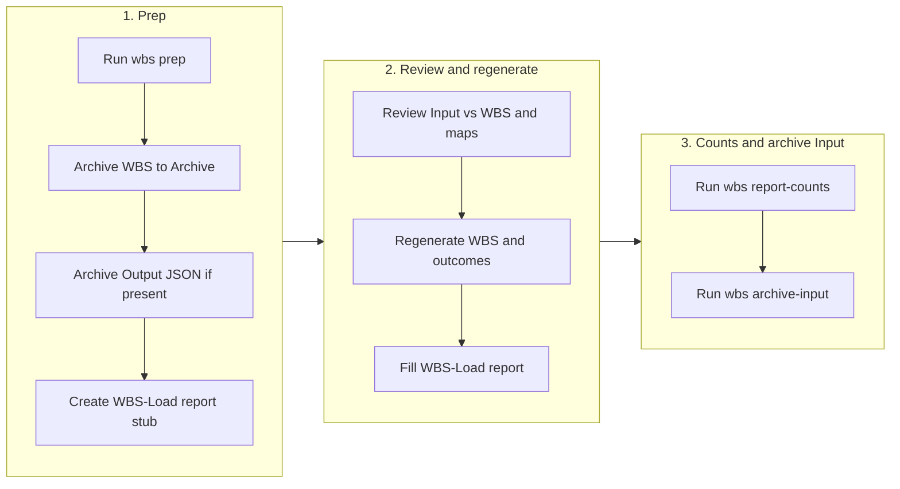
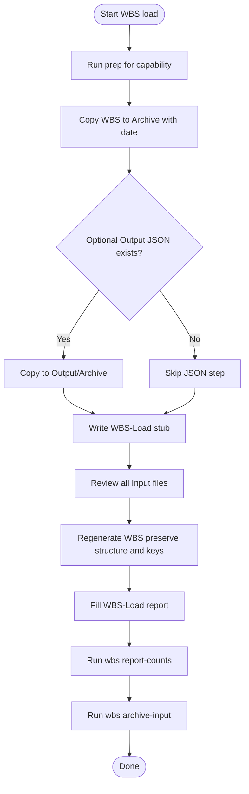

# WBS update pattern (Input → WBS)

This document describes the process for loading **`{Capability}/Input/`** into the normative **`*-WBS.md`**, plus outcomes/dependency JSON and planning HTML. Prep: **`dynamo-plan wbs prep`** (or `Scripts/wbs-load-prep.js`, which forwards to the **dynamo-os** planning toolkit); paths and `{Prefix}` come from **`dynamo-os.config.cjs`**.

`wbs prep` may also archive an optional **`{Prefix}-WBS-Load-Snapshot.json`** in `Output/` (filename from the toolkit) if that file exists — that is a **sidecar** artifact, not a required step for the WBS update.

## Cursor skill (trigger by phrase)

- **"Import the latest PA WBS information"** — Loads all files from `WSA/PA/Input/` and follows the process.
- **"Load PA WBS from Input"** / **"Run WBS load for VI"** / **"Run WBS load for WB"** — Same for the given capability (PA, VI, WM, or WB).

The skill: [`.cursor/skills/wbs-update-pattern/SKILL.md`](../.cursor/skills/wbs-update-pattern/SKILL.md).

---

## Process flow (overview)



**Sequence (detailed):**



---

## Folder layout (per capability)

| Path | Purpose |
|------|--------|
| `{Folder}/Input/` | New or updated source files. Process all files in the run. |
| `{Folder}/Input/Archive/` | Processed Input: `Input/Archive/{mm-dd-yyyy}/`. |
| `{Folder}/Archive/` | WBS snapshots: `{Prefix}-WBS-mm-dd-yyyy.md`. |
| `{Folder}/Output/` | Optional bridge JSON (toolkit name often `*-WBS-Load-Snapshot.json`). |
| `{Folder}/Update-Reports/` | `WBS-Load-mm-dd-yyyy.md`. |
| `{Folder}/{Prefix}-WBS.md` | Current WBS. Registries: e.g. `pa-outcomes.json`, `vi-outcomes.json`, etc. |

**PA / VI / WM** live under **`WSA/{PA,VI,WM}/`**; **WB** is **`WSB-WSC/WB/`**.

### Outcome-map dependency edges (JSON)

See [`.cursor/skills/wbs-update-pattern/reference.md`](../.cursor/skills/wbs-update-pattern/reference.md) and **`WSB-WSC/dependency-sources.yml`**.

---

## Step 1: Run the prep script

```bash
dynamo-plan wbs prep <capability>
```

Or `node ../dynamo-os/planning-toolkit/bin/cli.js wbs prep <capability>` / `node Scripts/wbs-load-prep.js <capability>`.

**Do not modify the live `*-WBS.md` until** `wbs prep` has completed successfully and created the **dated** WBS under **`{Folder}/Archive/{Prefix}-WBS-mm-dd-yyyy.md`**. If prep fails, fix the error before applying Input-driven edits to the WBS (see the **Gate — archive before edit** block in [`.cursor/skills/wbs-update-pattern/reference.md`](../.cursor/skills/wbs-update-pattern/reference.md) Pattern A).

## Step 2: Review Input and regenerate WBS

Regenerate **`{Prefix}-WBS.md`** and update outcome/dependency JSON and HTML per capability rules. Fill the **WBS-Load** report (especially **Input files processed**).

## Step 3: Report counts and archive Input

```bash
dynamo-plan wbs report-counts <capability> <dateStamp>
dynamo-plan wbs archive-input <capability> <dateStamp>
```

Same **mm-dd-yyyy** `dateStamp` as the WBS-Load report.

---

## Related

- [`.cursor/skills/wbs-update-pattern/SKILL.md`](../.cursor/skills/wbs-update-pattern/SKILL.md)  
- [Scripts/wbs-load-prep.js](../Scripts/wbs-load-prep.js) · [Scripts/README.md](../Scripts/README.md)  
- **Legacy Jira docs** (not default workflow): [Documentation/legacy/README.md](legacy/README.md)
