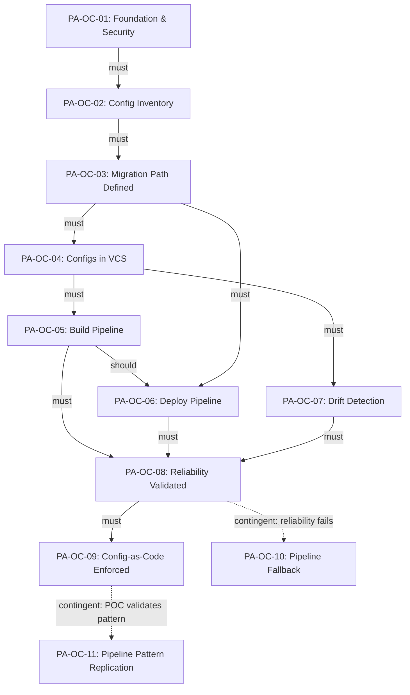

# PA-WSB: Pipeline Automation -- Outcome-Based Work Breakdown Structure

**Dynamo Consulting | DMSi Software**
**March 2026 | v1.3 | R0**
**Classification: Dynamo Confidential**

---

## 1. Purpose and Approach

This document defines the Pipeline Automation implementation using an outcome-based work breakdown structure. It replaces the sequential stage-gate model (S0-S8) with a structure organized around measurable outcomes with target dates, non-linear dependencies, and explicit handling of iterative validation cycles and conditional work.

### Why Outcome-Based

The original WBS organized work into 9 sequential stages with exit gates. In practice, the work is not linear:

- Drift detection (formerly S4 WP 4.3) depends only on configs being in version control, not on the build or deploy pipelines being complete. It can run in parallel with pipeline development.
- The build pipeline (S4 WP 4.1) and deploy pipeline (S4 WP 4.2) are tightly coupled, but drift detection serves a different purpose entirely and has no dependency on either.
- Security and compliance work (data classification, access governance, credential management) spans S0 and S1 in the stage-gate model because of timing, but it serves a single purpose: establishing the security baseline that gates everything downstream.
- Pipeline reliability validation (S4 WP 4.4) is an iterative loop, not a one-way gate. If reliability is below 90%, the team cycles back to fix error handling and re-validates.
- Pipeline pattern replication to other config types (beyond NGINX) is conditional on the NGINX proof-of-concept validating the end-to-end pipeline framework and leadership deciding to extend the pattern to additional configuration types.

This structure makes those realities explicit. Every piece of work traces to an outcome. Dependencies are typed (must, should, contingent). Parallel execution is visible. Iterative cycles have defined policies. Conditional work has explicit triggers.

### How to Read This Document

Each outcome follows a standard template:

- **Category**: Baseline (single-pass), Iterative (validation cycles), or Conditional (trigger-activated)
- **Target Date**: When the outcome should be complete (TBD placeholders for dates not yet set)
- **Success Criteria**: Measurable conditions that must be met to close the outcome
- **Deliverables**: Specific artifacts or completed actions (these become Jira Stories)
- **Dependencies**: What must/should/contingent be complete before this outcome can start or finish
- **Iteration Policy**: For Iterative outcomes, defines the validation period, cadence, max cycles, and fallback
- **Trigger Condition**: For Conditional outcomes, defines what activates the outcome
- **Risks and Decisions**: Attached to the specific outcome they affect

### Scope

Pipeline Automation covers the end-to-end automation of configuration and code deployment for DMSi environments. For this initial engagement, scope is constrained to NGINX as the proof-of-concept target:

- Build pipeline: generating and testing NGINX configs inside GitHub Actions
- Deploy pipeline: pushing validated configs to target environments via Ansible
- Drift detection pipeline: comparing GitHub source-of-truth against live server state and alerting on divergence
- Secret management and SOC 2 compliance for all pipeline artifacts
- GitHub runner strategy and network connectivity to DMSi environments

> **ASSUMPTION:** Application deployment automation (what Caley manages) is NOT in scope for this engagement. If DMSi expects application deployment to be included, this must be escalated to Cameron immediately, as it significantly changes the scope and timeline.

> **NOTE:** The team has estimated approximately 12+ pipelines will eventually be needed across environment configs, application configs, and customer configs. This WSB covers only the NGINX proof-of-concept (3 pipelines). Additional pipelines will be scoped after the proof-of-concept validates the pattern.

**Outcomes 1–9** deliver the pipeline *framework* (pattern) using NGINX as the proof-of-concept. **Outcome 10** (Pipeline Fallback) is the contingent recovery path if reliability validation fails. **Outcome 11** (Pipeline Pattern Replication) replicates the proven framework to other config types (PASOE configs, customer runtime configs, infrastructure configs, etc.)—not application code. Application deployment (Caley's domain) is out of scope (see Decision Register PA-D-14).

### Definition of Done

Outcomes are **complete as complete as we can for now**: we deliver the outcome and its deliverables to the best of our current knowledge, with the understanding that we may loop back (e.g. discovery, reliability validation) as we learn more. This allows the team to satisfy milestone reporting while acknowledging non-linear work.

### Systems of record and planning views

- **Jira (authoritative backlog):** **WSA-2656** is the **capability of record** for Pipeline Automation (*v2: Pipeline Automation*)—the single Jira root for this WSB. Outcome Epics (**WSA-3268**–**WSA-3278**), Stories, and Sub-tasks are the default source of truth for status, ownership, and sprint-level execution. Action items roll up under Epic **WSA-2657** (*PA Level: Action Items*). There is **no automatic sync** from GitHub Projects; items may exist in GitHub for discovery or stakeholder views—**reconcile into Jira** for commitment and reporting.
- **This document (PA-WSB):** Normative outcome definitions, success criteria, deliverable IDs, dependencies, risks, and decisions.
- **Visual timeline:** `PA/PA-Outcome-map.html` shows the **POC band** (weeks 1–2 on the timeline, before PA-OC-01) as **active engineering work**—building a proof-of-concept that **proves infrastructure and architecture** (how the pipeline will run, connect, and be operated) for leadership visibility. It is **not** idle schedule padding. POC is still **not** a separate **PA-OC-XX** row in the outcome table below (it does not add a twelfth numbered outcome); execution detail is tracked in **Jira** and reconciled here. The same page reflects **1.5 FTE** assumptions and calendar bands.

---

## 2. Outcome Map

| ID | Outcome | Category | Target Date | Milestone Alignment |
|----|---------|----------|-------------|---------------------|
| PA-OC-01 | [PA-OC-01] Foundation Access and Security Baseline Complete | Baseline | [TBD -- Weeks 1-2] | M3: Foundation Complete |
| PA-OC-02 | Configuration Inventory and Credential Mapping Complete | Baseline | [TBD -- Weeks 2-4] | M3: Foundation Complete |
| PA-OC-03 | Migration Path and Runner Infrastructure Defined | Baseline | [TBD -- Weeks 4-6] | M3: Foundation Complete |
| PA-OC-04 | Configurations in Version Control | Baseline | [TBD -- Weeks 6-10] | M4: Config Pipeline Active |
| PA-OC-05 | Build Pipeline Operational | Baseline | [TBD -- Weeks 10-12] | M4: Config Pipeline Active |
| PA-OC-06 | Deploy Pipeline Operational | Baseline | [TBD -- Weeks 10-13] | M4: Config Pipeline Active |
| PA-OC-07 | Drift Detection Operational | Baseline | [TBD -- Weeks 7-11] | M4: Config Pipeline Active |
| PA-OC-08 | Pipeline Reliability Validated | Iterative | [TBD -- Weeks 12-16] | M4: Config Pipeline Active |
| PA-OC-09 | Config-as-Code Enforced | Iterative | [TBD -- Weeks 16-20] | M5: Config-as-Code Enforced |
| PA-OC-10 | Pipeline Fallback Activated | Conditional | [TBD -- triggered by reliability failure] | -- |
| PA-OC-11 | Pipeline Pattern Replication | Conditional | [TBD -- triggered by PA-OC-09 completion + leadership decision] | M6: Pattern Replication |

### Parallel Execution Summary

The following outcomes can run concurrently once their dependencies are met:

- **PA-OC-07** (Drift Detection) can begin as soon as PA-OC-04 (Configs in Version Control) is complete. It does NOT depend on the build or deploy pipelines. This is the key parallelism opportunity -- drift detection serves a different purpose (compliance and visibility) than build/deploy (automation).
- **PA-OC-05** (Build Pipeline) and **PA-OC-07** (Drift Detection) can run concurrently after PA-OC-04.
- **PA-OC-02** (Config Inventory) can begin specific work packages in parallel with PA-OC-01 completion -- Matthew is already building the config inventory from Ansible playbook analysis.
- **PA-OC-06** (Deploy Pipeline) has a `should` dependency on PA-OC-05 (Build Pipeline) -- deployment can begin development in parallel, but full validation requires build artifacts.

The **POC band** (see `PA-Outcome-map.html`) is a **two-week period of real delivery** before PA-OC-01 on the visual timeline: the team **builds and exercises a POC** to **prove infrastructure and architecture** (and related approach, tooling, and access). It does not add a twelfth numbered **PA-OC-XX** outcome; progress is reported via **Jira** and these planning views for leadership.

---

## 3. Dependency Graph

### Dependency Type Legend

- **must** (solid arrow): Hard prerequisite. The dependent outcome cannot start until the prerequisite is complete.
- **should** (solid arrow, labeled): Recommended sequence. Can proceed with documented risk acceptance.
- **contingent** (dashed arrow): Only applies if a specific condition is met.

---

## 4. Outcomes

---

### [PA-OC-01] Foundation Access and Security Baseline Complete

**Category:** Baseline
**Target Date:** [TBD -- Weeks 1-2]
**Owner:** Dynamo + Andy Meyers
**Status:** Complete — see Jira Epic **WSA-3268**; reconcile success criteria below with evidence in Jira.
**Source:** S0 (WP 0.1, 0.2, 0.3, 0.4, 0.5, 0.6)

#### Success Criteria

- [ ] SSH/RDP read-only access to NGINX target servers confirmed
- [ ] NGINX deployment process fully documented from Rex walkthrough
- [ ] AWS account structure and VPC topology documented
- [ ] SOC 2 compliance requirements applicable to pipeline automation documented
- [ ] Data classification report for pipeline artifacts reviewed by GRC
- [ ] Dynamo access governance terms documented and signed off
- [ ] Network security controls for GitHub runner traffic documented
- [ ] Secrets identified in current config files with remediation approach agreed

#### Deliverables

| ID | Deliverable | Owner | Due |
|----|-------------|-------|-----|
| PA-OC-01.1 | Environment Access and Network Discovery | Dynamo + Andy | [TBD] |
| PA-OC-01.2 | Deployment Process Documentation | Dynamo + Rex | [TBD] |
| PA-OC-01.3 | Security and Compliance Baseline | Dynamo + Dan | [TBD] |
| PA-OC-01.4 | Data Classification for Pipeline Artifacts | Dynamo + GRC | [TBD] |
| PA-OC-01.5 | Dynamo Access Governance Review | Dynamo + Andy | [TBD] |
| PA-OC-01.6 | Network Security Documentation | Dynamo + Andy | [TBD] |

**PA-OC-01.1: Environment Access and Network Discovery**

- Obtain SSH/RDP read-only access to NGINX target servers
- Document AWS account structure and VPC topology
- Map network connectivity paths between GitHub runners and target environments
- Identify firewall rules and security groups that affect pipeline connectivity
- Document current DNS and load balancer configuration for NGINX

**PA-OC-01.2: Deployment Process Documentation**

- Conduct deployment walkthrough with Rex (NGINX build process)
- Document all scripts, files, and playbooks Ansible pulls for NGINX build
- Map the share drive file locations used in current process
- Document manual steps, sequencing, and validation checks Rex performs
- Identify any MFA or human-interaction requirements in the current Ansible workflow

**PA-OC-01.3: Security and Compliance Baseline**

- Document SOC 2 compliance requirements applicable to pipeline automation
- Identify secrets in current config files (certificates, IPs, credentials)
- Assess data classification requirements for config artifacts
- Document current access control patterns (who has access to what)
- Identify shared credentials and hardcoded secrets (e.g., database scripts using shared user accounts)

**PA-OC-01.4: Data Classification for Pipeline Artifacts**

- Enumerate data types in NGINX configs: host IPs, certificates, environment variables, customer-specific settings
- Determine if any config data contains customer PII, PHI, or regulated data
- Classify each data type per DMSi's sensitivity levels (or define levels if none exist)
- Document which classified data types will be stored in GitHub repositories
- Produce data classification report -- reviewed by GRC before PA-D-02 is resolved
- SOC 2 CC6.1 and ISO 27001 A.5.12 require data classification before third-party transmission

**PA-OC-01.5: Dynamo Access Governance Review**

- Review MSA for security provisions, NDA terms, and data handling obligations
- Define Dynamo's maximum access scope in GitHub repos and deployment infrastructure
- Require named individuals for Dynamo admin accounts (no shared accounts)
- Define access expiration date or periodic review schedule (recommend quarterly)
- Enable audit logging of all Dynamo administrative actions in GitHub
- Document access handoff and deprovisioning plan for engagement end
- SOC 2 CC6.2 and ISO 27001 A.5.19 require third-party access controls

**PA-OC-01.6: Network Security Documentation**

- Request TierPoint's network architecture documentation for DMSi's environment
- Identify firewall rules required for GitHub runner to NGINX server communication
- Confirm TLS version and cipher suites for runner-to-server communication
- Determine if outbound traffic inspection (proxy, DLP, IDS) will affect runner connectivity
- Document network segmentation boundaries affecting runner placement
- ISO 27001 A.8.20 requires documented network security controls

#### Dependencies

| Depends On | Type | Description |
|------------|------|-------------|
| None | -- | This is the starting outcome |

#### Risks

| Risk ID | Severity | Description | Mitigation |
|---------|----------|-------------|------------|
| PA-R-01 | HIGH | Current deployment knowledge is concentrated in Rex. If Rex is unavailable during this outcome, process documentation will be incomplete and downstream outcomes will be built on assumptions. | Schedule Rex walkthrough in week 1; document process in real-time |
| PA-R-X8 | MEDIUM | No formal data classification exists at DMSi today. Pipeline artifacts may contain sensitive data that requires specific handling under SOC 2 CC6.1. | Complete PA-OC-01.4 early; define classification levels if none exist |

#### Decisions Required

| ID | Type | Decision | Owner | Required By |
|----|------|----------|-------|-------------|
| PA-D-01 | TYPE 2 | GitHub runner deployment model (tools VPC vs. per-region vs. hosted) | Dynamo + Andy | PA-OC-01 exit |
| PA-D-02 | TYPE 2 | Secret management approach (GitHub Secrets, HashiCorp Vault, AWS Secrets Manager) | Dynamo + Andy | PA-OC-01 exit |
| PA-D-03 | TYPE 1 | SOC 2 compliance standard for pipeline artifacts | Andy + Ryan | PA-OC-01 exit |
| PA-D-11 | TYPE 2 | Data classification standard for pipeline artifacts | GRC + Dynamo | PA-OC-01 exit |

---

### PA-OC-02: Configuration Inventory and Credential Mapping Complete

**Category:** Baseline
**Target Date:** [TBD -- Weeks 2-4]
**Owner:** Dynamo + Andy Meyers
**Status:** Not Started
**Source:** S1 (WP 1.1, 1.2, 1.3)

Inventory is scoped to **NGINX pipeline configs** required to stand up and run this pipeline—not an organization-wide complete config inventory. We only need the configs we will migrate and operate on for the NGINX proof-of-concept.

#### Success Criteria

- [ ] All NGINX configuration files, templates, and supporting artifacts cataloged (for this pipeline)
- [ ] Config file locations on share drive mapped
- [ ] Config dependencies documented (which configs reference which other files)
- [ ] Environment-specific config variations identified (per-client, per-site)
- [ ] Broader config landscape documented for future pipeline planning
- [ ] All credentials discovered during inventory with management approach defined per credential type
- [ ] Secret scan complete -- no credentials in inventoried configs without remediation plan
- [ ] Credential rotation schedule defined

#### Deliverables

| ID | Deliverable | Owner | Due |
|----|-------------|-------|-----|
| PA-OC-02.1 | NGINX Configuration Inventory | Dynamo + Matthew | [TBD] |
| PA-OC-02.2 | Broader Configuration Landscape Assessment | Dynamo + Andy | [TBD] |
| PA-OC-02.3 | Credential and Secret Management Plan | Dynamo + Andy | [TBD] |

**PA-OC-02.1: NGINX Configuration Inventory**

- Catalog all NGINX config files and templates used by Ansible
- Document config file locations on the share drive
- Map config dependencies (which configs reference which other files)
- Identify environment-specific config variations (per-client, per-site)
- Document current config change frequency and change requesters
- Scan all config files for embedded secrets (credentials, certificates, API keys) before any version control migration

**PA-OC-02.2: Broader Configuration Landscape Assessment**

- Catalog configuration categories: customer runtime, platform, application
- Map coverage to customer runtime configs (daily, production, provider settings)
- Document app server configurations
- Document infrastructure-layer configurations
- Capture third-party integration configs
- Document current state per config type with risk methodology

**PA-OC-02.3: Credential and Secret Management Plan**

- Inventory all credentials discovered during config inventory: database accounts, API keys, certificates, service accounts
- Define secret management approach per credential type (GitHub Secrets, vault, AWS Secrets Manager)
- Define rotation schedule for each credential type (recommend 90-day maximum)
- Restrict credential scopes to minimum required permissions per integration
- Document credential ownership -- who can create, rotate, and revoke each secret
- Enable GitHub secret scanning on all repositories
- SOC 2 CC6.1 and ISO 27001 A.5.17 require secret management controls

#### Dependencies

| Depends On | Type | Description |
|------------|------|-------------|
| PA-OC-01 | must | Environment access, process documentation, and security baseline must be established before inventory can be validated |

#### Risks

| Risk ID | Severity | Description | Mitigation |
|---------|----------|-------------|------------|
| PA-R-03 | MEDIUM | NGINX config inventory may be incomplete if undocumented configs exist outside the known share drive locations | Scope narrowed to NGINX configs specifically (not a complete org-wide inventory). Team (12 Mar 2026): Matt C: "we're not going to be able to gather a complete inventory" — approach changed to targeting NGINX configs only. Validate NGINX-relevant configs against recent production incidents to identify gaps. | 
| PA-R-S1 | HIGH | Database scripts use a shared service account with hardcoded credentials. This prevents audit trail attribution. If any script is compromised, all scripts' access is compromised. | Rotate shared credential immediately; plan individual service accounts before configs enter VCS |
| PA-R-S2 | HIGH | Config migration to GitHub risks committing hardcoded credentials to version control. The shared service account amplifies blast radius. | Scan all configs for credentials before any repository commit; enable GitHub secret scanning |

#### Decisions Required

| ID | Type | Decision | Owner | Required By |
|----|------|----------|-------|-------------|
| PA-D-04 | TYPE 2 | Priority ordering for config types beyond NGINX | Andy + Dynamo | PA-OC-02 exit |
| PA-D-12 | TYPE 2 | Credential rotation and management tooling | Dynamo + Andy | PA-OC-02 exit |

---

### PA-OC-03: Migration Path and Runner Infrastructure Defined

**Category:** Baseline
**Target Date:** [TBD -- Weeks 4-6]
**Owner:** Dynamo + Andy Meyers
**Status:** Not Started
**Source:** S2 (WP 2.1, 2.2, 2.3)

#### Success Criteria

- [ ] Export method documented and validated for each NGINX config type
- [ ] Repository structure designed, agreed, and documented for SOC 2 compliance
- [ ] GitHub runner proof-of-concept successful with connectivity to target servers
- [ ] Ansible automation feasibility confirmed (can run without human interaction)
- [ ] Branching strategy defined and compatible with automation workflow

#### Deliverables

| ID | Deliverable | Owner | Due |
|----|-------------|-------|-----|
| PA-OC-03.1 | Export Method and Format Decisions | Dynamo | [TBD] |
| PA-OC-03.2 | Repository Structure Design | Dynamo + Andy | [TBD] |
| PA-OC-03.3 | GitHub Runner Strategy and POC | Dynamo + Andy | [TBD] |

**PA-OC-03.1: Export Method and Format Decisions**

- Document export method for each NGINX config type (file copy, API, CLI)
- Select canonical format per config type (YAML, JSON, raw NGINX conf)
- Define secret extraction and replacement strategy (placeholders, vault refs)
- Validate export methods produce identical output to current process

**PA-OC-03.2: Repository Structure Design**

- Define repository structure (by config type, client, environment, or hybrid)
- Establish branching strategy compatible with automation workflow
- Define access patterns: who has read, write, and approve permissions
- Document storage and access patterns for SOC 2 compliance

**PA-OC-03.3: GitHub Runner Strategy and POC**

- Evaluate AWS account capabilities for hosting GitHub runners
- Assess tools VPC vs. per-region runner deployment
- Test network connectivity from runner to target NGINX servers
- Document runner security posture (IAM roles, network policies)
- Validate that Ansible can be executed from the runner (no MFA, no manual interaction)

#### Dependencies

| Depends On | Type | Description |
|------------|------|-------------|
| PA-OC-02 | must | Config inventory must be complete before export methods and repo structure can be designed accurately |

#### Risks

| Risk ID | Severity | Description | Mitigation |
|---------|----------|-------------|------------|
| PA-R-04 | HIGH | If Ansible execution requires human interaction (MFA, button-pushing), the deploy pipeline cannot be fully automated. Rex currently runs Ansible locally; it is unknown whether this can be automated. | Validate in PA-OC-03.3 before committing to PA-OC-06 pipeline design 3.13.2026 |
| PA-R-05 | HIGH | Migration format decisions delayed beyond two weeks will block PA-OC-04 progress | Time-box format decisions; use YAML as default where no strong preference exists. Assume configs can be obtained from internal network drive; **if configs cannot be obtained off the internal network drive, this risk escalates to blocker** (per team 12 Mar 2026). Status: **ELEVATED TO HIGH** by Nick (12 Mar 2026) — "I'm going to mark this as High then until we understand that it's not". |
| PA-R-X5 | MEDIUM | AWS account access: Runner infrastructure requires AWS account access that may take weeks to provision | **Decision-dependent:** Risk is conditional on runner strategy decision (PA-D-01/PA-D-07 — use DMSi AWS or not). Team (12 Mar 2026): Brent noted "it's not a risk, it's more of a decision". Until runner strategy is decided, classify as decision. Once AWS is chosen as the strategy, provisioning delay becomes the risk. Begin access request in PA-OC-01; escalate to Hilltop if unresolved. |

#### Decisions Required

| ID | Type | Decision | Owner | Required By |
|----|------|----------|-------|-------------|
| PA-D-05 | TYPE 2 | Repository structure pattern (by config type, client, environment) | Dynamo | PA-OC-03 exit |
| PA-D-06 | TYPE 2 | Canonical config format per type | Dynamo | PA-OC-03 exit |
| PA-D-07 | TYPE 1 | GitHub runner deployment model (AWS account, VPC) | Andy + Dynamo | PA-OC-03 exit |
| PA-D-08 | TYPE 1 | Ansible automation feasibility (can it run without human interaction?) | Dynamo + Rex | PA-OC-03 exit |

---

### PA-OC-04: Configurations in Version Control

**Category:** Baseline
**Target Date:** [TBD -- Weeks 6-10]
**Owner:** Dynamo + Andy Meyers
**Status:** Not Started
**Source:** S3 (WP 3.1, 3.2)

All NGINX operational configurations are migrated from the share drive to GitHub as the single source of truth. Every config change is a commit with context. Config ownership is mapped and enforced through CODEOWNERS.

#### Success Criteria

- [ ] All NGINX configs migrated from share drive to GitHub repository
- [ ] Migration validated (diff against source confirms completeness)
- [ ] No secrets in repository (scan confirmed)
- [ ] CODEOWNERS file mapping config paths to approvers
- [ ] Branch protection rules configured
- [ ] CAB approval obtained for production config migration

#### Deliverables

| ID | Deliverable | Owner | Due |
|----|-------------|-------|-----|
| PA-OC-04.1 | Config Migration Execution | Dynamo | [TBD] |
| PA-OC-04.2 | Ownership and Access Control | Dynamo + Andy | [TBD] |

**PA-OC-04.1: Config Migration Execution**

- Export all NGINX configs from share drive using documented methods
- Strip secrets and replace with vault references or placeholders
- Commit configs to repository with descriptive commit messages
- Validate migration completeness (diff against source)
- Submit config migration as a formal change request through DMSi's CAB process (include rollback procedure and risk assessment; obtain CAB approval before production configs are migrated)

**PA-OC-04.2: Ownership and Access Control**

- Define CODEOWNERS file mapping config paths to approvers
- Configure branch protection rules
- Document the approval workflow for config changes

#### Dependencies

| Depends On | Type | Description |
|------------|------|-------------|
| PA-OC-03 | must | Export methods, repo structure, and runner strategy must be defined before migration can execute |
| PA-D-13 | must | CAB change request process must be understood before production config migration |

#### Risks

| Risk ID | Severity | Description | Mitigation |
|---------|----------|-------------|------------|
| PA-R-X7 | HIGH | Shared database credentials embedded in config files. Migrating to GitHub without credential management creates SOC 2 violations. | Complete PA-OC-02.3 credential management plan before any config migration |

#### Decisions Required

| ID | Type | Decision | Owner | Required By |
|----|------|----------|-------|-------------|
| PA-D-13 | TYPE 1 | CAB change request process for pipeline deployments | Andy + Ryan | PA-OC-04 entry |

---

### PA-OC-05: Build Pipeline Operational

**Category:** Baseline
**Target Date:** [TBD -- Weeks 10-12]
**Owner:** Dynamo
**Status:** Not Started
**Source:** S4 (WP 4.1)

GitHub Actions workflow that generates and validates NGINX configs. Triggered by PR merge. Runs linting, schema validation, and templating to produce deployment-ready artifacts.

#### Success Criteria

- [ ] GitHub Actions workflow operational for NGINX config build
- [ ] Config linting and schema validation passing
- [ ] Config templating with secret injection from vault functional
- [ ] Artifact packaging and versioning working
- [ ] Tested across multiple environment/client config variations

#### Deliverables

| ID | Deliverable | Owner | Due |
|----|-------------|-------|-----|
| PA-OC-05.1 | Build Pipeline Implementation | Dynamo | [TBD] |
| PA-OC-05.2 | Build Validation Suite | Dynamo | [TBD] |

**PA-OC-05.1: Build Pipeline Implementation**

- Create GitHub Actions workflow for NGINX config build
- Implement config linting and schema validation steps
- Implement config templating with secret injection from vault
- Build artifact packaging and versioning

**PA-OC-05.2: Build Validation Suite**

- Test against multiple environment/client config variations
- Validate build output matches expected config structure
- Document build pipeline usage for team onboarding

#### Dependencies

| Depends On | Type | Description |
|------------|------|-------------|
| PA-OC-04 | must | Configs must be in version control before the build pipeline can operate on them |

#### Risks

| Risk ID | Severity | Description | Mitigation |
|---------|----------|-------------|------------|
| PA-R-06 | MEDIUM | Pipeline reliability below 90% will undermine team trust and lead to manual workarounds | Start with non-production environments to build confidence; comprehensive error handling. Team (12 Mar 2026): Matt F's assessment: "it's probably either going to be it works 100% or it works 0%". Low concern overall, but bigger risk is partial adoption (half use pipeline, half don't) unless SSH key access is restricted to pipeline-only operations. |

#### Decisions Required

| ID | Type | Decision | Owner | Required By |
|----|------|----------|-------|-------------|
| PA-D-09 | TYPE 2 | Drift detection alerting channel (PagerDuty vs. Slack) | Andy | PA-OC-05 entry |

---

### PA-OC-06: Deploy Pipeline Operational

**Category:** Baseline
**Target Date:** [TBD -- Weeks 10-13]
**Owner:** Dynamo + Rex
**Status:** Not Started
**Source:** S4 (WP 4.2)

Automated deployment of validated NGINX configs to target environments using Ansible, triggered by successful build pipeline completion. Includes pre-deploy validation, deployment execution, and post-deploy health checks.

#### Success Criteria

- [ ] GitHub Actions triggers Ansible deployment via runner successfully
- [ ] Pre-deploy validation checks passing
- [ ] Deployment execution with status reporting at each checkpoint
- [ ] Post-deploy health checks confirming config applied correctly
- [ ] Rollback tested and documented
- [ ] Deployed to non-production environment first, then production

#### Deliverables

| ID | Deliverable | Owner | Due |
|----|-------------|-------|-----|
| PA-OC-06.1 | Deploy Pipeline Implementation | Dynamo + Rex | [TBD] |
| PA-OC-06.2 | Rollback and Recovery | Dynamo | [TBD] |

**PA-OC-06.1: Deploy Pipeline Implementation**

- Configure GitHub Actions to trigger Ansible deployment via runner
- Implement pre-deploy validation checks
- Implement deployment execution with status reporting at each checkpoint
- Build post-deploy health checks and rollback triggers
- Test deployment to non-production environment first

**PA-OC-06.2: Rollback and Recovery**

- Build automated rollback from build artifacts
- Test rollback end-to-end in non-production
- Document rollback procedures for team

#### Dependencies

| Depends On | Type | Description |
|------------|------|-------------|
| PA-OC-03 | must | Runner infrastructure and Ansible feasibility must be confirmed |
| PA-OC-05 | should | Build pipeline should be operational to produce artifacts for deployment; deploy pipeline development can start in parallel but full validation requires build artifacts |

#### Risks

| Risk ID | Severity | Description | Mitigation |
|---------|----------|-------------|------------|
| PA-R-X4 | HIGH | Ansible requires MFA or human interaction that cannot be automated. Deploy pipeline must be redesigned around a different mechanism. | Confirmed in PA-OC-03.3; if infeasible, design alternative deploy mechanism |

#### Decisions Required

| ID | Type | Decision | Owner | Required By |
|----|------|----------|-------|-------------|

---

### PA-OC-07: Drift Detection Operational

**Category:** Baseline
**Target Date:** [TBD -- Weeks 7-11]
**Owner:** Dynamo
**Status:** Not Started
**Source:** S4 (WP 4.3)

Background pipeline that periodically compares the GitHub source-of-truth against live server configs and alerts on any divergence. This provides the metrics needed for the operational scorecard and prevents unauthorized manual changes from going undetected.

This outcome can begin as soon as PA-OC-04 (Configs in VCS) is complete. It does NOT depend on the build or deploy pipelines. This is the key parallel execution opportunity.

#### Success Criteria

- [ ] Scheduled GitHub Action running drift comparison on defined cadence
- [ ] Config fetch from live servers via runner operational
- [ ] Diff logic producing accurate comparison results
- [ ] Alerting integrated (PagerDuty or Slack)
- [ ] Drift severity thresholds defined and escalation paths documented

#### Deliverables

| ID | Deliverable | Owner | Due |
|----|-------------|-------|-----|
| PA-OC-07.1 | Drift Detection Pipeline Implementation | Dynamo | [TBD] |
| PA-OC-07.2 | Drift Alerting and Escalation | Dynamo + Andy | [TBD] |

**PA-OC-07.1: Drift Detection Pipeline Implementation**

- Build scheduled GitHub Action for drift comparison
- Implement config fetch from live servers via runner
- Implement diff logic with normalized comparison (ignore whitespace, comments, ordering where appropriate)
- Define drift detection cadence (recommend: hourly for critical configs, daily for others)

**PA-OC-07.2: Drift Alerting and Escalation**

- Integrate drift alerts with PagerDuty or Slack (per PA-D-09)
- Define drift severity thresholds: critical (security-relevant configs), warning (operational configs), info (cosmetic)
- Define escalation paths per severity level
- Build drift detection dashboard for visibility

#### Dependencies

| Depends On | Type | Description |
|------------|------|-------------|
| PA-OC-04 | must | Configs must be in VCS as the source-of-truth before drift can be measured |

#### Risks

| Risk ID | Severity | Description | Mitigation |
|---------|----------|-------------|------------|
| PA-R-07 | MEDIUM | Drift detection may produce false positives if live configs include dynamically generated content | Build normalization rules; tune thresholds based on initial results |

#### Decisions Required

| ID | Type | Decision | Owner | Required By |
|----|------|----------|-------|-------------|
| PA-D-09 | TYPE 2 | Drift detection alerting channel (PagerDuty vs. Slack) | Andy | PA-OC-07 entry |

---

### PA-OC-08: Pipeline Reliability Validated

**Category:** Iterative
**Target Date:** [TBD -- Weeks 12-16]
**Owner:** Dynamo + Andy
**Status:** Not Started
**Source:** S4 (WP 4.4)

This is the first major validation outcome. All three NGINX pipelines (build, deploy, drift detection) must demonstrate 90%+ success rate for routine deployments before the team advances to enforcement. This gate protects against premature Config-as-Code enforcement on unreliable pipelines.

#### Success Criteria

- [ ] Build pipeline success rate >= 90% over 2-week measurement window
- [ ] Deploy pipeline success rate >= 90% over 2-week measurement window
- [ ] Drift detection producing accurate results with < 5% false positive rate
- [ ] Rollback tested and trusted by DMSi engineering team
- [ ] Pipeline status dashboard operational (approved, deploying, complete, failed)
- [ ] Team sign-off that pipelines are production-ready

#### Deliverables

| ID | Deliverable | Owner | Due |
|----|-------------|-------|-----|
| PA-OC-08.1 | Pipeline Reliability Metrics | Dynamo | [TBD] |
| PA-OC-08.2 | Error Handling and Circuit Breakers | Dynamo | [TBD] |
| PA-OC-08.3 | Pipeline Status Dashboard | Dynamo | [TBD] |
| PA-OC-08.4 | Reliability Validation Report | Dynamo | [TBD] |

**PA-OC-08.1: Pipeline Reliability Metrics**

- Define success/failure criteria for each pipeline type
- Implement pipeline run logging and metric collection
- Track success rate over 2-week rolling window

**PA-OC-08.2: Error Handling and Circuit Breakers**

- Implement circuit breakers for partial deploy failures
- Build automated rollback from build artifacts
- Handle network failures, timeout scenarios, and partial state

**PA-OC-08.3: Pipeline Status Dashboard**

- Create pipeline status dashboard (approved, deploying, complete, failed)
- Load test pipelines across multiple environments
- Track mean time to deploy and mean time to rollback

**PA-OC-08.4: Reliability Validation Report**

- Compile 2-week reliability metrics for all three pipelines
- Document any failures, root causes, and fixes applied
- Produce sign-off document for Andy and DMSi engineering

#### Dependencies

| Depends On | Type | Description |
|------------|------|-------------|
| PA-OC-05 | must | Build pipeline must be operational |
| PA-OC-06 | must | Deploy pipeline must be operational |
| PA-OC-07 | must | Drift detection must be operational |

#### Iteration Policy

- **Validation period:** 2 weeks of pipeline operation
- **Review cadence:** Daily during validation (pipeline run review)
- **Max iterations:** 3 cycles (fix issues, re-measure, repeat)
- **Fallback:** If 3 cycles fail to achieve 90%, trigger PA-OC-10 (Pipeline Fallback) and escalate to Cameron/Hilltop with root cause analysis

#### Risks

| Risk ID | Severity | Description | Mitigation |
|---------|----------|-------------|------------|
| PA-R-06 | HIGH | Pipeline reliability below 90% will undermine team trust and lead to manual workarounds | Build comprehensive error handling; start with non-production environments. Team note (12 Mar 2026): assessment may be binary (works or doesn't); bigger concern is partial adoption (half use pipeline, half don't) unless SSH key access is restricted to pipeline only. |
| PA-R-X1 | HIGH | Andy bottleneck: decisions required for error handling and escalation patterns may stall reliability fixes | Use delegation authority; Type 2 decisions should be resolved same-day |

#### Decisions Required

| ID | Type | Decision | Owner | Required By |
|----|------|----------|-------|-------------|
| PA-D-10 | TYPE 1 | Config-as-code enforcement policy (what happens when pipeline is the only path?) | Andy + leadership | PA-OC-08 exit |

---

### PA-OC-09: Config-as-Code Enforced

**Category:** Iterative
**Target Date:** [TBD -- Weeks 16-20]
**Owner:** Dynamo + Andy + DMSi Engineering
**Status:** Not Started
**Source:** S5 (WP 5.1, 5.2)

> **CONE OF UNCERTAINTY:** This outcome sits at the mid-point of the implementation. Effort estimates carry +/- 50% variance depending on pipeline reliability results and team adoption speed.

The config pipeline becomes the enforced default. No manual NGINX config changes are allowed outside the pipeline for covered config types. Drift detection actively flags unauthorized changes. Team is trained and following the config-as-code workflow.

#### Success Criteria

- [ ] Config-as-code enforced for NGINX critical configs (80%+ coverage)
- [ ] Manual config changes blocked or flagged for covered config types
- [ ] Drift detection alerting active with defined escalation
- [ ] DMSi engineering team trained on config-as-code workflow
- [ ] Runbooks documented for common config change scenarios
- [ ] Incident response plan updated to reference pipeline automation tooling
- [ ] 4-week enforcement period with zero unauthorized manual changes

#### Deliverables

| ID | Deliverable | Owner | Due |
|----|-------------|-------|-----|
| PA-OC-09.1 | Enforcement and Drift Alerting | Dynamo | [TBD] |
| PA-OC-09.2 | Team Training and Adoption | Dynamo + Andy | [TBD] |
| PA-OC-09.3 | Incident Response Plan Update | Dynamo + DMSi | [TBD] |
| PA-OC-09.4 | Enforcement Validation Report | Dynamo | [TBD] |

**PA-OC-09.1: Enforcement and Drift Alerting**

- Enable config-as-code enforcement for NGINX critical configs
- Configure drift detection to alert on unauthorized manual changes
- Define exception process for emergency manual changes (with post-hoc pipeline reconciliation)

**PA-OC-09.2: Team Training and Adoption**

- Conduct training sessions with DMSi engineering on config-as-code workflow
- Document runbooks for common config change scenarios (new client, config update, rollback)
- Provide hands-on practice in non-production environment

**PA-OC-09.3: Incident Response Plan Update**

- Update DMSi's incident response plan to reference GitHub Actions pipelines, drift detection alerting, and rollback procedures
- Include evidence collection procedures using pipeline logs
- SOC 2 CC7.3 and ISO 27001 A.5.26 require current IRP documentation

**PA-OC-09.4: Enforcement Validation Report**

- Track 4-week enforcement period metrics
- Document any manual change exceptions with justification
- Produce M5 evidence package for Config-as-Code Enforced milestone

#### Dependencies

| Depends On | Type | Description |
|------------|------|-------------|
| PA-OC-08 | must | Pipeline reliability must be validated before enforcement can begin -- you cannot enforce a workflow through unreliable tools |
| PA-D-10 | must | Config-as-code enforcement policy must be approved by leadership |

#### Iteration Policy

- **Validation period:** 4 weeks of enforced operation
- **Review cadence:** Weekly enforcement review
- **Max iterations:** 2 cycles (if unauthorized changes persist, investigate root cause and re-train)
- **Fallback:** If enforcement cannot be sustained after 2 cycles, relax to "pipeline-preferred" (not enforced) and document the organizational blockers

#### Risks

| Risk ID | Severity | Description | Mitigation |
|---------|----------|-------------|------------|
| PA-R-08 | HIGH | Team adoption resistance -- engineers may find the pipeline workflow slower than manual changes for urgent fixes | Provide emergency manual change process with post-hoc reconciliation; demonstrate pipeline speed in training |
| PA-R-X6 | MEDIUM | Scope creep to include application deployment (Caley's domain). Enforcement scope must be limited to config automation only. | Explicit scope documentation; escalate any scope expansion to Cameron |

#### Decisions Required

| ID | Type | Decision | Owner | Required By |
|----|------|----------|-------|-------------|
| PA-D-10 | TYPE 1 | Config-as-code enforcement policy | Andy + leadership | PA-OC-09 entry |

---

### PA-OC-10: Pipeline Fallback Activated

**Category:** Conditional
**Target Date:** [TBD -- triggered by reliability failure]
**Owner:** Dynamo + Andy
**Status:** Ready (not triggered)

This outcome activates if PA-OC-08 (Pipeline Reliability) validation fails after maximum iterations. It represents the planned fallback path, not an unplanned failure response.

#### Trigger Condition

- **Trigger:** PA-OC-08 validation fails after max iterations (3 cycles)
- **Activation window:** Immediate -- manual deployment processes must remain available until trigger is resolved

#### Success Criteria

- [ ] Manual deployment processes confirmed operational and documented
- [ ] Root cause of reliability failure documented
- [ ] Revised plan presented to Cameron/Hilltop with options: extend timeline, reduce scope, or redesign pipeline architecture

#### Deliverables

| ID | Deliverable | Owner | Due |
|----|-------------|-------|-----|
| PA-OC-10.1 | Reliability Failure Root Cause Analysis | Dynamo | [TBD] |
| PA-OC-10.2 | Revised Implementation Plan | Dynamo | [TBD] |

#### Dependencies

| Depends On | Type | Description |
|------------|------|-------------|
| PA-OC-08 | contingent | Only activates on reliability validation failure |

---

### PA-OC-11: Pipeline Pattern Replication

**Category:** Conditional
**Target Date:** [TBD -- triggered by PA-OC-09 completion + leadership decision]
**Owner:** Dynamo + Andy Meyers
**Status:** Not Started
**Source:** Beyond original stage-gate scope

#### Trigger Condition

**Trigger:** PA-OC-09 (Config-as-Code Enforced) completes successfully, proving the end-to-end pipeline framework works for NGINX configs, AND leadership decides to extend the pattern to additional config types.

**What triggers it:** The NGINX POC proves the full pipeline framework works -- configs in GitHub, build/deploy/drift pipelines operational, reliability validated, config-as-code enforced. Leadership then decides whether to replicate this pattern for other configuration types (PASOE configs, customer runtime configs, infrastructure configs, etc.)

**What work it starts:** Applying the proven pipeline framework (GitHub Actions workflows, runner strategy, drift detection, enforcement) to additional configuration types beyond NGINX. Each new config type follows the same pattern but with config-specific adaptations.

**What outcome it produces:** Additional config types have automated pipelines following the same framework proven by the NGINX POC. The pattern is replicable and documented.

#### Success Criteria

- [ ] At least one additional config type selected for pipeline replication
- [ ] Pipeline framework adapted for selected config type
- [ ] Build, deploy, and drift detection operational for new config type
- [ ] Reliability validated at 90%+ for new config pipeline
- [ ] Framework replication playbook documented for future config types

#### Deliverables

| ID | Deliverable | Owner | Due |
|----|-------------|-------|-----|
| PA-OC-11.1 | Config Type Selection and Prioritization | Dynamo + Andy | [TBD] |
| PA-OC-11.2 | Pipeline Framework Adaptation | Dynamo | [TBD] |
| PA-OC-11.3 | Replication Playbook | Dynamo | [TBD] |

**PA-OC-11.1: Config Type Selection and Prioritization**

- Review discovered config landscape (from PA-OC-02 discovery of broader config inventory)
- Prioritize config types for pipeline pattern replication (candidates: PASOE configs, customer runtime configs, infrastructure configs)
- Document selection rationale and sequencing

**PA-OC-11.2: Pipeline Framework Adaptation**

- Adapt GitHub Actions workflows for new config type (build, deploy, drift detection logic)
- Update runner strategy if needed for new config type
- Update credential management approach for new config type if needed
- Test full pipeline end-to-end in non-production

**PA-OC-11.3: Replication Playbook**

- Document the pattern and procedures for replicating the pipeline framework to future config types
- Include decision points and adaptation checklist
- Include estimates and resource requirements for future replications
- Serve as operational knowledge base for repeating this outcome for additional config types

#### Dependencies

| Depends On | Type | Description |
|------------|------|-------------|
| PA-OC-09 | contingent | Pipeline framework must be proven end-to-end before replicating to new config types |

#### Notes

> **IMPORTANT:** This outcome is about replicating the pipeline PATTERN to other config types (PASOE, customer runtime, infrastructure configs), not about application code deployment. Application deployment automation (Caley's domain) is explicitly out of scope.

---

## 5. Cross-Cutting Risks

The following risks apply across multiple outcomes and are tracked at the engagement level.

| Risk ID | Description | Probability | Impact | Owner | Mitigation |
|---------|-------------|-------------|--------|-------|------------|
| PA-R-X1 | Andy bottleneck: nearly all decisions require Andy, who may not have authority to decide. Decisions escalate beyond him, adding weeks of delay. | HIGH | HIGH | Cameron + Dynamo |
| PA-R-X2 | SOC 2 compliance gap: Dynamo deliverables must meet SOC 2 even if current DMSi practices do not. Retrofitting compliance after the fact is significantly more expensive. | HIGH | HIGH | Dan + Ryan |
| PA-R-X3 | Secrets in config files: Certificates, IPs, and credentials are likely embedded across config files on the share drive. Must be identified and managed before VCS migration. | HIGH | HIGH | Dynamo |
| PA-R-X4 | Ansible automation infeasibility: If Ansible requires MFA or human interaction to execute, deploy pipeline must be redesigned. | MEDIUM | HIGH | Dynamo + Rex |
| PA-R-X5 | AWS account access: Runner infrastructure requires AWS account access that may take weeks to provision. | MEDIUM | HIGH | Andy + Dynamo |
| PA-R-X6 | Scope creep to application deployment: DMSi may expect Caley's application deployment work to be in scope. | MEDIUM | MEDIUM | Cameron |
| PA-R-X7 | Shared database credentials embedded in config files create SOC 2 violations if migrated to GitHub. | HIGH | HIGH | Dan + Dynamo |
| PA-R-X8 | Data classification gap: No formal data classification exists at DMSi today. Pipeline artifacts may contain sensitive data. | MEDIUM | HIGH | GRC + Dynamo |

### Decision Delegation Authority

To prevent single-person bottleneck on decision throughput (Andy is named on nearly all decisions):

| Primary Owner | Delegate | Delegation Scope |
|---------------|----------|------------------|
| Andy Meyers | Brent | All Type 2 infrastructure decisions (PA-D-01, PA-D-04, PA-D-09) |
| Andy Meyers | Rex | Ansible and deployment process questions (PA-Q-03) |
| Andy Meyers | Ryan | SOC 2 and compliance decisions (PA-D-03) |

Delegation does not remove Andy as the accountable owner. Delegation allows work to proceed when Andy is in meetings, on PTO, or at capacity.

### Decision Escalation Rules

**Type 2 decisions:** If the primary owner has not resolved the decision within 3 business days of the required-by date, the recommended option is adopted as the default. The owner can reverse the decision at any time. Dynamo documents the default adoption and notifies the owner.

**Type 1 decisions:** If the primary owner has not resolved the decision within 5 business days of the required-by date, Dynamo escalates to Andy Meyers. If unresolved after 5 additional business days, Dynamo escalates to Cameron/Hilltop. Type 1 decisions cannot auto-default -- they require explicit sign-off.

---

## 6. Decision Register

Each decision is classified using the Bezos / Amazon Type 1 / Type 2 framework. Type 1 decisions are one-way doors (irreversible) and require deliberate process and explicit sign-off. Type 2 decisions are two-way doors (reversible) and should be made quickly by a single owner within one working day.

**The most common failure mode: treating Type 2 decisions like Type 1 -- scheduling review meetings, waiting for full stakeholder alignment, and stalling momentum on decisions that can be made, tested, and corrected.**

| ID | Type | Decision | Owner | Required By | Status |
|----|------|----------|-------|-------------|--------|
| PA-D-02 | TYPE 1 | Secret management approach (GitHub Secrets, Vault, AWS Secrets Manager) | Dynamo + Andy | PA-OC-01 exit | OPEN |
| PA-D-03 | TYPE 1 | SOC 2 compliance standard for pipeline artifacts | Andy + Ryan | PA-OC-01 exit | OPEN |
| PA-D-07 | TYPE 1 | GitHub runner deployment model (AWS account, VPC) | Andy + Dynamo | PA-OC-03 exit | OPEN |
| PA-D-08 | TYPE 1 | Ansible automation feasibility | Dynamo + Rex | PA-OC-03 exit | OPEN |
| PA-D-13 | TYPE 1 | CAB change request process for pipeline deployments | Andy + Ryan | PA-OC-04 entry | OPEN |
| PA-D-10 | TYPE 1 | Config-as-code enforcement policy | Andy + leadership | PA-OC-08 exit | OPEN |
| PA-D-14 | TYPE 1 | Application deployment automation (Caley's domain) in or out of scope? | Cameron | Immediately | **RESOLVED** — Out of scope. Documented 12 Mar 2026. |
| PA-D-01 | TYPE 2 | GitHub runner deployment model (tools VPC vs. per-region vs. hosted) | Dynamo + Andy | PA-OC-01 exit | OPEN |
| PA-D-04 | TYPE 2 | Priority ordering for config types beyond NGINX | Andy + Dynamo | PA-OC-02 exit | OPEN |
| PA-D-05 | TYPE 2 | Repository structure pattern | Dynamo | PA-OC-03 exit | OPEN |
| PA-D-06 | TYPE 2 | Canonical config format per type | Dynamo | PA-OC-03 exit | OPEN |
| PA-D-09 | TYPE 2 | Drift detection alerting channel (PagerDuty vs. Slack) | Andy | PA-OC-05 entry | OPEN |
| PA-D-11 | TYPE 2 | Data classification standard for pipeline artifacts | GRC + Dynamo | PA-OC-01 exit | OPEN |
| PA-D-12 | TYPE 2 | Credential rotation and management tooling | Dynamo + Andy | PA-OC-02 exit | OPEN |

**Note on PA-D-02:** DMSi does not have an existing secret management tool; Dynamo will recommend. Team (12 Mar 2026): Matt F indicated secret management is needed while building the first pipeline, elevating this to Type 1 (one-way door decision).

---

## 7. Open Questions

### Feeding Type 1 Decisions -- Answer Before Acting

These questions, once answered and acted upon, lock in irreversible choices.

- **PA-Q-01** [feeds PA-D-03]: What specific SOC 2 controls apply to automated deployment pipelines? Owner: Dan. Required: before PA-OC-01 exit. Note: Dan calling out Secure & Documented.
- **PA-Q-02** [feeds PA-D-07]: Can Dynamo provision GitHub runners in the DMSi AWS account, and what approval process is required? Owner: Andy. Required: before PA-OC-03 exit. Rex meeting (Friday) to explore; Rex may point to right people. Status: Outstanding as of 3.13.26.
- **PA-Q-03** [feeds PA-D-08]: Does the current Ansible workflow require MFA or human interaction that cannot be automated? Owner: Rex. Required: before PA-OC-03 exit. Status (12 Mar 2026): Matt F confirmed service account with SSH keys found (no SSO required). Partially answers feasibility question; confirm final automation capability with Rex.
- **PA-Q-05** [feeds PA-D-01]: What is the preferred GitHub runner topology? Owner: Dynamo. Required: PA-OC-01. Status: **CONFIRMED TYPE 1** (12 Mar 2026) — Matt C: "that's going to inform a lot of our other decisions". Keep as Type 1.
- **PA-Q-06** [feeds PA-D-02]: Does DMSi have an existing secret management tool, or should Dynamo recommend one? Owner: Andy. Required: PA-OC-01. Status: **ELEVATED TO TYPE 1** (12 Mar 2026) — Matt F indicated secret management is needed while building the first pipeline. Matt C confirmed: "I don't need to ask to know they don't have" existing secret management tooling.
- **PA-Q-08** [feeds PA-D-14]: Is application deployment automation (Caley's work) in or out of scope? Owner: Cameron. Required: Immediately. **RESOLVED (12 Mar 2026):** Out of scope. Logged in Decision Register.
- **PA-Q-11** [feeds PA-D-13]: What is the CAB (Change Advisory Board) process and lead time for infrastructure changes at DMSi? Owner: Andy. Required: before PA-OC-04 entry. Note: DMSi has a CAB; meets weekly; ~3–4 days notice with documents for internal review; run loosely. Process detail needed for PA-OC-09.
- **PA-Q-04** [feeds PA-D-10]: Who has authority to approve config-as-code enforcement policy? Is it Andy or does it require executive approval? Owner: Cameron. Required: before PA-OC-08 exit. **PA-D-10 is classified TYPE 1** (irreversible organizational commitment to enforcement). Team discussion (12 Mar 2026) noted policy detail may emerge late; authority and sign-off path must still be explicit before PA-OC-09.

### Feeding Type 2 Decisions -- Answer Quickly, Correct If Wrong

- **PA-Q-07** [feeds PA-D-05]: Repo structure preference: by config type, by client, by environment, or hybrid? Owner: Dynamo (to recommend). Required: PA-OC-03. Note: DMSi currently uses single repo for configs; Dynamo will drive recommendation; iterate as more configs are added.
- **PA-Q-09** [feeds PA-D-11]: Does DMSi have a formal data classification policy? If not, what sensitivity levels should we define for pipeline artifacts? Owner: GRC / Leanne. Required: before PA-OC-01 exit.

---

## 8. Cross-Workstream Dependencies

| Dep ID | External Workstream | External Outcome | Internal Outcome | Type | Coordination |
|--------|--------------------|--------------------|-------------------|------|--------------|
| PA-CW-01 | Visibility Infrastructure (WSA-120) | Dynatrace security/compliance decisions | PA-OC-01 | must | Dan's security review applies to all workstreams. Security baseline from PA-OC-01 WP 0.3 must be shared with VI workstream. Biweekly security sync. |
| PA-CW-02 | Work Management (WSA) | Work management system operational | PA-OC-04 | should | Pipeline tasks tracked in same system as all operational readiness work. Stage transitions visible to leadership. |
| PA-CW-03 | Learning System (WSA) | Operational scorecard metrics | PA-OC-07 | should | Drift detection metrics feed the operational scorecard. Metric definitions must align with drift detection output format. |
| PA-CW-04 | Visibility Infrastructure (WSA-120) | SDLC event ingestion capability | PA-OC-08 | should | Pipeline deployment events should emit to Dynatrace SDLC API for CFR and DORA metrics when VI is operational. |
| PA-CW-05 | Incident Response (Compliance) | IRP documentation current | PA-OC-09 | must | IRP must be updated after pipeline automation is operational (PA-OC-08 exit) and before enforcement (PA-OC-09 entry). SOC 2 CC7.3 requires current IRP. |

---

## 9. Constraint Summary

| Gate | Outcome Transition | Key Constraint |
|------|-------------------|----------------|
| PA-D-01, PA-D-02, PA-D-03, PA-D-11 | PA-OC-01 -> PA-OC-02 | Runner model, secrets approach, SOC 2 baseline, and data classification resolved |
| PA-D-04, PA-D-12, Config inventory | PA-OC-02 -> PA-OC-03 | NGINX inventory complete, credential management documented |
| PA-D-05, PA-D-06, PA-D-07, PA-D-08 | PA-OC-03 -> PA-OC-04 | Repo structure, format, runner infra, and Ansible feasibility confirmed |
| PA-D-13, Config migration | PA-OC-04 -> PA-OC-05/PA-OC-07 | CAB approval obtained; all configs in GitHub, no secrets in repo |
| Pipeline reliability 90%+ | PA-OC-05+06+07 -> PA-OC-08 | All three pipelines operational (build, deploy, drift) |
| PA-D-10, Team readiness | PA-OC-08 -> PA-OC-09 | Enforcement policy approved, pipelines trusted, IRP updated |

---

## 10. Jira Mapping

| Outcome Model Element | Jira Issue Type | Key / relationship |
|-----------------------|-----------------|----------------------|
| Capability (Pipeline Automation) | Capability | **WSA-2656** (*v2: Pipeline Automation*) — **capability of record**; root of the PA hierarchy |
| Outcome (PA-OC-01 … PA-OC-11) | Epic | **Parent = WSA-2656** (Epic keys **WSA-3268**–**WSA-3278**). Epic **Summary** (and Jira **Epic Name** where used) match `[PA-OC-XX] …` titles in this WSB. |
| Action items (cross-cutting risks, decisions, follow-ups) | Story / Action Item | Children of Epic **WSA-2657** (*PA Level: Action Items*), also under **WSA-2656** |
| Deliverable (PA-OC-XX.Y) | Story | Under the Epic for that outcome (Epic Link / parent Epic) |
| Task-level work | Sub-task | Parent = Story (Deliverable) |

**Legacy (closed in Jira):** Epic **WSA-36** (*Stage 0: Tool Access and Process Knowledge*) was **cancelled / resolved**; work is **superseded by** Epic **WSA-3268** — **[PA-OC-01] Foundation Access and Security Baseline Complete**. Do not use **WSA-36** for new work.

**Labels (Jira):** `Pipeline-Automation` plus per-outcome `oc-01` … `oc-11` on Epics **WSA-3268**–**WSA-3278**; capability **WSA-2656** also uses `PA-capability-of-record`. *Use the spelling and casing above so filters match.*

**Component:** `Pipeline Automation` (id **10016** in WSA) — set on outcome Epics for reporting.

**Custom fields in Jira (WSA Epics):**

- **Outcome Category** (`customfield_10428`): Baseline / Iterative / Conditional — **set per Epic** to match PA-OC-01…11 categories in this WSB.
- **Due date** (system): optional **target completion** for an outcome Epic (closest match to “Target Date” in the outcome map).
- **Dependency Type** (must / should / contingent): use **issue links** or documentation in Story/Sub-task descriptions until a dedicated field exists.
- **Validation Status**: not yet a Jira field — track in description or labels if needed.

---

## 11. Status Reporting Template

| ID | Outcome | Category | Owner | Target Date | Status | % Complete | Risk Flag | Notes |
|----|---------|----------|-------|-------------|--------|------------|-----------|-------|
| PA-OC-01 | [PA-OC-01] Foundation Access and Security Baseline Complete | Baseline | Dynamo + Andy | [TBD] | Complete | 100% | -- | Jira **WSA-3268** (replaces legacy **WSA-36**) |
| PA-OC-02 | Config Inventory | Baseline | Dynamo + Andy | [TBD] | Not Started | 0% | -- | -- |
| PA-OC-03 | Migration Path Defined | Baseline | Dynamo + Andy | [TBD] | Not Started | 0% | -- | -- |
| PA-OC-04 | Configs in VCS | Baseline | Dynamo + Andy | [TBD] | Not Started | 0% | -- | -- |
| PA-OC-05 | Build Pipeline | Baseline | Dynamo | [TBD] | Not Started | 0% | -- | -- |
| PA-OC-06 | Deploy Pipeline | Baseline | Dynamo + Rex | [TBD] | Not Started | 0% | -- | -- |
| PA-OC-07 | Drift Detection | Baseline | Dynamo | [TBD] | Not Started | 0% | -- | Parallel with PA-OC-05/06 |
| PA-OC-08 | Reliability Validated | Iterative | Dynamo + Andy | [TBD] | Not Started | 0% | -- | 2-week validation |
| PA-OC-09 | Config-as-Code Enforced | Iterative | Dynamo + Andy | [TBD] | Not Started | 0% | -- | 4-week enforcement |
| PA-OC-10 | Pipeline Fallback | Conditional | Dynamo + Andy | -- | Ready | 0% | -- | Trigger: reliability failure |
| PA-OC-11 | Pipeline Pattern Replication | Conditional | Dynamo + Andy | -- | Ready | 0% | -- | Trigger: PA-OC-09 complete + leadership decision |

**Status values:** Not Started, In Progress, Validating (Cycle N), Blocked, Complete, Ready (conditional only)
**Risk flags:** GREEN (on track), AMBER (at risk), RED (behind, needs escalation), -- (not applicable)

---

## Appendix: Stage-Gate to Outcome Mapping

This table shows how the original stage-gate WBS maps to this outcome-based structure.

| Original Stage | Original Work Packages | Outcome(s) | Notes |
|---------------|----------------------|-------------|-------|
| S0: Access and Process Knowledge | WP 0.1-0.6 | PA-OC-01 | All S0 work maps to a single foundation outcome |
| S1: Config Inventory Complete | WP 1.1-1.3 | PA-OC-02 | Credential management (WP 1.3) consolidated here from S0 security baseline |
| S2: Migration Path Defined | WP 2.1-2.3 | PA-OC-03 | Runner strategy is infrastructure that enables multiple downstream outcomes |
| S3: Configs in VCS | WP 3.1-3.2 | PA-OC-04 | Migration execution + ownership enforcement |
| S4: Config Pipeline Operational | WP 4.1 | PA-OC-05 | Build pipeline split into its own outcome |
| S4: Config Pipeline Operational | WP 4.2 | PA-OC-06 | Deploy pipeline split -- has different dependency chain |
| S4: Config Pipeline Operational | WP 4.3 | PA-OC-07 | Drift detection split -- can run parallel with build/deploy |
| S4: Config Pipeline Operational | WP 4.4 | PA-OC-08 | Reliability validation is iterative, not single-pass |
| S5: Config-as-Code Operational | WP 5.1-5.2 | PA-OC-09 | Enforcement + training + IRP update consolidated |
| (New) | -- | PA-OC-10 | Pipeline fallback -- planned recovery path if reliability validation fails (3 cycles) |
| (New) | -- | PA-OC-11 | Pipeline pattern replication -- applies proven framework to additional config types beyond NGINX |

---

*Document generated March 2026 by Dynamo Consulting. This document uses the Outcome-Based Project Model framework.*
