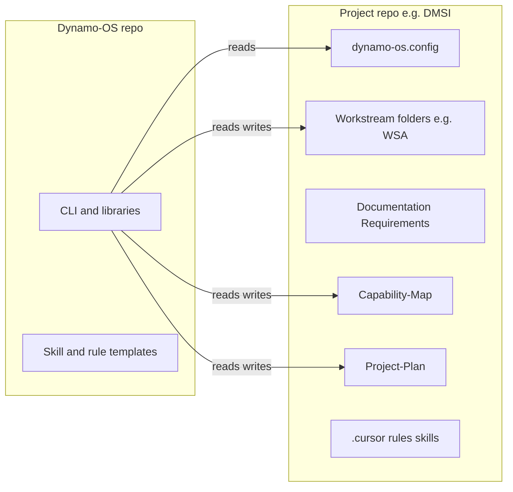

# Dynamo-OS — Product requirements (PRD)

**Status:** Draft (aligned to internal planning)  
**Last updated:** 2026-03-26 (workstreams-at-root; Git/S3/SSM + PR policy; Jira exit north star; Lambda phasing)  
**Audience:** Owners of planning repos (e.g. DMSI-Op-Readiness-II-Plan) and the future **Dynamo-OS** tooling repository.

## Purpose

Split **reusable tooling** (WBS lifecycle, map sync, Gantt data build, Lambda static handler, and **transitional** Jira adapters) into a **Dynamo-OS** repository, delivered as a **versioned npm package with a CLI**. Each **project repository** holds **planning data**, **capability work**, **HTML artifacts**, and **project-specific configuration** (disk paths, Gantt sources; Jira settings only while Jira remains).

**First project consumer:** `DMSI-Op-Readiness-II-Plan`. Additional independent project repos follow the same layout and config.

---

## Distribution model

- **Primary:** Publish **Dynamo-OS** as an **npm package** (private npm, GitHub Packages, or Verdaccio) exposing a **`dynamo-os` CLI** (e.g. `npx @your-scope/dynamo-os …`). Project repos declare it as a **devDependency** and run commands from the project root for reproducible versions and straightforward CI.
- **Interim:** **Git submodule** at e.g. `vendor/dynamo-os` only if daily co-development is needed before the package exists; migrate to npm when APIs stabilize.

---

## Standard project repository layout

Target tree for **every** project repo. Tooling resolves paths via **`dynamo-os.config`** at the repo root (naming variants such as `Capability-Map` vs `Capability-map` are fine if config matches).

### Folder naming reference (workstream vs capability)

| Concept | Meaning | Example folder names |
|--------|---------|----------------------|
| **Workstream** | Top-level delivery / program folder at **repo root** (not the same as a capability) | **WSA**, **WSB-WSC** |
| **Capability** | Folder **inside** a workstream | **PA**, **VI**, **WM**, **WB** |

**Canonical path pattern (DMSI standard):** `<Workstream>/<Capability>/` at repository root — e.g. **`WSA/PA/`**, **`WSB-WSC/WB/`**.

**Decision:** Do **not** require a parent `Workstreams/` directory for this program; workstream folders live beside `Documentation/`, `Requirements/`, etc. Other project repos may optionally use `Workstreams/<WS>/…` if **`dynamo-os.config`** lists those paths.

Example (this repo):

```text
WSA/             ← workstream
  PA/            ← capability
  VI/
  WM/
WSB-WSC/         ← workstream
  WB/            ← capability
Documentation/
Requirements/
Capability-map/  ← or Capability-Map/ per naming policy
Project-Plan/
```

Optional extra nesting (e.g. `WSA/Capabilities/PA/`) is allowed if **`dynamo-os.config`** lists the real disk path. **Do not treat `PA` / `VI` / `WM` as workstreams** — they are capabilities under a workstream folder such as **WSA**.

### Top-level content folders

- **Workstream roots** (e.g. **`WSA/`**, **`WSB-WSC/`**) — Each contains **capability** folders (see reference above). Multiple workstreams per project repo are supported.

- **`Documentation/`** — Process docs, structure snapshots, Jira/JQL notes.

- **`Requirements/`** — PRDs, planning prompts, constraint maps.

- **`Capability-Map/`** — Lambda-facing HTML/JSON and sync inputs (PascalCase recommended for consistency; legacy `Capability-map/` acceptable via config).

### Root-level supporting folders and files

- **`Project-Plan/`** — **Option A (decided):** Combined Gantt HTML, `gantt-data.json`, milestones as a **fifth** top-level folder (not nested under Documentation).

- **`.cursor/`**, **`.github/`** — Editor rules/skills and CI.

- **`package.json`** — Includes **devDependency** on `dynamo-os`.

- **`dynamo-os.config`** (or `dynamo-os.config.cjs` / `.json`) — Project-specific paths and Jira roots.

### Inside each capability folder

Examples: `WSA/PA/`, `WSB-WSC/WB/`.

- **`Jira/`** — Dated Jira export JSON (and optional kanban status artifacts alongside exports, if that pattern is retained).

- **`Output/`** — `*-WBS-Jira-Import.json` and **`Output/Archive/`** for dated snapshots.

- **`Archive/`** — Dated WBS markdown (and similar) archives from prep scripts.

### Alongside the above (capability root)

- Primary WBS markdown (e.g. `PA-WBS.md`), `*-outcomes.json`, planning HTML (`*-kanban.html`, `*-Outcome-map.html`, …).

- **`Input/`** with **`Input/Archive/<dateStamp>/`** after a WBS load.

- **`Update-Reports/`** — WBS-Load reports.

These paths support the existing WBS update workflow; the CLI resolves them via config.

### Layout rationale

- **Pros:** Clear separation of process documentation, delivery workstreams, and top-level capability map; new repos look identical; no hardcoded `PA/` at repo root in code.

- **Migration (DMSI):** Capability trees live under **`WSA/PA`**, **`WSA/VI`**, **`WSA/WM`**, **`WSB-WSC/WB`**. After moves, sweep **stale doc strings** (older reports, READMEs), **relative links** in HTML, **Cursor** rules/skills, and **GitHub Actions** `paths:` / zip commands.

- **Naming:** Standardize capability map folder casing for Linux CI.

---

## Architecture (conceptual)



- **Dynamo-OS repo:** Node libraries, CLI, tests, README; optional **template** Cursor skill/rule markdown for copying into project repos.

- **Each project repo:** Workstream folder(s) (e.g. **`WSA/`**, **`WSB-WSC/`**), **`Documentation/`**, **`Requirements/`**, **`Capability-Map/`** (or `Capability-map/`), **`Project-Plan/`**, plus **`.cursor/`**, **`.github/`**, **`dynamo-os.config`**.

---

## Code and scripts to consolidate in Dynamo-OS

Parameterize all of the following with **project config** (no hardcoded capability paths or DMSI-only Jira keys in library code).

| Area | Current location (this repo) | Notes |
|------|------------------------------|--------|
| Jira export / delete / import / link | `Scripts/jira-export-pa.js`, `jira-export-wb.js`, `jira-delete-under-root.js`, `jira-delete-issue-tree.js`, `jira-import-wm.js`, `jira-link-wm-action-items.js` | Shared HTTP/auth; env from `.cursor/.env` |
| Capability paths | `Scripts/wbs-capability-folder.js` | Replace with config-driven resolution (remove WB-only special case) |
| WBS load lifecycle | `Scripts/wbs-load-prep.js`, `wbs-move-input-to-archive.js`, `wbs-load-report-counts.js` | Generic once paths come from config |
| Kanban status from export | `Scripts/jira-kanban-status-from-export.js` | Generalize beyond PA-default paths |
| Gantt data build | `Project-Plan/build-gantt-data.js` | Move engine to Dynamo-OS; **WBS list + base year** in config |
| Capability map date sync | `Capability-map/sync-stage-dates-from-outcome-maps.js` | Move engine; **HTML paths + stage mapping + year** in config |
| Lambda handler | `Capability-map/index.mjs` | Generic static server; package with project HTML/JSON per deploy docs |

---

## What remains in each project repository

- All **content** under the standard layout (WBS, outcomes JSON, exports, per-capability and portfolio HTML, prose naming the engagement).

- **CI:** e.g. `.github/workflows/deploy-capability-map.yml` stays per project; steps invoke **`npx dynamo-os package-lambda`** (or documented `zip` layout) using **paths from config**.

- **Cursor:** `.cursor/skills/` and `.cursor/rules/` stay **per project** (wording and paths). Dynamo-OS may ship templates. **Documentation/WBS-Update-Pattern.md** may split: generic in Dynamo-OS, examples in the project.

---

## Project configuration (`dynamo-os.config`)

Consumed by the CLI from the **project repo root**. Schema can evolve; start minimal for DMSI.

- **`projectRoot`:** `.` (optional future: run from subdirectories).

- **`capabilities`:** Map of capability id → `{ diskPath, filePrefix, jiraCapabilityRoot, jiraActionItemRoot }` (replaces inline `CAPABILITY_CONFIG` and `getCapabilityFolder` behavior).

- **`jira`:** Optional overrides (e.g. env file path; default `.cursor/.env`).

- **`gantt`:** e.g. `{ wbsPaths: [...], baseYear: 2026, output: "Project-Plan/gantt-data.json" }` — paths relative to repo root (e.g. `WSA/PA/PA-WBS.md`).

- **`capabilityMapSync`:** Outcome-map HTML paths and stage-update rules.

---

## Migration sequence

1. **Bootstrap Dynamo-OS repo:** `package.json`, `bin`, shared Jira client + env loader, first CLI command (e.g. `jira export`) wired to config; publish `0.1.0` or use `npm link`.

2. **Add config to DMSI** and route **one** workflow (e.g. Jira export) through the CLI to validate wiring.

3. **Port** remaining `Scripts/`, `Project-Plan/build-gantt-data.js`, and `Capability-map/sync-…` into Dynamo-OS; replace or thin-wrap local scripts with `npx dynamo-os …` as needed.

4. **Update Cursor artifacts in the project repo:** `.cursor/skills/` **and** `.cursor/rules/` — see **Cursor rules (per project repo)** below. Keep skills and rules consistent with each other and with `dynamo-os.config` / CLI commands.

5. **Update** `Scripts/README.md` (or successor) to document the CLI.

6. **Restructure DMSI** (when applicable): capabilities under **`WSA/`** / **`WSB-WSC/`**; fix links and workflow path filters; run **Post-restructure checklist** (below).

7. **New project repo:** Scaffold from a template with the **same top-level pattern** (workstream roots + `Documentation`, `Requirements`, `Capability-Map`, `Project-Plan`), capability stubs, sample `dynamo-os.config`, and Cursor templates (skills **and** rules).

---

## Post-restructure checklist (DMSI)

Use this after moving folders so tooling, CI, and docs stay trustworthy.

- **Scripts:** Confirm `Scripts/wbs-capability-folder.js` (and any hardcoded paths) match **`WSA/…`** and **`WSB-WSC/WB`**; run `node Scripts/wbs-load-prep.js PA` (dry check paths), Jira export dry run if applicable.
- **Build / sync:** `node Project-Plan/build-gantt-data.js`; `node Capability-map/sync-stage-dates-from-outcome-maps.js`; fix any path errors.
- **Static HTML:** Open `Project-Plan/Combined-Outcome-Gantt.html` and spot-check links to outcome maps; open capability maps and kanban files.
- **GitHub Actions:** `.github/workflows/deploy-capability-map.yml` — `paths:` filters include **`WSA/`** (and other zips paths match disk); local `zip` command matches CI.
- **Documentation:** Update [Documentation/Project-Structure.md](Documentation/Project-Structure.md), [Documentation/Capacity-Map-Target-Date-Updates.md](Documentation/Capacity-Map-Target-Date-Updates.md) (remove references to `WM/`, `VI/`, `PA/` at repo root), and any runbooks that cite old paths.
- **Cursor rules:** Audit `.cursor/rules/*.mdc` — **`globs`** must match the real workstream/capability paths (e.g. `WSA/PA/**`); body text must reference current paths and commands. After Dynamo-OS CLI lands, replace `node Scripts/...` examples with `npx dynamo-os ...` where applicable; align **project-plan.mdc** with `Project-Plan/` and `Capability-map/` links; keep **Jira** language consistent with the **Jira direction** (transitional adapter, not permanent SoT). **Evaluate** whether to add **folder-scoped** rules (see PRD § Cursor rules → Evaluating additional folder-scoped rules).
- **Archive / historical:** Old `Update-Reports/*.md` may reference previous paths — either leave as historical or add a one-line note that paths were pre-restructure.
- **`dynamo-os.config`:** When introduced, becomes the single source of truth for workstream/capability paths; until then, **`wbs-capability-folder.js`** is the de facto map.

---

## Source of truth, Git, and runtime stores (decided)

- **Git** is the **source of truth for human-facing planning**: WBS markdown, outcome maps, kanban HTML, Gantt inputs, dated snapshots you expect people to **read, diff, and review** in the repo.

- **S3 and AWS Systems Manager Parameter Store (SSM)** are for **operational / runtime** data: large blobs, ephemeral caches, feature flags, Lambda config, or anything that should **not** require a git commit to update.

- When **automation** produces **planning artifacts** that you care to review (generated JSON, refreshed HTML snippets, reconciled tables), prefer a **GitHub App** or bot that opens a **pull request**, or **push to a branch + PR**, instead of **silent direct pushes to `main`**. That preserves review, CI gates, and rollback.

---

## Jira direction (north star)

**Long-term goal:** **Remove dependencies on Jira** for this planning system. Jira export/import, kanban status derived from Jira, and “Jira as execution SoT” patterns are **transitional**, not the end state.

**Implications for architecture and Dynamo-OS:**

- **Do not** hard-couple portfolio views or WBS semantics to Jira in ways that cannot be dropped later (avoid “Jira issue key required everywhere” as the only identifier).
- **WBS + repo artifacts** remain the **normative** structure; any Jira sync is an **optional adapter** until it is removed.
- **Skills and scripts** that assume Jira should be **isolatable** (clear module boundaries) so they can be retired or replaced with **repo-only** workflows (e.g. status in markdown/JSON only).
- **Scheduled “authoritative Jira pull”** is **not** a target end state; if used briefly, it must not block the path to **zero Jira**.

---

## AWS Lambda (phasing)

**Today (this repo):** One Lambda deploys a **ZIP** of static HTML/JSON (capability map, Gantt, workstream trees) via [`.github/workflows/deploy-capability-map.yml`](.github/workflows/deploy-capability-map.yml); handler serves files from the package (`Capability-map/index.mjs`).

**Next (planned direction):** **Additional Lambda functions** for API-style or **scheduled** work (e.g. report generation, or **transitional** Jira adapters). Design passes should follow **Source of truth, Git, and runtime stores** above and respect the **Jira direction** (north star).

- **One concern per function** — keep static hosting Lambda **read-only** and cold-start friendly; put long or mutating workflows behind a **dedicated** function or **Step Functions** if runtime exceeds Lambda limits.
- **Secrets** — use **Secrets Manager** or SSM for runtime secrets; least-privilege IAM per function. (Jira credentials, while Jira remains, live here—not baked into Lambdas.)
- **Triggers** — EventBridge schedule vs manual invoke vs queue; **idempotency** for any external writes.
- **Planning outputs** — if a Lambda (or Action) materializes **reviewable** planning files, land them via **PR** (GitHub App / branch workflow), not silent `main`. **Operational** outputs go to **S3/SSM** as appropriate.
- **Dynamo-OS** — Package Lambda layout and optional “second function” template should live in the tooling repo; each **project repo** keeps **which** functions exist and **env-specific** ARNs/names in workflow or IaC.

---

## Risks and constraints

- **No root `package.json` today** in DMSI — adding one per project repo is expected for `devDependencies`.

- **HTML is largely hand-maintained** — Dynamo-OS should own **sync/generation utilities**, not mandatory full-site build pipelines unless explicitly chosen later.

- **Version drift** — Pin `dynamo-os` per project; bump when layout logic or sync rules change.

- **Jira exit** — While Jira adapters exist, avoid designs that **cannot** be removed; track retirement of export/import paths as the **north star** progresses.

---

## Cursor rules (per project repo)

**Rules stay in each project repository** (not in Dynamo-OS), except optional **templates** shipped with Dynamo-OS for greenfield repos. Whenever layout, scripts, or policies change, update rules so the editor applies correct guidance automatically.

**Files to maintain (this repo today):**

- **`project-plan.mdc`** — Combined Gantt, outcome maps, kanban paths under `WSA/` and `WSB-WSC/WB/`, WBS locations, design system. Update when paths or HTML names change.
- **`pa.mdc`**, **`vi.mdc`**, **`wm.mdc`**, **`wb.mdc`** — **`globs`** must match capability roots (e.g. `WSA/PA/**`, `WSB-WSC/WB/**`). Bodies reference canonical WBS files, READMEs, and **script/CLI** commands for export and WBS load.

**When to update rules (explicit triggers):**

- Folder moves (workstream/capability layout) or renames (`Capability-map` vs `Capability-Map`).
- Replacing `Scripts/*.js` with **`npx dynamo-os …`** (or wrappers).
- **Skills** change — keep **skills and rules in sync** (same paths, same command strings, same Jira/transitional wording).
- **Jira north star** — tighten wording over time so rules do not imply Jira is forever required for structure.

**Dynamo-OS template repos** should include starter **`.cursor/rules`** matching the standard layout and globs so new projects are consistent from day one.

### Evaluating additional folder-scoped rules

Cursor loads rules from **`.cursor/rules/*.mdc`** at the **repository root**. “Folder-level” rules means **additional `.mdc` files** whose frontmatter **`globs`** target a subtree (for example `Capability-map/**`). Do **not** create nested `.cursor/rules` inside `WSA/` or `Documentation/` unless your tooling explicitly supports it; the standard pattern is **one rules directory + glob scoping**.

**As part of migration, evaluate** whether any of these areas deserve their **own** rule file (or a **split** of an existing rule) so edits in that tree get **targeted** guidance without firing capability-specific rules:

| Area (example glob) | Why it might need its own rule |
|---------------------|--------------------------------|
| **`Capability-map/**`** | Embedded JSON/state in HTML, Lambda-related files, sync script conventions; different from WBS markdown in `WSA/`. |
| **`Project-Plan/**`** | Combined Gantt HTML, `gantt-data.json`, milestones; vanilla static HTML rules may be long enough to isolate from `project-plan.mdc` if that file mixes Gantt + cross-links to `WSA/`. |
| **`Documentation/**`** | Process/runbook markdown vs planning HTML; link style, when to update `Project-Structure.md`. |
| **`Requirements/**`** | PRD structure, Dynamo-os-prd alignment, “decision” vs “spec” tone. |
| **`Scripts/**`** | If thin wrappers remain: Node conventions, env loading, comments matching Dynamo-OS CLI. |
| **`.github/**`** | Workflow triggers, `paths:` filters, deploy zip layout, secrets naming. |
| **`WSB-WSC/**` (outside `WB/`)** | Files like `WSB-WSC-Outcome-Map.html` may not match `wb.mdc` if globs are only `WSB-WSC/WB/**`. |

**Criteria to add a new rule file**

- **Distinct constraints** (stack, format, or review expectations) that do not belong in `pa.mdc` / `vi.mdc` / `wm.mdc` / `wb.mdc`.
- **Noise reduction** — editing `Capability-map/capability-map.html` should not always load four capability rules if they add no value.
- **Avoid sprawl** — prefer **one** new rule with clear `globs` over many overlapping files; merge if two globs share the same body.

**Deliverable:** During the Cursor rules pass, produce a short **audit** (even a bullet list in a PR or in `Documentation/`): proposed new `.mdc` names, `globs`, and rationale — or **“no additional rules; existing five + project-plan suffice”** with one sentence why.

---

## Implementation checklist (from planning)

- [ ] Create Dynamo-OS repo: `package.json`, bin CLI, shared modules (Jira adapter **pluggable / removable**), README  
- [ ] Define `dynamo-os.config` schema (capabilities, paths, optional Jira adapter block, gantt, capabilityMapSync)  
- [ ] Move Scripts + `build-gantt-data.js` + `sync-stage-dates-from-outcome-maps.js` into Dynamo-OS; generalize via config  
- [ ] Wire DMSI: config, CLI entrypoints, deploy workflow  
- [ ] Update `.cursor/skills/` and **`.cursor/rules/*.mdc`** (globs, paths, CLI commands, Jira transitional wording); **evaluate folder-scoped rules** (Capability-map, Project-Plan, Documentation, Requirements, Scripts, `.github`, `WSB-WSC` outside `WB`) and document add/split/none decision; skills/README; optional template skills + **template rules** in Dynamo-OS  
- [ ] Add second project repo template (same layout + minimal config)  
- [ ] Document canonical tree; workstreams at repo root (`WSA`, `WSB-WSC`); per-capability `Jira`, `Output` (+ `Output/Archive`), `Archive`, `Input`, `Update-Reports`; Option A root `Project-Plan`; post-restructure checklist; Lambda phasing

---

## Related documents

- `Documentation/WBS-Update-Pattern.md`  
- `Documentation/Jira-Export-Process.md`  
- `Scripts/README.md`  
- `.cursor/skills/wbs-update-pattern/SKILL.md`  
- `.cursor/skills/jira-export/SKILL.md`  
- `.cursor/rules/project-plan.mdc`, `.cursor/rules/pa.mdc`, `.cursor/rules/vi.mdc`, `.cursor/rules/wm.mdc`, `.cursor/rules/wb.mdc`
