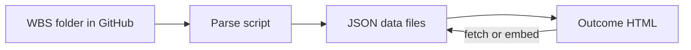
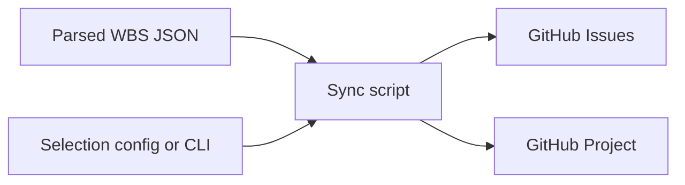

# Dynamic WBS-to-Outcome HTML Data Flow

**Alignment with [PRD-dmsi-project-planning-prd.md](PRD-dmsi-project-planning-prd.md):** This plan is extended to match the PRD. The PRD adds: (1) three data sources merged into `project-plan.json` (WBS, GitHub Projects status, custom admin); (2) Lambda hosting (Node 22, us-east-2) and dedicated repo `dmsi-project-planning`; (3) pull of status from GitHub Projects (scheduled/manual) plus existing push of selected WBS items to Projects; (4) Custom Admin Interface (Lambda-served, writes `custom-data.json` via GitHub API); (5) Confluence embedding via iframes; (6) Full visual set (Gantt, WBS Visual, Status Dashboard, Critical Path, Resource Allocation, Milestone Tracker). The sections below incorporate these where applicable.

**Resolved decisions (see PRD §5.1):** All current docs move to a **new repo** `dmsi-project-planning`. **One** GitHub Project for the whole initiative. WBS ↔ Projects linkage by **key in title** (e.g. OC-04.1). Use **existing** visuals first; new visuals may be added later. Merge runs in Actions; deploy zips pre-built files to Lambda. Custom data schema TBD; merge strategy options documented in PRD §5.2.

---

## Current State

- **Capability folders (PA, VI, WM) and Project-Plan**: Static HTML files with **hardcoded** data in `<script>` blocks:
  - **Outcome maps** (e.g. [PA/PP-Outcome-map.html](PA/PP-Outcome-map.html), [VI/VI-WSB-Outcome-Map.html](VI/VI-WSB-Outcome-Map.html), [WM/WM-Outcome-Map.html](WM/WM-Outcome-Map.html)): `outcomes` array (id, name, cat, start, end, deps, risk, deliverables count, milestone, dates), dependency edges, node positions, and summary/decision cards.
  - **Kanban boards** (e.g. [PA/PP-kanban.html](PA/PP-kanban.html), [VI/VI-kanban.html](VI/VI-kanban.html), [WM/WM-kanban.html](WM/WM-kanban.html)): Large `outcomeData` object keyed by outcome ID with `name` and `deliverables[]` (id, name, subtasks[]).
  - **Combined Gantt** ([Project-Plan/Combined-Outcome-Gantt.html](Project-Plan/Combined-Outcome-Gantt.html)): Hardcoded capability metadata (WM, VI, PP) with outcome counts and date ranges.
- **WBS source by capability**: The **source of truth** for WBS content is markdown in each capability folder: [PA/PP-WSB.md](PA/PP-WSB.md), [VI/VI-WBS.md](VI/VI-WBS.md), [WM/WM-WBS.md](WM/WM-WBS.md). Each file contains:
  - **Outcome map table** (ID, Outcome, Category, Target Date, Milestone)
  - **Mermaid dependency block** (from/to/type: must, should, contingent)
  - **Per-outcome sections**: `### OC-XX: Title`, **Category:**, **Target Date:**, **Owner:**, **Status:**, **Success Criteria** (bullets), **Deliverables** (table), then **OC-XX.Y: Deliverable Name** with bullet subtasks

When the WBS is edited, the HTML today does not change; you have to manually sync data in two places.

---

## Recommended Approach: Build-Time Data Generation + Data-Driven HTML

Use a **single pipeline**: WBS markdown (from a folder in GitHub) → parsed data (JSON) → HTML loads JSON and renders. No server at view time; everything stays static and hostable anywhere (e.g. GitHub Pages).




**Why this approach**

- **Single source of truth**: All narrative and structure stays in the WBS markdown files in the GitHub folder; no duplicated outcome/deliverable/dependency data in HTML.
- **Static output**: No backend required for viewing; you can still use file:// with embedded data or a simple static server.
- **Predictable**: Re-run the parser whenever WBS changes; HTML stays as templates that consume data.

**Alternatives considered**

- **Runtime only (no build)**: Browsers block `fetch()` on `file://` for same-directory JSON. You’d need a local server or to embed data in HTML; embedding is effectively the same as a build step that injects JSON.
- **Full SSG (e.g. 11ty)**: Clean, but more setup and learning curve; the same parser can be reused later if you move to an SSG.
- **Server that reads WBS on each request**: Unnecessary for a doc set that updates occasionally; build-step is simpler and works with static hosting.

---

## 1. WBS Parser and Output Schema

**Add a parser script** (Node.js or Python, your preference) that:

- **Input**: One WBS file at a time (e.g. `PA/PP-WSB.md`, `VI/VI-WBS.md`, `WM/WM-WBS.md`).
- **Output**: One JSON file per WBS, e.g. `data/PP.json`, `data/VI.json`, `data/WM.json` (or a shared `data/` under Project-Plan or repo root per PRD).

**Parsing steps**

1. **Outcome map table**
  Find the markdown table under a clear heading (e.g. "## 2. Outcome Map"). Parse rows into: `id`, `outcome` (name), `category`, `targetDate`, `milestoneAlignment`. Normalize category (Baseline / Iterative / Conditional).
2. **Dependency graph**
  Locate the first `

```mermaid `block that contains`graph TD`. Parse lines like:

- `OC-01[OC-01: Label] -->|must| OC-02[OC-02: Label]`
- `OC-08 -.->|contingent: ...| OC-10[...]`  
 Extract: `from`, `to`, `type` (must | should | contingent). Optionally keep short labels for tooltips.

1. **Per-outcome sections**
  For each `### OC-XX: ...` section until the next `### OC-` or end of "## 4. Outcomes":
  - **Category**, **Target Date**, **Owner**, **Status**: from `**Key:** value` lines.
  - **Success criteria**: list items under `#### Success Criteria`.
  - **Deliverables table**: parse the table (ID, Deliverable, Owner, Due) into a list of deliverables with id and name (and optionally owner/due).
  - **Deliverable subtasks**: for each `**OC-XX.Y: Deliverable Name`** block, take the following bullet list as that deliverable’s subtasks.
2. **Optional (later)**
  - Decisions / risks sections (e.g. "Critical Decisions") if they follow a consistent pattern, to drive decision cards on the outcome map.
  - Week/date derivation: parse "Weeks 1-2" / "[TBD -- Weeks 6-10]" and, with a configurable project start date, compute `startWeek`/`endWeek` for timeline views.

**Suggested JSON schema (per project)**

```json
{
  "projectId": "PP",
  "title": "Pipeline Automation",
  "outcomeMap": [
    { "id": "OC-01", "outcome": "Foundation Access and Security Baseline Complete", "category": "Baseline", "targetDate": "[TBD -- Weeks 1-2]", "milestoneAlignment": "M3: Foundation Complete" }
  ],
  "dependencies": [
    { "from": "OC-01", "to": "OC-02", "type": "must" }
  ],
  "outcomes": [
    {
      "id": "OC-01",
      "name": "Foundation Access and Security Baseline Complete",
      "category": "Baseline",
      "targetDate": "[TBD -- Weeks 1-2]",
      "owner": "Dynamo + Andy Meyers",
      "status": "Not Started",
      "successCriteria": ["...", "..."],
      "deliverables": [
        { "id": "OC-01.1", "name": "Environment Access and Network Discovery", "subtasks": ["...", "..."] }
      ]
    }
  ]
}
```

You can add a `timeline` section later (e.g. `startWeek`/`endWeek` per outcome) once week extraction and start-date config are in place.

---

## 2. Where to Put Generated Data and How HTML Uses It

**Option A – Load JSON at runtime (recommended for flexibility)**  

- Write JSON files to something like `data/PP.json`, `data/VI.json`, `data/WM.json` (e.g. in Project-Plan or repo root).  
- HTML uses `fetch('data/PP.json')` (or relative path from the page).  
- **Caveat**: `fetch()` to a separate file does not work on `file://`. So you either:
  - Serve the site from a simple static server (e.g. `npx serve outcome` or `python -m http.server` in `outcome/`), or
  - Use Option B for local file opening.

**Option B – Embed JSON in the page at build time**  

- Parser (or a second step) writes a small JS file per project, e.g. `data/PP-data.js` that contains `window.WBS_DATA_PP = { ... };`.  
- Each HTML page includes `<script src="data/PP-data.js"></script>` (path relative to page; PA/VI/WM pages would use e.g. `../data/PP-data.js` if data lives at repo root) and then uses `window.WBS_DATA_PP`.  
- This works with `file://` and any static host; no server needed.  
- Tradeoff: HTML files are still “built” (script tag and possibly a single generated script file per project).

**Recommendation**: Prefer **Option B** (embedded JS data) so that opening e.g. `PA/PP-Outcome-map.html` from the file system or any static host always works. Option A is fine if you always use a local server or deploy to a host that serves the `data/` directory.

**PRD alignment:** The PRD uses a **single merged payload** `project-plan.json` (from `wbs-data.json` + `status-data.json` + `custom-data.json`) served by Lambda. Visuals fetch that one URL. So the parser output can either feed into per-project files that are then merged in a `merge-data.yml` step, or the merge step consumes parser output directly; the final artifact for visuals is `project-plan.json`.

---

## 2b. Data Architecture and Infrastructure (PRD)

Per the PRD, the system uses three data sources and Lambda hosting:

| File | Source | Description |
|------|--------|-------------|
| `wbs-data.json` | Parsed from WBS markdown | Tasks, hierarchy, deliverables, dependencies, milestones (parser output) |
| `status-data.json` | Synced **from** GitHub Projects | Task status, assignees, progress (pull workflow) |
| `custom-data.json` | Admin interface | Commentary, external deps, risk flags, custom dates |
| `project-plan.json` | Merged at deploy time | Combined output consumed by all visuals |

- **Repo:** Dedicated repo `dmsi-project-planning` with `data/`, `visuals/`, `admin/`, Lambda handler (`index.mjs`).
- **Lambda:** Node.js 22.x, us-east-2; Function URL (no auth, internal). Serves HTML under e.g. `/gantt.html` and JSON at e.g. `/project-plan.json`.
- **GitHub Actions:** `deploy.yml` (push to main → deploy Lambda); `sync-github-projects.yml` (scheduled/manual → fetch Projects data → `status-data.json`); `merge-data.yml` (on push → merge into `project-plan.json`).
- **Confluence:** Visuals embedded on Confluence pages via iframe macro (width 100%, height per visual).

**Visuals (PRD):** Gantt Chart, WBS Visual, Status Dashboard, Critical Path, Resource Allocation, Milestone Tracker. Existing outcome maps / kanban / combined Gantt can map into these (e.g. outcome map → WBS Visual, combined Gantt → Gantt Chart) or be extended.

**Custom Admin Interface:** Lambda-served `/admin.html`; admin edits supplemental data; on save, write `custom-data.json` to repo via GitHub API; redeploy picks up new data.

---

## 3. Refactor HTML to Be Data-Driven

**Outcome map pages** (e.g. PA/PP-Outcome-map.html, VI/VI-WSB-Outcome-Map.html, WM/WM-Outcome-Map.html)

- Remove the hardcoded `outcomes` array, dependency list, and node positions from the script.
- Load project data from `data/PP-data.js` or `../data/PP-data.js` (or `fetch('data/PP.json')`) depending on where data lives.
- **Timeline**: Derive `outcomes[]` for the swim lanes from `outcomeMap` (or from the detailed `outcomes[]`). If the parser does not yet output week indices, keep a small mapping or config (e.g. `weekRanges: { "OC-01": [3,5], ... }`) in the generated data so the existing `dateRange(start, end)` and grid logic still work. Later, replace that mapping with parser-produced `startWeek`/`endWeek`.
- **Dependency diagram**: Build the diagram from `dependencies` (and optional node positions if you choose to keep or regenerate them).
- **Summary cards**: Compute from data (e.g. count by category, total outcomes, total weeks if present).
- **Decision/insight cards**: If you add decision/risk parsing to the WBS, render from data; otherwise leave as static content for now.

**Kanban pages** (e.g. PA/PP-kanban.html, VI/VI-kanban.html, WM/WM-kanban.html)

- Remove the hardcoded `outcomeData` object.
- Load the same project JSON/JS (e.g. `PP-data.js` or path from capability folder).
- Build the outcome list and the deliverable/subtask tree from `outcomes[]` (each outcome’s `deliverables[]` with `subtasks[]`). Existing DOM/card logic can stay; only the data source changes.

**Combined Gantt** (Project-Plan/Combined-Outcome-Gantt.html)

- Load all three project data files (or one combined `all-data.js`).
- Replace hardcoded capability array with data derived from the three WBS outputs (PA, VI, WM): project id, title, outcome count, date range (if available), and link to the correct outcome map in PA/, VI/, or WM/.

**Naming / mapping**

- Keep a clear convention: **PA**: `PP-WSB.md` → `PP` → `PP-Outcome-map.html`, `PP-kanban.html`, `data/PP-data.js` (or `PP.json`). **VI**: `VI-WBS.md` → `VI` → `VI-WSB-Outcome-Map.html`, `VI-kanban.html`, `data/VI-data.js`. **WM**: `WM-WBS.md` → `WM` → `WM-Outcome-Map.html`, `WM-kanban.html`, `data/WM-data.js`. Combined views live in **Project-Plan/**.

---

## 4. Build Automation (Optional but Recommended)

- **Manual**: Run the parser (e.g. `node scripts/parse-wbs.js` or `python scripts/parse_wbs.py`) after editing any WBS file; regenerate `data/*.js` (or `*.json`). When working locally, the parser reads from the capability folders **PA/** (PP-WSB.md), **VI/** (VI-WBS.md), **WM/** (WM-WBS.md).
- **File watcher**: Use a dev tool (e.g. `nodemon`, `watchman`, or a VS Code task) to run the parser when any WBS file in PA/, VI/, or WM/ changes.
- **CI (recommended)**: WBS source lives in capability folders (PA, VI, WM) in GitHub; run the parser in GitHub Actions on push (e.g. to default branch or when PA/, VI/, WM/ change), then commit updated `data/` (or publish the built site). That way updating WBS and pushing automatically regenerates data and updates the HTML.

---

## 5. GitHub Projects: Push and Pull (PRD-Aligned)

GitHub Projects is used in **two ways**:

**A. Push (WBS → GitHub Projects)**  
The **full WBS lives in a folder in GitHub** (source of truth). When you are ready to work on specific items, a **triggered process** pushes **selected** outcomes/deliverables to GitHub Projects (create issues, add to project). Developers track execution on the board without duplicating the entire WBS.

- **Triggered, not automatic**: Run when you decide (e.g. "we're about to start OC-04, push OC-04 and its deliverables").
- **Selective**: By outcome ID list, status, "next N outcomes," or date window.

**B. Pull (GitHub Projects → status in visuals)**  
Per the PRD, **GitHub Projects is the source of truth for task status**. A workflow (`sync-github-projects.yml`) runs on a schedule or manually, fetches project/issue status and assignees, and writes `status-data.json`. The merge step combines WBS + status + custom data into `project-plan.json`, so visuals automatically reflect status updates from GitHub Projects.

**Goals**

- **WBS in GitHub**: Structure and content from WBS; GitHub Projects holds the subset of work items you pushed plus live status.
- **Status in GitHub Projects**: Status, assignees, progress flow from GitHub Projects into the merged JSON and into the visuals.

**How it fits the pipeline**

- **Input**: Parsed WBS data (the same JSON/JS produced for the HTML) plus a **selection** (e.g. outcome IDs like `["OC-03","OC-04"]`, or a rule like "all outcomes with status Not Started and target in next 4 weeks").
- **Process**: For each selected outcome (and optionally its deliverables), create or update **GitHub Issues** in your repo, then **add those issues to your GitHub Project** (Projects v2 supports adding issues by URL or node ID via REST or GraphQL).
- **Output**: Issues in the repo and items on the Project board, with titles and descriptions that reference the WBS (e.g. `OC-04.1: Config Migration Execution` with body linking back to the WBS doc).




**Concrete design**

1. **Sync script** (e.g. `scripts/sync-wbs-to-github.js` or `.py`):
  - Reads one or more project JSON files (PP, VI, WM) and a **selection** (CLI args, or a small config file like `sync-selection.json`: `{ "PP": ["OC-03", "OC-04"], "VI": [] }`).
  - For each selected outcome (and optionally each of its deliverables), call GitHub REST or GraphQL to:
    - **Create** an issue (title = deliverable/outcome name, body = description + WBS reference, labels e.g. `wbs`, `PP`, `OC-04`).
    - **Add** the issue to the target GitHub Project (e.g. Projects v2 Items API, or `gh project item-add`).
  - **Idempotency**: Keep a small local state file (e.g. `data/sync-state.json`) that records which WBS IDs have already been synced and the corresponding GitHub issue number. On re-run, either skip already-synced items or update existing issues from WBS (optional).
2. **What to push**: Typical choices:
  - **Outcomes only**: One issue per outcome (OC-01, OC-02, …); developers use the issue for the outcome and track subtasks elsewhere or in the issue body.
  - **Deliverables as issues**: One issue per deliverable (OC-01.1, OC-01.2, …); better granularity for a Kanban-style project board. Subtasks can go in the issue body or as GitHub task lists.
  - **Configurable**: Let the script accept a mode (e.g. `--outcomes-only` vs `--deliverables`) so you can choose per run.
3. **Credentials**: Use a **GitHub Personal Access Token** (or GitHub App) with `repo` and `project` scopes, stored in env (e.g. `GITHUB_TOKEN`) or a local config that is not committed. Document in README.
4. **Trigger**: Run manually when you're ready ("we're starting OC-04 next week, sync OC-04"), or from a simple GitHub Action (e.g. `workflow_dispatch` with inputs for project and outcome list), or a local shortcut. No need for continuous sync.

**Implementation order (relative to main plan)**

- After the WBS parser and per-project JSON exist: add the sync script, selection config/CLI, and idempotency state; test with one project and one outcome. Then add GitHub Project association and document the trigger (manual vs `workflow_dispatch`).

---

## 6. Implementation Order

**Phase 1 – WBS-driven visuals**  
1. **Parser**: Implement the WBS parser for one file (e.g. PA/PP-WSB.md) and emit one JSON (or JS) file. Validate against the current PA outcome map and kanban structure.
2. **Outcome map**: Refactor one outcome map page (PA) to use the generated data; keep timeline working (with temporary mapping or parser-produced weeks).
3. **Kanban**: Refactor the same project’s kanban page (PA) to use the same data.
4. **Parser**: Extend parser for VI (VI/VI-WBS.md) and WM (WM/WM-WBS.md) (same schema); add week-range extraction and/or start-date config if desired.
5. **Remaining HTML**: Switch VI and WM outcome maps and kanbans to their data files; then refactor Project-Plan/Combined Gantt to use the three datasets.
6. **Docs and automation**: Add a short README (how to run the parser, how to regenerate data; note source folders PA/, VI/, WM/ and combined output in Project-Plan/ or data/), and optionally a file watcher or CI job.
**Phase 2 – GitHub Projects (push)**  
7. **Push to GitHub Projects**: Add sync script (selection config/CLI, create issues, add to Project, sync-state for idempotency); document trigger (manual or `workflow_dispatch`) and credentials.

**Phase 3 – PRD: Lambda, merge, status pull, admin, Confluence**  
8. **Repo and Lambda**: Create or align repo `dmsi-project-planning` with structure in PRD §10; add Lambda handler (Node 22, us-east-2) to serve `visuals/*.html` and `data/*.json`; add `deploy.yml` (push to main to deploy).  
9. **Merge step**: Implement `merge-data.yml` and merge logic to combine `wbs-data.json` + `status-data.json` + `custom-data.json` into `project-plan.json`; visuals consume `project-plan.json`.  
10. **Pull from GitHub Projects**: Implement `sync-github-projects.yml` (scheduled + manual) to fetch GitHub Projects data and write `status-data.json`; define field mapping (status, assignees, progress).  
11. **Custom Admin Interface**: Build `admin.html` (Lambda-served); on save, write `custom-data.json` to repo via GitHub API; document redeploy.  
12. **Confluence**: Document iframe embedding; align visual set with PRD (Gantt, WBS Visual, Status Dashboard, Critical Path, Resource Allocation, Milestone Tracker).

---

## 7. Summary


| Item                | Action                                                                                                                                                       |
| ------------------- | ------------------------------------------------------------------------------------------------------------------------------------------------------------ |
| **Source of truth** | WBS markdown files in capability folders (PA/, VI/, WM/) in GitHub; parser and HTML consume from those. Combined plan visuals in Project-Plan/. No duplicate outcome/deliverable/dependency data in HTML.                       |
| **Parser**          | New script (Node or Python) in e.g. `scripts/` that parses outcome map table, mermaid block, and per-outcome sections (including deliverables and subtasks). |
| **Data output**     | One JSON or JS data file per WBS (e.g. `data/PP-data.js`) with outcome map, dependencies, and detailed outcomes + deliverables + subtasks.           |
| **HTML**            | Refactor outcome maps, kanbans, and combined Gantt to load this data and render from it (remove hardcoded arrays/objects).                                   |
| **Timeline**        | Keep existing week-based logic; feed it from parser output (add week-range parsing or a small config in generated data).                                     |
| **Viewing**         | Use embedded JS data so `file://` works; or use static server + JSON for simpler pipeline.                                                                   |
| **Updates**         | Re-run parser when WBS changes; optionally automate with a file watcher or CI.                                                                               |
| **GitHub Projects** | Push: triggered sync of selected WBS items to Projects. Pull: sync-github-projects workflow writes status-data.json; merged into project-plan.json (PRD).   |
| **PRD (Lambda, merge, admin)** | Three sources (WBS, status, custom) merged into project-plan.json; Lambda serves visuals + JSON; admin UI writes custom-data.json via GitHub API; Confluence iframes. |


After this, any change to the WBS (new outcomes, reordered deliverables, dependency changes, or new subtasks) flows into the HTML by re-running the parser and refreshing the page.