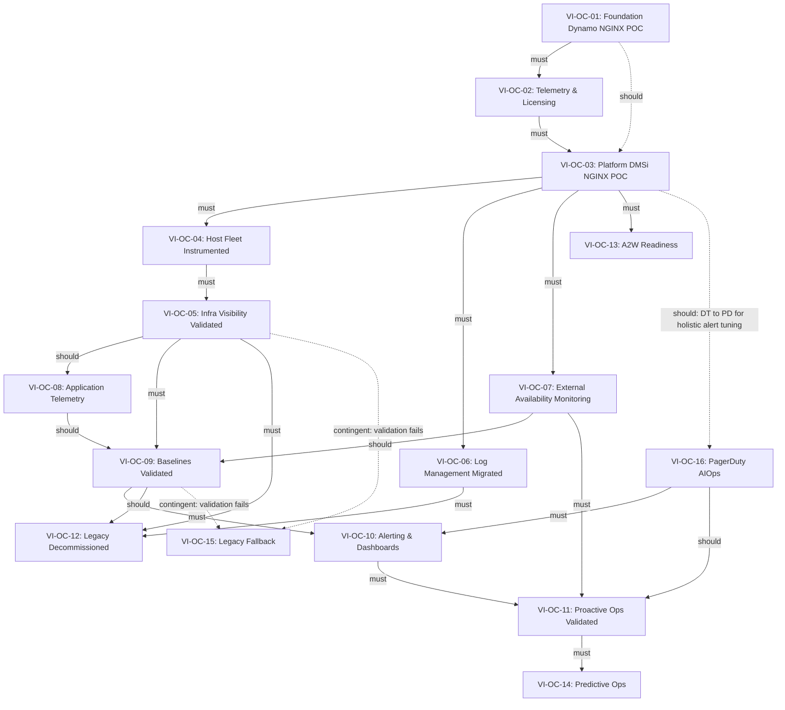

# VI-WBS: Visibility Infrastructure -- Outcome-Based Work Breakdown Structure

**Dynamo Consulting | DMSi Software**
**March 2026 | v1.0**
**Classification: Dynamo Confidential**

---

## 1. Purpose and Approach

This document defines the Visibility Infrastructure (VI) implementation using an outcome-based work breakdown structure. It replaces the sequential stage-gate model (S0-S9) with a structure organized around measurable outcomes with target dates, non-linear dependencies, and explicit handling of iterative validation cycles and conditional work.

### Why Outcome-Based

The original WBS organized work into 10 sequential stages with exit gates. In practice, the work is not linear:

- Log management (formerly S3) depends only on licensing and platform access, not on host instrumentation being complete. It can run in parallel with infrastructure deployment.
- Synthetic monitoring (formerly S4) has no hard dependency on the 30-day infrastructure validation gate. It can begin as soon as the platform is deployed.
- A2W monitoring readiness is scattered across S0, S4, S5, and S8 because of timing, but it serves a single purpose and should be tracked as one outcome.
- The 30-day and 60-day validation gates are iterative loops, not one-way gates. If validation fails, the team cycles back within the same outcome.
- Legacy decommissioning (Elastic, CheckMK) gates on multiple independent validation outcomes, not on a single stage.

This structure makes those realities explicit. Every piece of work traces to an outcome. Dependencies are typed (must, should, contingent). Parallel execution is visible. Iterative cycles have defined policies. Conditional work has explicit triggers.

### How to Read This Document

Each outcome follows a standard template:

- **Category**: Baseline (single-pass), Iterative (validation cycles), or Conditional (trigger-activated)
- **Target Date**: When the outcome should be complete (TBD placeholders for dates not yet set)
- **Success Criteria**: Measurable conditions that must be met to close the outcome
- **Deliverables**: Specific artifacts or completed actions (these become Jira Stories)
- **Dependencies**: What must/should/contingent be complete before this outcome can start or finish
- **Iteration Policy**: For Iterative outcomes, defines the validation period, cadence, max cycles, and fallback
- **Trigger Condition**: For Conditional outcomes, defines what activates the outcome
- **Risks and Decisions**: Attached to the specific outcome they affect

---

## 2. Outcome Map

| ID | Outcome | Category | Target Date | Milestone Alignment |
|----|---------|----------|-------------|---------------------|
| VI-OC-01 | Foundation Planning and Architecture Complete (Dynamo NGINX POC) | Baseline | [TBD -- Weeks 1-2]; planning/architecture aligned with **Dynamo NGINX POC** (Pipeline Automation); inventory + design + integration docs | -- |
| VI-OC-02 | Telemetry Strategy and Licensing Resolved | Baseline | [TBD -- Weeks 2-3] | -- |
| VI-OC-03 | Dynatrace Platform and Integrations Deployed (DMSi NGINX POC) | Baseline | [TBD -- Weeks 3-4]; **entire outcome due M3** — tenant/ActiveGate/integrations + A2W telemetry, scripts, Elastic, DMSi Dynatrace POC execution (VI-OC-03.5–03.8) | **M3** |
| VI-OC-04 | Host Fleet Instrumented | Baseline | [TBD -- Weeks 4-5] | -- |
| VI-OC-05 | Infrastructure Visibility Validated | Iterative | [TBD -- Week 6-10] | M2 data dependency |
| VI-OC-06 | Log Management Migrated | Iterative | [TBD -- Weeks 4-9] | -- |
| VI-OC-07 | External Availability Monitoring Operational | Baseline | [TBD -- Weeks 5-7] | M3 dependency |
| VI-OC-08 | Application Telemetry Operational | Iterative | [TBD -- Weeks 7-9] | M5 dependency |
| VI-OC-09 | Baselines and Data Quality Validated | Iterative | [TBD -- Weeks 9-11] | -- |
| VI-OC-10 | Alerting Optimized and Persona Views Live | Iterative | [TBD -- Weeks 11-13] | M4 deliverable |
| VI-OC-11 | Proactive Operations Validated | Iterative | [TBD -- Week 13+] | M5 deliverable |
| VI-OC-12 | Legacy Systems Decommissioned | Baseline | [TBD -- Weeks 10-14] | -- |
| VI-OC-13 | A2W Monitoring Readiness | Conditional | [TBD -- triggered by A2W launch] | M5 (if A2W live) |
| VI-OC-14 | Predictive Operations and Advanced Capabilities | Conditional | [TBD -- Oct 2026+] | M7 deliverable |
| VI-OC-15 | Legacy Fallback Activated | Conditional | [TBD -- triggered by validation failure] | -- |
| VI-OC-16 | PagerDuty AIOps Deployed and Validated | Iterative | March 9 - April 20 (Active) | M4 deliverable |

### Parallel Execution Summary

The following outcomes can run concurrently once their dependencies are met:

- **VI-OC-04** (Host Instrumentation), **VI-OC-06** (Log Migration), and **VI-OC-07** (Synthetic Monitoring) can all begin once VI-OC-03 (Platform Deployed) is complete. They do not depend on each other.
- **VI-OC-08** (Application Telemetry) can begin design work in parallel with VI-OC-05 (Infrastructure Validation), needing only a `should` dependency for full execution.
- **VI-OC-13** (A2W Readiness) can progress incrementally alongside any other active outcome, as long as VI-OC-03 is complete.
- **VI-OC-16** (PagerDuty AIOps) is already underway on **PagerDuty-native** event sources (e.g. CheckMK and other services already ingesting into PagerDuty) and **does not wait** for VI-OC-03. Treat **VI-OC-03.3** (Dynatrace → PagerDuty) as the coordination point when **Dynatrace-sourced** alerts must be folded into the same dedupe/AIOps model and when **VI-OC-10** assumes a unified DT+PD alerting story. It feeds into VI-OC-10 (alerting tuning) and VI-OC-11 (proactive ops validation).

---

## 3. Dependency Graph

### Dependency Type Legend

- **must** (solid arrow): Hard prerequisite. The dependent outcome cannot start until the prerequisite is complete.
- **should** (solid or dashed arrow, labeled): Recommended sequence. Can proceed with documented risk acceptance. §3 uses dashed lines for some `should` edges to distinguish optional coordination from hard `must` prerequisites.
- **contingent** (dashed arrow): Only applies if a specific condition is met.

---

## 4. Outcomes

---

### VI-OC-01: Foundation Planning and Architecture Complete (Dynamo NGINX POC)

**Category:** Baseline
**Target Date:** [TBD -- Weeks 1-2]
**Owner:** Dynamo + Andy Meyers
**Status:** In Progress — **Dynamo NGINX POC alignment**: foundation visibility work tied to Pipeline Automation’s NGINX proof-of-concept (architecture, inventory, integration design). **DMSi-environment Dynatrace execution** (trial, OTO exporters, training, M3-facing deliverables) is under **VI-OC-03** (DMSi NGINX POC).
**Source:** S0 (WP 0.1, 0.2, 0.4, 0.5, 0.6, 0.7)

#### Success Criteria

- [ ] Environment inventory complete, reviewed, and signed off by Andy and Brent
- [ ] Dynatrace architecture design documented and reviewed by Robin and Andy
- [ ] Integration architecture (PagerDuty, status page, CheckMK coexistence) documented

#### Deliverables

| ID | Deliverable | Owner | Due |
|----|-------------|-------|-----|
| VI-OC-01.1 | Environment Inventory and Gap Assessment | Dynamo + Andy | [TBD] |
| VI-OC-01.2 | Dynatrace Architecture Design | Dynamo + Robin | [TBD] |
| VI-OC-01.3 | Integration Architecture | Dynamo | [TBD] |

**VI-OC-01.1: Environment Inventory and Gap Assessment**

- Document all Windows and Linux hosts in scope -- count, OS version, role, and owner
- Inventory all PASOE instances (server count, session limits, NGINX configs)
- Map current CheckMK alert coverage to hosts -- identify monitored vs. unmonitored
- Review Elastic index structure and log sources -- determine what Dynatrace can replace vs. complement
- Document all current PagerDuty services, escalation policies, and on-call schedules
- Identify infrastructure NOT owned by DMSi (TierPoint-managed, NetApp, customer-side)
- Produce completed inventory spreadsheet -- reviewed and signed off by Andy and Brent

**VI-OC-01.2: Dynatrace Architecture Design**

- Determine OneAgent deployment model (standard host agent on all in-scope hosts)
- Design ActiveGate topology -- number of Environment ActiveGates, placement, and redundancy
- Confirm network connectivity requirements -- outbound HTTPS from hosts to Dynatrace SaaS or Managed tenant
- Identify Progress OpenEdge monitoring constraints -- document what OneAgent detects natively vs. what requires custom extensions or OpenTelemetry (VI-Q-25)
- Define monitoring layers and owner for each: infrastructure (Dynamo/DMSi Eng), APM (Dev team dependency), synthetic (Dynamo), network (TBD)
- Document the RDP delivery model limitation for RUM -- explicitly scope current-state RUM as out of scope pending A2W
- Produce an architecture diagram reviewed by Robin and Andy

**VI-OC-01.3: Integration Architecture**

- Design PagerDuty integration -- alerting profiles, severity mapping, service routing
- Design status page automation -- map Dynatrace entity states to service components
- Design CheckMK coexistence plan -- define alert deduplication strategy during transition period
- Define alert ownership model -- which team (Dynamo, DMSi Eng, Support) owns which alert category
- Document integration architecture in a single reference document

#### Dependencies

| Depends On | Type | Description |
|------------|------|-------------|
| None | -- | This is the starting outcome |

#### Risks

| Risk ID | Severity | Description | Mitigation |
|---------|----------|-------------|------------|
| VI-R-X5 | HIGH | Access dependencies **or DMSi engagement stalls** (server access, Elastic configs, GitHub org, procedural/political delays on approvals) remain unresolved, blocking VI-OC-03/VI-OC-04 and POC progress | Formally request access in VI-OC-01.1; escalate to Hilltop if not resolved before VI-OC-02 starts; treat repeated “slow no” on access as the same severity as missing credentials |
| VI-R-01 | MEDIUM | Environment inventory incomplete due to undocumented hosts or shadow infrastructure | Cross-reference CheckMK host list, Elastic log sources, and PagerDuty service map to triangulate coverage |

#### Decisions Required

| ID | Type | Decision | Owner | Required By |
|----|------|----------|-------|-------------|
| VI-D-01 | TYPE 1 | Dynatrace SaaS vs. Managed deployment | Andy Meyers | VI-OC-01 exit |
| VI-D-03 | TYPE 2 | CheckMK coexistence duration (30-day / 60-day / immediate) | Brent + Andy | VI-OC-01 exit |
| VI-D-05 | TYPE 2 | Infrastructure monitoring scope (production only vs. all environments) | Andy + Dynamo | VI-OC-01.2 |
| VI-D-20 | TYPE 2 | New Relic coexistence or replacement | Andy + Dynamo | VI-OC-01 exit |

---

### VI-OC-02: Telemetry Strategy and Licensing Resolved

**Category:** Baseline
**Target Date:** [TBD -- Weeks 2-3]
**Owner:** Dynamo + Brent + DMSi Procurement
**Status:** Not Started
**Source:** S1 (WP 1.1-1.6), S0.3

#### Success Criteria

- [ ] ABL telemetry evaluation complete with documented checkpoints
- [ ] OpenTelemetry feasibility assessed and documented
- [ ] Log retention and compliance requirements confirmed by GRC
- [ ] Dynatrace licensing procured and contract executed
- [ ] RBAC model defined
- [ ] New Relic scope clarified and disposition confirmed

#### Deliverables

| ID | Deliverable | Owner | Due |
|----|-------------|-------|-----|
| VI-OC-02.1 | ABL Telemetry Evaluation | Dynamo + Brent | [TBD] |
| VI-OC-02.2 | OpenTelemetry Feasibility Assessment | Dynamo + Dan + Matt | [TBD] |
| VI-OC-02.3 | Log Retention and Compliance Review | Andy + Leanne (GRC) | [TBD] |
| VI-OC-02.4 | Licensing and Procurement | DMSi Procurement + Dynamo | [TBD] |
| VI-OC-02.5 | RBAC Design | Andy + Dynamo | [TBD] |
| VI-OC-02.6 | New Relic Scope Clarification | Andy + Dynamo | [TBD] |

**VI-OC-02.1: ABL Telemetry Evaluation**

- Document ABL telemetry critical checkpoints -- what must be instrumented for MTTD target
- Quality audit of existing ABL/OE telemetry against industry standards
- Diagnostic coverage assessment -- log analytics platform, existing instrumentation, metrics, SLIs
- Decision on Elastic migration path, Prometheus, and any additional telemetry needs

**VI-OC-02.2: OpenTelemetry Feasibility Assessment**

- Confirm Progress OpenEdge version supports OpenTelemetry SDK
- Evaluate feasibility of custom spans for ABL-level transaction context (VI-D-14)
- Document OpenTelemetry gap vs. native OneAgent JVM detection
- Produce feasibility report -- reviewed by Dan and Matt (VI-Q-25)

**VI-OC-02.3: Log Retention and Compliance Review**

- Confirm current Elastic log retention policy (VI-Q-09)
- Leanne (GRC) confirms compliance requirements for log retention (VI-D-17)
- Measure daily log ingest volume (GB/day) from Elastic index sizes for licensing cost projection
- Document retention decision and DDU impact

**VI-OC-02.4: Licensing and Procurement**

- Estimate host unit count for OneAgent licensing across all in-scope hosts
- Evaluate Dynatrace Platform Subscription (DPS) vs. classic host-based licensing for cost optimization (cost benchmarks: $120K-$160K annually, 3-year TCO $784K-$1.075M)
- Engage the Dynatrace account team -- request a POC tenant or trial environment for validation
- Confirm Dynatrace SaaS vs. Managed deployment decision (VI-D-01)
- Finalize POC scope and DPS vs. Classic host unit decision
- Confirm budget authorization with Hilltop
- Route procurement through DMSi procurement process -- confirm lead time
- Complete licensing procurement -- Dynatrace contract executed
- Document final licensing scope and cost -- reviewed by Hilltop before commitment

**VI-OC-02.5: RBAC Design**

- Define Admin / Operator / Viewer role mapping to DMSi teams (VI-D-06)
- Confirm whether customer-visible dashboards are shared externally or remain internal

**VI-OC-02.6: New Relic Scope Clarification**

- Confirm whether New Relic is actively used and for what purpose
- If active, map New Relic scope to Dynatrace capabilities
- Define coexistence plan or replacement timeline

#### Dependencies

| Depends On | Type | Description |
|------------|------|-------------|
| VI-OC-01 | must | Architecture design and inventory required before licensing can be scoped accurately |

#### Risks

| Risk ID | Severity | Description | Mitigation |
|---------|----------|-------------|------------|
| VI-R-X6 | HIGH | Dynatrace licensing cost materially exceeds DMSi budget, causing mid-implementation scope reduction | Complete VI-OC-02.4 before any infrastructure deployment; design implementation to be modular so scope can be reduced without rework |
| VI-R-X1 | HIGH | Progress OpenEdge architectural constraints prevent achieving APM depth required for MTTD target without compensating synthetic monitoring scope | Validate in VI-OC-01 / VI-OC-03 POC scope; define fallback scope with stakeholders before VI-OC-08 |

#### Decisions Required

| ID | Type | Decision | Owner | Required By |
|----|------|----------|-------|-------------|
| VI-D-02 | TYPE 1 | Licensing model (DPS vs. Classic) -- multi-year contract commitment | DMSi Procurement + Dynamo | VI-OC-02.4 |
| VI-D-04 | TYPE 2 | APM instrumentation ownership and dev team capacity | Brent | VI-OC-02 exit |
| VI-D-06 | TYPE 2 | RBAC model in Dynatrace | Andy + Dynamo | VI-OC-02.5 |
| VI-D-14 | TYPE 2 | APM instrumentation depth for OpenEdge | Brent + dev team | VI-OC-02.2 |
| VI-D-17 | TYPE 1 | Dynatrace log retention period (35/90/custom days) | Andy + Leanne (GRC) | VI-OC-02.3 |

---

### VI-OC-03: Dynatrace Platform and Integrations Deployed (DMSi NGINX POC)

**Category:** Baseline
**Target Date:** [TBD -- Weeks 3-4]; **Milestone 3 (M3)** — all deliverables below (VI-OC-03.1 through VI-OC-03.8) are due **by M3**
**Owner:** Dynamo + DMSi Engineering (Matt, Brent, Robin, Andy, Jared per deliverable)
**Status:** Not Started — **DMSi NGINX POC** scope: production Dynatrace platform setup in DMSi plus M3 planning/execution deliverables (telemetry strategy, scripts, Elastic mapping, in-environment POC). Trial scope/end date: VI-Q-26.
**Source:** S2 (WP 2.1, 2.2, 2.5, 2.6); M3 program alignment

#### Success Criteria

- [ ] Dynatrace tenant provisioned with network zones, RBAC, and tagging strategy configured
- [ ] ActiveGate(s) deployed and validated with failover tested
- [ ] PagerDuty integration operational with end-to-end test confirmed
- [ ] Status page automation configured and tested in staging
- [ ] A2W telemetry strategy document produced and signed off (VI-OC-03.5)
- [ ] Custom script inventory centralized in GitHub with classification complete (VI-OC-03.6)
- [ ] Elastic log source inventory complete with volume estimates (VI-OC-03.7)
- [ ] Dynatrace POC execution in DMSi environment complete per VI-OC-03.8 (agents/config, training, trial calendar, rollout checkpoints)

#### Deliverables

| ID | Deliverable | Owner | Due |
|----|-------------|-------|-----|
| VI-OC-03.1 | Dynatrace Tenant Setup | Dynamo | **M3** |
| VI-OC-03.2 | ActiveGate Deployment | Dynamo + Andy | **M3** |
| VI-OC-03.3 | PagerDuty Integration | Dynamo | **M3** |
| VI-OC-03.4 | Status Page Integration | Dynamo + Jared | **M3** |
| VI-OC-03.5 | A2W Telemetry Strategy (M3 Deliverable) | Dynamo + Robin | **M3** |
| VI-OC-03.6 | Custom Script Rationalization Planning | Dynamo + Andy | **M3** |
| VI-OC-03.7 | Elastic Inventory and Log Source Mapping | Dynamo + Andy | **M3** |
| VI-OC-03.8 | Dynatrace POC — DMSi Environment Execution | Dynamo + Matt + Brent | **M3** |

**VI-OC-03.1: Dynatrace Tenant Setup**

- Provision Dynatrace SaaS tenant (or deploy Managed instance per VI-D-01)
- Configure network zones to reflect DMSi's data center topology
- Set up user accounts -- apply RBAC model per VI-D-06
- Configure tagging strategy -- define host tags for environment, tier, product, and owner
- Enable auto-tagging rules aligned to naming conventions

**VI-OC-03.2: ActiveGate Deployment**

- Deploy Environment ActiveGate(s) on designated on-prem hosts
- Validate outbound HTTPS connectivity from ActiveGate to Dynatrace SaaS endpoint
- Configure ActiveGate for OneAgent traffic routing
- Test failover if multiple ActiveGates are deployed
- Document ActiveGate host requirements and reserve capacity

**VI-OC-03.3: PagerDuty Integration**

- Configure Dynatrace alerting profiles -- start conservative to avoid flood
- Create Dynatrace PagerDuty integration via portable webhook layer (VI-D-19)
- Map Dynatrace severity levels to PagerDuty priority (P1/P2/P3)
- Route Dynatrace alerts to appropriate PagerDuty services and escalation policies
- Test end-to-end: trigger test problem, confirm PagerDuty incident creation
- Document deduplication logic for CheckMK parallel operation period (VI-D-07)

**VI-OC-03.4: Status Page Integration**

- Map Dynatrace monitored entities to status page service components
- Configure Dynatrace webhook to trigger status page updates on problem open/close
- Define status page update logic (Degraded, Outage, Maintenance)
- Test automated status update flow end-to-end in staging
- Define manual override process for status page when automated updates are incorrect

**VI-OC-03.5: A2W Telemetry Strategy (M3 Deliverable)**

**Scope note:** A2W is not broadly in production today; treat this deliverable as **current-state** monitoring (RDP-delivered Agility) plus **future-state hooks** for A2W. Where A2W has no committed production date, emphasize **initial Real User Monitoring (RUM) strategy** and a **readiness checklist** for when A2W goes live, rather than pretending full A2W instrumentation is executable now. Contract milestone wording may be a pre-Dynatrace holdover — align narrative with Dynamo’s Dynatrace-first plan.

- Document current-state monitoring approach for RDP-delivered Agility
- Define target-state monitoring requirements for A2W browser-delivered interface (RUM, synthetic, APM)
- Map Dynatrace capabilities to A2W target state
- Identify instrumentation work that must be done by the dev team at A2W launch
- Produce telemetry strategy document -- reviewed and signed off by Robin and engineering leads

**VI-OC-03.6: Custom Script Rationalization Planning**

- Inventory all custom monitoring scripts -- including CheckMK modules, standalone scripts, and scripts feeding Elastic indices
- Centralize script inventory into a managed repository (GitHub)
- For each script, classify: (a) replaced by OneAgent, (b) replaceable via Extension Framework, (c) must be retained
- For retained scripts, document what they monitor and why OneAgent does not cover it
- Identify any scripts that feed data into or query from Elastic indices -- dependency on VI migration timeline

**VI-OC-03.7: Elastic Inventory and Log Source Mapping**

- Identify who owns the Elastic cluster -- admin credentials, cluster version, and hosting location
- Export inventory of all Elastic indices -- names, retention periods, data volumes, and approximate daily ingest rate
- Map each index to a log source -- which application, host, or service generates it
- Identify any Kibana dashboards currently in use -- who uses them, for what purpose, and how frequently
- Identify any Elastic alerts or Watcher rules currently in use
- Estimate daily log ingest volume in GB/day -- this directly affects Dynatrace Log Management licensing cost
- Produce completed log source inventory -- reviewed by Andy and Brent

**VI-OC-03.8: Dynatrace POC — DMSi Environment Execution**

- Install/configure Dynatrace components in DMSi POC/dev scope per **VI-OC-01.2** architecture (agents, connectivity, tagging as applicable)
- **PASOE / OpenTelemetry:** enable or configure OpenTelemetry (OTO) exporters in PASOE per DMSi change control (**assumption:** Matt has access to change PASOE config — validate; see §7.5)
- Capture **two additional configuration items** documented from engagement notes (e.g. Fireflies transcript follow-ups) and track to completion
- Schedule and complete **Dynatrace-led training** with DMSi teams (coordinate with Brent / account team)
- Coordinate **application reboots / maintenance windows** with DMSi for agent or exporter changes (**assumption:** DMSi availability for reboots — validate; see §7.5)
- Maintain a **POC / trial calendar**: trial start, agreed **trial end date** (VI-Q-26), and which premium features are in scope for the trial
- Produce **rollout checkpoints** for the POC (what must be true after each phase) — internal working artifact; formal SOW text follows leadership alignment

#### VI-OC-03 execution note (intra-outcome order and M3 MVP)

Contractually all deliverables **03.1–03.8** target **M3**; in practice use **parallel tracks** to avoid a false “platform first, then everything else” serial story:

- **Track A — tenant and routing:** **03.1**, **03.2**, then **03.3** / **03.4** after **VI-D-01** / contract and when soft-launch strategy (**VI-D-09**) is clear.
- **Track B — discovery and planning:** **03.5** (A2W telemetry strategy), **03.6** (script rationalization), and **03.7** (Elastic inventory) can run **in parallel** with Track A where access allows; they do not all need a fully hardened production tenant on day one.
- **Track C — DMSi POC execution:** **03.8** often runs on a **trial or POC tenant** and may **start or deepen** before every production hardening item in 03.1–03.4 is complete — document explicit risk if production and trial timelines diverge.

**VI-OC-03.7 vs VI-OC-02.3:** **VI-OC-02.3** already measures **GB/day** from Elastic for retention and **licensing projection**. **VI-OC-03.7** is the **migration-grade** inventory: index names, owners, dashboards, Watcher rules, and **per–log-source mapping** for cutover to Dynatrace Log Management. Treat 02.3 as **sizing input**; 03.7 as **authoritative inventory for migration** (refine or replace 02.3 estimates if the tenant or scope changed).

**M3 MVP if procurement or access slips:** Minimum credible **M3** story: **03.1** + **03.2** operational for agreed scope, **03.8** POC executed per checkpoints with trial calendar (**VI-Q-26**) documented, **03.5** strategy signed off, and **03.7** far enough along that log migration risk is visible. Defer **03.3**/**03.4** to documented post-M3 only with explicit program acceptance (alert and status automation gaps).

#### Dependencies

| Depends On | Type | Description |
|------------|------|-------------|
| VI-OC-02 | must | Licensing must be procured and RBAC defined before tenant can be provisioned |
| VI-OC-01 | should | Architecture design (VI-OC-01.2) should precede or overlap DMSi POC execution (VI-OC-03.8); document risk if parallel |

#### Risks

| Risk ID | Severity | Description | Mitigation |
|---------|----------|-------------|------------|
| VI-R-08 | MEDIUM | Status page automation may create incorrect or misleading updates if problem detection fires on non-customer-impacting issues | Run status page automation in "dry run" mode first |
| VI-R-X3 | HIGH | Dynatrace generates a new wave of alert noise layered on top of CheckMK during parallel operation | Conservative initial thresholds; soft-launch period before PagerDuty routing; deduplicate in PagerDuty |

#### Decisions Required

| ID | Type | Decision | Owner | Required By |
|----|------|----------|-------|-------------|
| VI-D-07 | TYPE 2 | Dual-alerting deduplication strategy during CheckMK parallel run | Brent + Andy | VI-OC-03.3 |
| VI-D-09 | TYPE 2 | Alert soft-launch strategy (Dynamo review channel vs. direct PagerDuty) | Dynamo + DMSi Eng | VI-OC-03.3 |
| VI-D-19 | TYPE 2 | PagerDuty-to-ticket-system integration architecture (portable webhook vs. native ConnectWise) | Dynamo + WSC lead | VI-OC-03.3 |

---

### VI-OC-04: Host Fleet Instrumented

**Category:** Baseline
**Target Date:** [TBD -- Weeks 4-5]
**Owner:** Dynamo + DMSi Engineering
**Status:** Not Started
**Source:** S2 (WP 2.3, 2.4)

#### Success Criteria

- [ ] OneAgent deployed on all in-scope hosts (application, database, NGINX)
- [ ] Process group detection validated on each host type
- [ ] Infrastructure metrics flowing: CPU, memory, disk I/O, network I/O per host
- [ ] PASOE and OpenEdge monitoring configured with gap analysis documented
- [ ] Host groups created matching DMSi environment topology

#### Deliverables

| ID | Deliverable | Owner | Due |
|----|-------------|-------|-----|
| VI-OC-04.1 | OneAgent Deployment -- Infrastructure Monitoring | Dynamo + Andy | [TBD] |
| VI-OC-04.2 | Progress OpenEdge and PASOE Monitoring | Dynamo + Brent | [TBD] |

**VI-OC-04.1: OneAgent Deployment -- Infrastructure Monitoring**

- Confirm RHEL 7 OneAgent compatibility across all server configurations (VI-Q-17)
- Test OneAgent install on a non-production host -- validate process detection and resource overhead
- Document OneAgent deployment procedure -- reviewed by DMSi Eng before production deploy
- Deploy OneAgent to application hosts (PASOE, app servers)
- Deploy OneAgent to database hosts -- monitor for performance impact
- Deploy OneAgent to NGINX Hosts
- Validate process group detection on each host type
- Confirm infrastructure metrics flowing: CPU, memory, disk I/O, network I/O per host
- Create host groups in Dynatrace matching DMSi environment topology

**VI-OC-04.2: Progress OpenEdge and PASOE Monitoring** *(Highest-risk work package)*

- Validate OneAgent detection of PASOE processes (Java-based JVM monitoring). Configure OpenTelemetry if needed.
- **PASOE OTO exporters:** enable/configure OpenTelemetry exporters in PASOE where required for APM depth, per DMSi change control and VI-OC-03.8; cross-reference supplemental config notes (e.g. two items tracked from Fireflies / meeting follow-ups)
- Determine what OpenEdge ABL processes are detectable vs. require custom extensions
- Configure Dynatrace Extension Framework 2.0 for OpenEdge-specific metrics (if required)
- Instrument NGINX with Dynatrace NGINX extension -- validate request throughput and error rate metrics
- Define process availability monitoring for PASOE -- alert on unexpected process stop
- Document gap analysis: what is monitored vs. what remains unmonitored for OpenEdge

#### Dependencies

| Depends On | Type | Description |
|------------|------|-------------|
| VI-OC-03 | must | Tenant and ActiveGate must be operational before agents can be deployed |

#### Risks

| Risk ID | Severity | Description | Mitigation |
|---------|----------|-------------|------------|
| VI-R-05 | HIGH | PASOE JVM monitoring works but native OpenEdge ABL session monitoring is unknown until POC. Budget 40+ hours for custom extension development if standard detection fails | Validate in VI-OC-04.2 early; use Extension Framework 2.0 as fallback |
| VI-R-06 | HIGH | OneAgent deployment on production hosts may require maintenance windows difficult to schedule given firefighting posture. Production deployment may take 2-3x longer than planned | Start with non-production; coordinate maintenance windows with DMSi Eng early |
| VI-R-09 | LOW | Database host OneAgent deployment may cause performance overhead on high-I/O OpenEdge database hosts | Validate resource overhead in non-production before production deploy |
| VI-R-X7 | LOW | Dynatrace go-live coincides with a major incident, eroding trust before platform is stable | Soft launch with conservative thresholds; Dynamo monitors alert quality for first 2 weeks |

#### Decisions Required

| ID | Type | Decision | Owner | Required By |
|----|------|----------|-------|-------------|
| VI-D-08 | TYPE 2 | Process group naming convention for PASOE instances | Andy | VI-OC-04.1 |

---

### VI-OC-05: Infrastructure Visibility Validated

**Category:** Iterative
**Target Date:** [TBD -- Weeks 6-10]
**Owner:** Dynamo + Andy + Brent
**Status:** Not Started
**Source:** S2 (WP 2.7), 30-day validation gate

This is the first major validation outcome. Dynatrace infrastructure monitoring must demonstrably exceed CheckMK's coverage before the team advances to baseline and optimization work. This gate protects against premature decommissioning of legacy tools.

#### Success Criteria

- [ ] Dynatrace host coverage >= 95% of inventory
- [ ] Infrastructure dashboards replicate all CheckMK visibility
- [ ] Alert fidelity: zero missed critical events over 30-day window
- [ ] Team sign-off that Dynatrace meets or exceeds CheckMK baseline

#### Deliverables

| ID | Deliverable | Owner | Due |
|----|-------------|-------|-----|
| VI-OC-05.1 | Initial Infrastructure Dashboards | Dynamo | [TBD] |
| VI-OC-05.2 | Coverage Gap Analysis Report | Dynamo + Andy | [TBD] |
| VI-OC-05.3 | 30-Day Validation Report | Dynamo | [TBD] |

**VI-OC-05.1: Initial Infrastructure Dashboards**

- Build infrastructure health overview dashboard
- Build PASOE/NGINX process dashboard
- Build capacity planning dashboard
- Review dashboards with Andy and Brent

**VI-OC-05.2: Coverage Gap Analysis Report**

- Compare Dynatrace host list against VI-OC-01.1 inventory
- Identify any hosts not reporting or reporting incomplete metrics
- Document coverage percentage and remediation plan for gaps

**VI-OC-05.3: 30-Day Validation Report**

- Compile 30-day comparison: Dynatrace detection vs. CheckMK detection
- Document any incidents detected by CheckMK but missed by Dynatrace (and vice versa)
- Produce sign-off document for Andy and Brent

#### Dependencies

| Depends On | Type | Description |
|------------|------|-------------|
| VI-OC-04 | must | All hosts must be instrumented before validation can begin |

#### Iteration Policy

- **Validation period:** 30 days
- **Review cadence:** Weekly during validation
- **Max iterations:** 2 cycles before escalation to project sponsor
- **Fallback:** If 2 cycles fail, trigger VI-OC-15 (Legacy Fallback) and escalate to Hilltop

#### Risks

| Risk ID | Severity | Description | Mitigation |
|---------|----------|-------------|------------|
| VI-R-03 | HIGH | CheckMK provides visibility that Dynatrace cannot replicate for specific host types | Identify gaps in VI-OC-05.2; maintain CheckMK for those specific hosts |
| VI-R-04 | MEDIUM | 30-day window insufficient for seasonal workload patterns | Extend to 45 days if initial data is inconclusive |

---

### VI-OC-06: Log Management Migrated

**Category:** Iterative
**Target Date:** [TBD -- Weeks 4-9]
**Owner:** Dynamo + Andy
**Status:** Not Started
**Source:** S3 (WP 3.1-3.6)

This outcome can begin as soon as the platform is deployed (VI-OC-03). It does NOT depend on host instrumentation (VI-OC-04) or infrastructure validation (VI-OC-05). This is a key parallel execution opportunity compared to the sequential stage-gate model.

#### Success Criteria

- [ ] Dynatrace Log Management activated with DDU allocation confirmed sufficient
- [ ] All key log sources ingesting (PASOE, NGINX, Windows Event, Linux syslog, OpenEdge DB)
- [ ] Log processing and parsing rules validated for key formats
- [ ] All operationally used Kibana dashboards recreated in Dynatrace
- [ ] 30-day parallel validation complete -- Dynatrace log parity confirmed with Elastic
- [ ] All active Elastic alert rules recreated or marked deprecated

#### Deliverables

| ID | Deliverable | Owner | Due |
|----|-------------|-------|-----|
| VI-OC-06.1 | Dynatrace Log Management Activation | Dynamo | [TBD] |
| VI-OC-06.2 | Key Log Source Ingestion | Dynamo + Andy | [TBD] |
| VI-OC-06.3 | Log Processing and Parsing | Dynamo | [TBD] |
| VI-OC-06.4 | Remaining Log Source Migration | Dynamo + Andy | [TBD] |
| VI-OC-06.5 | Elastic Alert Migration | Dynamo + Andy | [TBD] |
| VI-OC-06.6 | Parallel Validation | Dynamo + DMSi Eng | [TBD] |

**VI-OC-06.1: Dynatrace Log Management Activation**

- Enable Dynatrace Log Management in the tenant -- confirm DDU allocation is sufficient
- Configure log ingestion scope per VI-D-18 (all logs vs. WARN+ vs. prod full / non-prod sampled)

**VI-OC-06.2: Key Log Source Ingestion**

- Configure OneAgent log monitoring for PASOE application logs
- Configure OneAgent log monitoring for NGINX access and error logs
- Configure Windows Event Log forwarding for all in-scope Windows hosts
- Configure Linux syslog forwarding for all in-scope Linux hosts
- Configure OpenEdge database logs

**VI-OC-06.3: Log Processing and Parsing**

- Define log processing rules in Dynatrace -- extract key fields (severity, customer ID, transaction type)
- Build custom parsing rules for NGINX, PASOE, and OpenEdge formats
- Validate log search and query capability vs. Kibana

**VI-OC-06.4: Remaining Log Source Migration**

- Identify any remaining log sources not covered in VI-OC-06.2 -- complete ingestion configuration
- Recreate all operationally used Kibana dashboards in Dynatrace dashboards or notebooks
- Confirm all Elastic alert rules have been recreated or marked deprecated

**VI-OC-06.5: Elastic Alert Migration**

- Identify any Elastic-based alerts routing to PagerDuty -- map for migration
- Recreate highest-priority log-based alerts in Dynatrace metric events
- Capture Elastic admin access and runbook documentation (VI-Q-12 knowledge silo risk)

**VI-OC-06.6: Parallel Validation**

- Initiate 30-day parallel validation period -- Elastic and Dynatrace log ingestion run simultaneously
- Engineering team validation -- confirm DMSi can perform incident investigation tasks using Dynatrace logs
- Compare Elastic and Dynatrace log parity -- document any gaps

#### Dependencies

| Depends On | Type | Description |
|------------|------|-------------|
| VI-OC-03 | must | Dynatrace tenant must be provisioned and accessible |
| VI-OC-02.3 | must | Log retention decision (VI-D-17) must be resolved before ingestion begins |

#### Iteration Policy

- **Validation period:** 30 days (parallel run with Elastic)
- **Review cadence:** Weekly during validation
- **Max iterations:** 2 cycles before escalation
- **Fallback:** Extend Elastic coexistence if Dynatrace log parity is not achieved

#### Risks

| Risk ID | Severity | Description | Mitigation |
|---------|----------|-------------|------------|
| VI-R-10 | HIGH | Elastic admin knowledge is siloed to 1-2 individuals; if they are unavailable during migration, Elastic configuration cannot be fully documented | Capture admin access and runbook in VI-OC-06.5 early |
| VI-R-11 | MEDIUM | Daily log ingest volume exceeds DDU budget, requiring scope reduction | Measure actual ingest in VI-OC-06.2 before committing to full scope |
| VI-R-12 | MEDIUM | Kibana dashboards rely on Elastic-specific query patterns (KQL/Lucene) that do not translate cleanly to DQL | Budget additional dashboard rebuild time; prioritize operationally critical dashboards |

#### Decisions Required

| ID | Type | Decision | Owner | Required By |
|----|------|----------|-------|-------------|
| VI-D-16 | TYPE 1 | Elastic decommission -- timing and data archival before shutdown (the actual shutdown is irreversible) | Andy + Dynamo | VI-OC-12 (not this outcome -- this outcome does migration, not decommission) |
| VI-D-18 | TYPE 2 | Log ingestion scope (all / WARN+ / production full, non-prod sampled) | Andy + Dynamo | VI-OC-06.1 |

---

### VI-OC-07: External Availability Monitoring Operational

**Category:** Baseline
**Target Date:** [TBD -- Weeks 5-7]
**Owner:** Dynamo + Andy
**Status:** Not Started
**Source:** S4 (WP 4.1-4.9)

This outcome can begin as soon as the platform is deployed (VI-OC-03). It does NOT depend on host instrumentation or infrastructure validation. Synthetic monitoring is the primary mechanism for MTTD improvement and directly supports the M3 tiered service promise (CW-02).

#### Success Criteria

- [ ] Top 5 customer-impacting workflows identified and scripted as synthetic monitors
- [ ] Private and external synthetic locations deployed
- [ ] Synthetic failures integrated with PagerDuty P1 policy
- [ ] MTTD baseline measurement initiated (30-day tracking)
- [ ] Network path monitoring deployed for critical paths
- [ ] NetApp ONTAP extension configured

#### Deliverables

| ID | Deliverable | Owner | Due |
|----|-------------|-------|-----|
| VI-OC-07.1 | Customer Journey Discovery | Dynamo + Jared + Bryan | [TBD] |
| VI-OC-07.2 | Synthetic Monitor Scripting | Dynamo | [TBD] |
| VI-OC-07.3 | Private Synthetic Location Deployment | Dynamo + Andy | [TBD] |
| VI-OC-07.4 | External Synthetic Location Configuration | Dynamo | [TBD] |
| VI-OC-07.5 | Synthetic Alert Configuration | Dynamo | [TBD] |
| VI-OC-07.6 | MTTD Baseline Measurement | Dynamo | [TBD] |
| VI-OC-07.7 | A2W Synthetic Readiness | Dynamo + Robin | [TBD] |
| VI-OC-07.8 | Network Path Monitoring | Dynamo + Andy | [TBD] |
| VI-OC-07.9 | NetApp ONTAP Extension | Dynamo | [TBD] |

**VI-OC-07.1: Customer Journey Discovery**

- Working session with Jared and Bryan to identify top 5 customer-impacting workflows to monitor synthetically

**VI-OC-07.2: Synthetic Monitor Scripting**

- Login flow (mandatory first), then top 4 additional journeys identified in VI-OC-07.1

**VI-OC-07.3: Private Synthetic Location Deployment**

- Deploy Private Synthetic Location -- required if customer journeys involve RDP-based access that cannot be tested from public locations

**VI-OC-07.4: External Synthetic Location Configuration**

- Deploy at minimum 2 external locations for outage detection independent of internal network

**VI-OC-07.5: Synthetic Alert Configuration**

- Integrate synthetic failures with PagerDuty P1 policy; confirm first-update timer <= 30 minutes

**VI-OC-07.6: MTTD Baseline Measurement**

- Begin tracking MTTD from synthetic detection vs. first customer report; establish 30-day baseline

**VI-OC-07.7: A2W Synthetic Readiness**

- Document synthetic test specifications for A2W web interface so tests can be activated at A2W launch

**VI-OC-07.8: Network Path Monitoring**

- Evaluate Dynatrace Network Monitoring vs. ThousandEyes (VI-D-13)
- Deploy chosen network monitoring tool for critical paths

**VI-OC-07.9: NetApp ONTAP Extension**

- Configure NetApp ONTAP extension -- captures storage IOPS, latency given prior storage incidents

#### Dependencies

| Depends On | Type | Description |
|------------|------|-------------|
| VI-OC-03 | must | Dynatrace tenant and ActiveGate must be operational |
| CW-02 | should | WSB tiered service design should align with synthetic monitoring scope |

#### Risks

| Risk ID | Severity | Description | Mitigation |
|---------|----------|-------------|------------|
| VI-R-13 | MEDIUM | Private Synthetic Location requires dedicated host (cannot share with Environment ActiveGate); server provisioning may delay synthetic deployment | Confirm server availability in VI-OC-01.1; provision early |
| VI-R-17 | LOW | Network path monitoring may require agents deployed in customer environments (ThousandEyes endpoint agents), creating external dependency | Default to Dynatrace native network monitoring; evaluate ThousandEyes only if gaps identified |

#### Decisions Required

| ID | Type | Decision | Owner | Required By |
|----|------|----------|-------|-------------|
| VI-D-10 | TYPE 2 | Synthetic location type for RDP-based journeys (private vs. public) | Andy + Dynamo | VI-OC-07.3 |
| VI-D-11 | TYPE 2 | Synthetic test frequency (1 min login / 5 min transactions) | Dynamo + Andy | VI-OC-07.2 |
| VI-D-12 | TYPE 2 | A2W synthetic test timing (build now vs. defer) | Robin + Brent | VI-OC-07.7 |
| VI-D-13 | TYPE 2 | Network path monitoring tool (Dynatrace vs. ThousandEyes) | Andy + Dynamo | VI-OC-07.8 |

---

### VI-OC-08: Application Telemetry Operational

**Category:** Iterative
**Target Date:** [TBD -- Weeks 7-9]
**Owner:** Dynamo + Brent + Dev Team
**Status:** Not Started
**Source:** S5 (WP 5.1-5.7)

**WARNING: Do not finalize this outcome until VI-D-04 (APM ownership) is resolved and the VI-OC-04 gap analysis is complete. Attempting to plan this work without that information will produce inaccurate scope.**

#### Success Criteria

- [ ] APM scope confirmed based on VI-OC-04 gap analysis
- [ ] PASOE service detection rules configured in Dynatrace
- [ ] Business-level custom metrics defined (active user sessions, transaction success rate, report job queue depth), including **SOSAVE** (service-order save duration — high priority to DMSi; see VI-Q-27, VI-R-20)
- [ ] OpenTelemetry evaluation complete (VI-D-14)
- [ ] Infrastructure and service dashboards built for engineering

#### Deliverables

| ID | Deliverable | Owner | Due |
|----|-------------|-------|-----|
| VI-OC-08.1 | APM Scope Confirmation | Dynamo + Brent | [TBD] |
| VI-OC-08.2 | PASOE Service Detection Configuration | Dynamo | [TBD] |
| VI-OC-08.3 | Custom Metric Definition | Dynamo + Bryan | [TBD] |
| VI-OC-08.4 | OpenTelemetry Evaluation (VI-D-14) | Brent + Dev Team | [TBD] |
| VI-OC-08.5 | Infrastructure and Service Dashboards | Dynamo | [TBD] |
| VI-OC-08.6 | RUM Design (A2W Future State) | Dynamo + Robin | [TBD] |

**VI-OC-08.1: APM Scope Confirmation**

- Based on VI-OC-04 gap analysis, define what is instrumentable in PASOE/OpenEdge vs. requires custom extension vs. not feasible

**VI-OC-08.2: PASOE Service Detection Configuration**

- Define service detection rules in Dynatrace for PASOE endpoints (Java-based JVM instrumentation)

**VI-OC-08.3: Custom Metric Definition**

- Define business-level metrics (active user sessions, transaction success rate, report job queue depth)
- **SOSAVE (priority):** DMSi tracks how long clients take to save service orders. Document the **as-is measurement process** (sources, batch jobs, fileshares, logs, or manual steps). Obtain **read-only fileshare / SME access** as needed to reproduce or supersede the metric in Dynatrace (metric events, log-based signals, custom instrumentation, or hybrid). Time-box discovery; escalate if access is blocked (VI-R-20)

**VI-OC-08.4: OpenTelemetry Evaluation (VI-D-14)**

- Assess whether OpenTelemetry SDK can be instrumented in Progress OpenEdge ABL for custom spans and traces (DEV TEAM dependency)

**VI-OC-08.5: Infrastructure and Service Dashboards**

- Build engineer-facing views: host health, PASOE instance status, storage IOPS, network latency

**VI-OC-08.6: RUM Design (A2W Future State)**

- Finalize RUM implementation specification for A2W web interface (VI-D-15)

#### Dependencies

| Depends On | Type | Description |
|------------|------|-------------|
| VI-OC-05 | should | Infrastructure visibility validated provides the baseline; APM can begin design work earlier but full execution should follow |
| VI-D-04 | must | APM ownership and dev team capacity must be resolved before committing scope |

#### Iteration Policy

- **Validation period:** Ongoing -- APM depth validated through VI-OC-09 baselines
- **Review cadence:** Biweekly during development
- **Max iterations:** Not applicable (incremental deepening, not pass/fail)
- **Fallback:** If OpenTelemetry is not feasible, compensate with expanded synthetic monitoring scope in VI-OC-07

#### Risks

| Risk ID | Severity | Description | Mitigation |
|---------|----------|-------------|------------|
| VI-R-14 | HIGH | APM instrumentation of Progress OpenEdge ABL requires dev team capacity. If dev team is still at 70% reactive load, this work will slip and M5 will be at risk. This is the most significant schedule risk in the engagement. | Confirm dev team allocation before starting; design for minimal dev hours |
| VI-R-15 | HIGH | OpenEdge ABL is not a natively supported Dynatrace technology for distributed tracing. Deep APM may not be achievable without significant custom development. | Set realistic expectations with DMSi leadership before starting |
| VI-R-16 | MEDIUM | Custom business metrics require knowledge of the OpenEdge application data model that only DMSi engineering SMEs possess | Plan for at least 2 working sessions with Bryan or Andy to define metrics |
| VI-R-20 | HIGH | **SOSAVE** (service-order save duration) cannot be replicated or replaced in Dynatrace without fileshare access, process documentation, or SME time — DMSi may see POC as low value | Early workshop with DMSi SMEs; formal read-only access request; time-boxed discovery; escalate via VI-R-X5 path if stalled |
| VI-R-X2 | HIGH | Dev team remains above 60% reactive load, preventing APM instrumentation work | VI-OC-08 APM scope is designed to minimize dev team hours; confirm allocation before VI-OC-05 exits |

#### Decisions Required

| ID | Type | Decision | Owner | Required By |
|----|------|----------|-------|-------------|
| VI-D-15 | TYPE 2 | RUM scope and timing (in scope for M5 if A2W live, or deferred) | Robin + Brent + Dynamo | VI-OC-08.6 |

---

### VI-OC-09: Baselines and Data Quality Validated

**Category:** Iterative
**Target Date:** [TBD -- Weeks 9-11]
**Owner:** Dynamo + Andy + Brent
**Status:** Not Started
**Source:** S6 (WP 6.1-6.4, 6.7-6.9)

**Cone of Uncertainty: This outcome sits at the mid-point of the implementation. Deliverables are defined at task level, but effort estimates carry +/- 30% variance depending on data quality discovered in earlier outcomes.**

#### Success Criteria

- [ ] Normal ranges documented for CPU, memory, disk I/O, and network across all host types
- [ ] Application baseline defined for key PASOE endpoints (throughput, error rates, response time)
- [ ] Synthetic baseline established for all monitored journeys
- [ ] SLOs formally defined with error budget burn rate alerts configured
- [ ] PagerDuty AIOps event volume confirmed adequate
- [ ] Baselines reviewed and validated by engineering (no competing shadow spreadsheets)

#### Deliverables

| ID | Deliverable | Owner | Due |
|----|-------------|-------|-----|
| VI-OC-09.1 | Infrastructure Baseline | Dynamo | [TBD] |
| VI-OC-09.2 | Application Baseline | Dynamo + Brent | [TBD] |
| VI-OC-09.3 | Synthetic Baseline | Dynamo | [TBD] |
| VI-OC-09.4 | SLO Definition | Dynamo + Andy | [TBD] |
| VI-OC-09.5 | PagerDuty AIOps Confirmation | Dynamo + Andy | [TBD] |
| VI-OC-09.6 | Baseline Review Session | Dynamo + Andy + Brent | [TBD] |
| VI-OC-09.7 | Data Quality Validation | Dynamo | [TBD] |

**VI-OC-09.1: Infrastructure Baseline**

- Document normal ranges for CPU, memory, disk I/O, and network across all host types; identify seasonal patterns

**VI-OC-09.2: Application Baseline**

- Define normal request throughput, error rates, and response time distributions for key PASOE endpoints
- Once **SOSAVE** is defined in VI-OC-08.3, add **service-order save latency** (or equivalent) to application baselines and candidate SLOs

**VI-OC-09.3: Synthetic Baseline**

- Establish normal synthetic response times and success rates across all monitored journeys

**VI-OC-09.4: SLO Definition**

- Formally define SLOs for each monitoring layer in Dynatrace; configure error budget burn rate alerts

**VI-OC-09.5: PagerDuty AIOps Confirmation**

- Confirm PagerDuty AIOps event volume covers Dynatrace projected events (VI-Q-21)
- PagerDuty AIOps pricing: at ~584+ alerts/week (~2,500+ events/month), the AIOps add-on cost must be in total budget

**VI-OC-09.6: Baseline Review Session**

- Working session with Brent and Andy to validate baselines match engineering intuition before they gate alert thresholds

**VI-OC-09.7: Data Quality Validation**

- Validate data against reality -- no competing shadow spreadsheets or manual reports undermining confidence

#### Dependencies

| Depends On | Type | Description |
|------------|------|-------------|
| VI-OC-05 | must | Infrastructure must be validated before baselines are meaningful |
| VI-OC-07 | should | Synthetic monitoring should be operational for synthetic baselines |
| VI-OC-08 | should | Application telemetry should be flowing for application baselines |

#### Iteration Policy

- **Validation period:** 2-4 weeks of stable data collection
- **Review cadence:** Weekly during baseline establishment
- **Max iterations:** 2 cycles (if baselines are rejected by engineering, redefine thresholds and re-collect)
- **Fallback:** If baselines cannot be established due to environmental instability, document the instability as a finding and establish provisional baselines with wider tolerance bands

#### Risks

| Risk ID | Severity | Description | Mitigation |
|---------|----------|-------------|------------|
| VI-R-18 | MEDIUM | Seasonal patterns not captured in baseline window (e.g., month-end processing spikes) | Document known seasonal patterns from engineering interviews; flag baseline gaps for post-go-live adjustment |
| VI-R-19 | LOW | Davis AI requires 14-day learning period; baselines may not be fully calibrated at outcome target date | Start data collection as early as possible; accept provisional baselines for initial SLO definition |

---

### VI-OC-10: Alerting Optimized and Persona Views Live

**Category:** Iterative
**Target Date:** [TBD -- Weeks 11-13]
**Owner:** Dynamo + DMSi Engineering
**Status:** Not Started
**Source:** S7 (WP 7.1-7.8)

#### Success Criteria

- [ ] All Dynatrace anomaly detection settings and custom alert rules audited
- [ ] False positive rate reduced: target <50 actionable alerts/week (down from 584+)
- [ ] PagerDuty AIOps / Event Intelligence enabled for noise reduction
- [ ] Final PagerDuty service routing confirmed and validated against pod ownership
- [ ] Persona-specific dashboards delivered (engineering, support, leadership)
- [ ] Engineering trust validated -- on-call engineers confirm alerts are trustworthy

#### Deliverables

| ID | Deliverable | Owner | Due |
|----|-------------|-------|-----|
| VI-OC-10.1 | Alert Audit | Dynamo | [TBD] |
| VI-OC-10.2 | Threshold Tuning | Dynamo | [TBD] |
| VI-OC-10.3 | PagerDuty AIOps Configuration (M4 Deliverable) | Dynamo | [TBD] |
| VI-OC-10.4 | Alert Routing Refinement | Dynamo + Brent | [TBD] |
| VI-OC-10.5 | SDLC Event Ingestion (CW-04) | Dynamo + Brent | [TBD] |
| VI-OC-10.6 | Status Page Templates | Jared | [TBD] |
| VI-OC-10.7 | Persona-Specific Dashboards | Dynamo | [TBD] |
| VI-OC-10.8 | Engineering Trust Validation | Dynamo | [TBD] |

**VI-OC-10.1: Alert Audit**

- Review all Dynatrace anomaly detection settings and custom alert rules; identify noise vs. signal using VI-OC-09 baselines

**VI-OC-10.2: Threshold Tuning**

- Adjust static and anomaly detection thresholds to reduce false positives; target <50 actionable alerts/week (down from 584+)

**VI-OC-10.3: PagerDuty AIOps Configuration (M4 Deliverable)**

- Enable Dynatrace AI Causation; configure PagerDuty Event Intelligence for noise reduction

**VI-OC-10.4: Alert Routing Refinement**

- Confirm final PagerDuty service routing logic; validate on-call schedules reflect pod ownership (CW-06)

**VI-OC-10.5: SDLC Event Ingestion (CW-04)**

- Connect CI/CD pipeline to Dynatrace SDLC API for CFR and DORA metrics (VI-Q-23)

**VI-OC-10.6: Status Page Templates**

- Setup and templates approved -- Jared (Support) owns customer-facing templates (CW-07)

**VI-OC-10.7: Persona-Specific Dashboards**

- Deliver engineering dashboard -- host health, service status, alerts
- Deliver support dashboard -- customer-facing status, open incidents, SLA tracking
- Deliver leadership dashboard -- MTTD trend, alert volume, operational health summary
- Ensure dashboards are role-based and automatic-to-the-right-person

**VI-OC-10.8: Engineering Trust Validation**

- Informal check: ask on-call engineers whether Dynatrace alerts are trustworthy and whether alert fatigue has improved

#### Dependencies

| Depends On | Type | Description |
|------------|------|-------------|
| VI-OC-09 | must | Baselines must be established before alert thresholds can be tuned meaningfully |
| CW-06 | should | WSB pod structure design should be provided before alert routing is finalized |
| CW-07 | should | WSB communication protocols should be aligned before status page templates go live |

#### Iteration Policy

- **Validation period:** 2 weeks of tuned alerting before trust validation
- **Review cadence:** Weekly alert noise review
- **Max iterations:** 3 tuning cycles (audit, tune, observe, repeat)
- **Fallback:** If alert volume remains above 100/week after 3 cycles, engage Dynatrace professional services for Davis AI tuning

#### Risks

| Risk ID | Severity | Description | Mitigation |
|---------|----------|-------------|------------|
| VI-R-07 | MEDIUM | Initial Dynatrace problem detection sensitivity may generate a flood of new alerts on top of existing CheckMK alerts | Start with conservative thresholds and expand; assign Dynamo team member as "noise filter" for first two weeks |

---

### VI-OC-11: Proactive Operations Validated

**Category:** Iterative
**Target Date:** [TBD -- Week 13+]
**Owner:** Dynamo + DMSi Engineering
**Status:** Not Started
**Source:** S8 (WP 8.1-8.8)

This is the capstone outcome. It validates that the entire monitoring stack is working as a unified capability: synthetic detection, infrastructure monitoring, alerting, dashboards, and incident response are producing the target MTTD and the team trusts the platform.

#### Success Criteria

- [ ] Synthetic + infrastructure monitoring reliably detects customer-visible issues within 10 minutes
- [ ] MTTD tracked weekly for 4 consecutive weeks and sustained at target
- [ ] Automated status page updates accurate and timely across real incident scenarios
- [ ] Engineers using Dynatrace for investigation; problem links in PagerDuty incidents
- [ ] Error budget policy operational -- change freeze triggers automatically
- [ ] Operational runbook documented and knowledge transfer complete
- [ ] M5 evidence package assembled and presented to Hilltop

#### Deliverables

| ID | Deliverable | Owner | Due |
|----|-------------|-------|-----|
| VI-OC-11.1 | MTTD Measurement and Tracking | Dynamo | [TBD] |
| VI-OC-11.2 | Status Page Automation Validation | Dynamo + Jared | [TBD] |
| VI-OC-11.3 | RUM Validation (A2W) | Dynamo | [TBD] |
| VI-OC-11.4 | Incident Response Integration | Dynamo + DMSi Eng | [TBD] |
| VI-OC-11.5 | Error Budget Policy | Dynamo + Brent | [TBD] |
| VI-OC-11.6 | Operational Runbook | Dynamo | [TBD] |
| VI-OC-11.7 | Knowledge Transfer | Dynamo + DMSi Eng | [TBD] |
| VI-OC-11.8 | M5 Evidence Package | Dynamo | [TBD] |

**VI-OC-11.1: MTTD Measurement and Tracking**

- Confirm synthetic + infrastructure monitoring reliably detects customer-visible issues within 10 minutes; track MTTD weekly for 4 consecutive weeks

**VI-OC-11.2: Status Page Automation Validation**

- Confirm automated status page updates are accurate and timely across real incident scenarios

**VI-OC-11.3: RUM Validation (A2W)**

- If A2W has launched, confirm Dynatrace RUM is operational and producing user experience data (VI-D-15)

**VI-OC-11.4: Incident Response Integration**

- Confirm Dynatrace problem links are included in PagerDuty incidents; engineers are using Dynatrace for investigation

**VI-OC-11.5: Error Budget Policy**

- Error budget policy operational -- change freeze triggers automatically when error budget exhausted

**VI-OC-11.6: Operational Runbook**

- Document Dynatrace operating procedures for DMSi engineering team

**VI-OC-11.7: Knowledge Transfer**

- Conduct working sessions with DMSi engineering team to ensure Dynatrace can be operated without Dynamo dependency

**VI-OC-11.8: M5 Evidence Package**

- Assemble evidence that MTTD <= 10 minutes is sustained over 4 weeks; document alert volume reduction; present to Hilltop

#### Dependencies

| Depends On | Type | Description |
|------------|------|-------------|
| VI-OC-10 | must | Alerting must be optimized and dashboards live before proactive operations can be validated |
| VI-OC-07 | must | Synthetic monitoring must be operational for MTTD measurement |

#### Iteration Policy

- **Validation period:** 4 consecutive weeks
- **Review cadence:** Weekly MTTD review
- **Max iterations:** 2 measurement cycles (if MTTD regresses, investigate root cause and re-measure)
- **Fallback:** If MTTD target cannot be sustained, document the gap and present revised target to Hilltop with root cause analysis

---

### VI-OC-12: Legacy Systems Decommissioned

**Category:** Baseline
**Target Date:** [TBD -- Weeks 10-14]
**Owner:** Dynamo + Andy + Leanne (GRC)
**Status:** Not Started
**Source:** S6 (WP 6.5, 6.6)

This outcome gates on multiple independent validations. Elastic decommission requires VI-OC-06 (log migration validated). CheckMK decommission requires VI-OC-05 (infrastructure visibility validated). Both benefit from VI-OC-09 (baselines validated) to confirm no data quality gaps.

**The Elastic shutdown step is a TYPE 1 (one-way door) decision. Once the cluster is shut down and data is not archived, that data is permanently lost.**

#### Success Criteria

- [ ] Elastic ingest set to read-only; Dynatrace is sole ingest target
- [ ] No active Elastic alerts or dashboards in use (2-week quiet period confirmed)
- [ ] Elastic data archived for compliance or historical analysis as required
- [ ] Elastic cluster shut down; compute and storage resources reclaimed
- [ ] Infrastructure cost savings documented (M3 deliverable input)
- [ ] CheckMK decommission recommendation presented (if baseline quality sufficient)

#### Deliverables

| ID | Deliverable | Owner | Due |
|----|-------------|-------|-----|
| VI-OC-12.1 | Elastic Decommission Execution | Dynamo + Andy | [TBD] |
| VI-OC-12.2 | CheckMK Decommission Evaluation | Dynamo + Brent | [TBD] |

**VI-OC-12.1: Elastic Decommission Execution**

- Set Elastic ingest to read-only -- stop new log forwarding; Dynatrace is sole ingest target
- Confirm no active Elastic alerts or dashboards are in use (2-week quiet period recommended)
- Archive any Elastic data required for compliance or historical analysis
- Shut down Elastic cluster -- reclaim compute and storage resources
- Document infrastructure cost savings from Elastic decommission (M3 deliverable input)

**VI-OC-12.2: CheckMK Decommission Evaluation**

- If Dynatrace baseline quality is sufficient, present recommendation to decommission CheckMK (VI-D-03, CW-01)

#### Dependencies

| Depends On | Type | Description |
|------------|------|-------------|
| VI-OC-05 | must | Infrastructure visibility must be validated before CheckMK can be considered for decommission |
| VI-OC-06 | must | Log management migration must be validated before Elastic can be decommissioned |
| VI-OC-09 | should | Baselines should be validated to confirm no data quality gaps from decommission |

#### Decisions Required

| ID | Type | Decision | Owner | Required By |
|----|------|----------|-------|-------------|
| VI-D-16 | TYPE 1 | Elastic decommission -- data archival before shutdown (irreversible) | Andy + Leanne (GRC) | VI-OC-12.1 |
| VI-D-03 | TYPE 2 | CheckMK coexistence duration | Brent + Andy | VI-OC-12.2 |

---

### VI-OC-13: A2W Monitoring Readiness

**Category:** Conditional
**Target Date:** [TBD -- triggered by A2W launch date confirmation]
**Owner:** Dynamo + Robin
**Status:** Ready (not triggered)
**Source:** S0.5, S4.7, S5.7, S8.3

This outcome consolidates all A2W-related monitoring work that was previously scattered across stages S0, S4, S5, and S8. It is planned but not scheduled until the A2W launch timeline is confirmed (VI-Q-05).

#### Trigger Condition

- **Trigger:** A2W launch date confirmed by Robin + Brent
- **Activation window:** Work must begin at least 6 weeks before A2W launch to allow synthetic test development, RUM configuration, and validation

#### Success Criteria

- [ ] A2W telemetry strategy documented and signed off (from VI-OC-03.5; prerequisite for VI-OC-13 activation)
- [ ] Synthetic test specifications for A2W web interface ready to activate
- [ ] RUM implementation specification finalized (VI-D-15)
- [ ] RUM operational and producing user experience data (post-launch)

#### Deliverables

| ID | Deliverable | Owner | Due |
|----|-------------|-------|-----|
| VI-OC-13.1 | A2W Synthetic Tests Activated | Dynamo | [TBD -- A2W launch] |
| VI-OC-13.2 | RUM Deployment and Validation | Dynamo + Dev Team | [TBD -- A2W launch] |

**VI-OC-13.1: A2W Synthetic Tests Activated**

- Activate synthetic tests developed in VI-OC-07.7 when A2W web interface is available

**VI-OC-13.2: RUM Deployment and Validation**

- Deploy Dynatrace RUM JavaScript tag on A2W web pages
- Validate user session data flowing and user experience metrics populating
- Configure RUM-based alerting for page load time degradation and JavaScript errors

#### Dependencies

| Depends On | Type | Description |
|------------|------|-------------|
| VI-OC-03 | must | Dynatrace platform must be operational |
| VI-OC-07.7 | should | A2W synthetic readiness work should be complete before activation |
| VI-OC-08.6 | should | RUM design should be finalized before deployment |

#### Risks

| Risk ID | Severity | Description | Mitigation |
|---------|----------|-------------|------------|
| VI-R-X4 | MEDIUM | A2W migration timeline is not known; RUM and synthetic work may need to be revisited or accelerated based on launch date | Design A2W monitoring artifacts as "ready to activate" anchored in **VI-OC-03.5** (strategy) and **VI-OC-07.7** (synthetic readiness); do not hard-code A2W launch assumptions |

---

### VI-OC-14: Predictive Operations and Advanced Capabilities

**Category:** Conditional
**Target Date:** [TBD -- Oct 2026+]
**Owner:** Dynamo + DMSi Engineering
**Status:** Ready (not triggered)
**Source:** S9 (WP 9.1-9.4)

This outcome represents the long-term vision. It triggers after VI-OC-11 (Proactive Operations) is validated and the organization has the maturity to leverage advanced capabilities.

#### Trigger Condition

- **Trigger:** VI-OC-11 complete and DMSi engineering operating Dynatrace independently
- **Activation window:** No urgency; begin when organizational readiness is confirmed

#### Success Criteria

- [ ] All five DORA metrics derivable from SDLC events
- [ ] SLI dashboards driving engineering priority decisions
- [ ] Synthetic and APM signals correlated with customer experience models
- [ ] Advanced capabilities evaluated and deployed where warranted

#### Deliverables

| ID | Deliverable | Owner | Due |
|----|-------------|-------|-----|
| VI-OC-14.1 | DORA Metrics Visibility (M7) | Dynamo + Brent | [TBD] |
| VI-OC-14.2 | SLI-Driven Engineering Prioritization | Dynamo + DMSi Eng | [TBD] |
| VI-OC-14.3 | Customer Experience Correlation | Dynamo | [TBD] |
| VI-OC-14.4 | Advanced Platform Capabilities | Dynamo | [TBD] |

**VI-OC-14.1: DORA Metrics Visibility (M7)**

- All five DORA metrics (including Deployment Rework Rate) derivable from SDLC events if ingestion is complete

**VI-OC-14.2: SLI-Driven Engineering Prioritization**

- SLI dashboards drive priority for engineering -- data from all monitoring layers rolls to the right people at the right time

**VI-OC-14.3: Customer Experience Correlation**

- Synthetic and APM signals correlated with customer experience models

**VI-OC-14.4: Advanced Platform Capabilities**

- Evaluate and deploy advanced capabilities where warranted (advanced RUM, predictive AI, custom integrations)

#### Dependencies

| Depends On | Type | Description |
|------------|------|-------------|
| VI-OC-11 | must | Proactive operations must be validated before advancing to predictive |
| VI-OC-10.5 | must | SDLC event ingestion must be complete for DORA metrics |

---

### VI-OC-15: Legacy Fallback Activated

**Category:** Conditional
**Target Date:** [TBD -- triggered by validation failure]
**Owner:** Dynamo + Andy
**Status:** Ready (not triggered)

This outcome activates if VI-OC-05 or VI-OC-09 validation fails after maximum iterations. It represents the planned fallback path, not an unplanned failure response.

#### Trigger Condition

- **Trigger:** VI-OC-05 (Infrastructure Visibility) or VI-OC-09 (Baselines) validation fails after max iterations (2 cycles each)
- **Activation window:** Immediate -- legacy systems must remain operational until trigger is resolved

#### Success Criteria

- [ ] Legacy systems (CheckMK, Elastic) confirmed operational and maintained
- [ ] Root cause of validation failure documented
- [ ] Revised plan presented to Hilltop with options: extend timeline, reduce scope, or accept partial migration

#### Deliverables

| ID | Deliverable | Owner | Due |
|----|-------------|-------|-----|
| VI-OC-15.1 | Validation Failure Root Cause Analysis | Dynamo | [TBD] |
| VI-OC-15.2 | Revised Implementation Plan | Dynamo | [TBD] |

#### Dependencies

| Depends On | Type | Description |
|------------|------|-------------|
| VI-OC-05 or VI-OC-09 | contingent | Only activates on validation failure |

---

### VI-OC-16: PagerDuty AIOps Deployed and Validated

**Category:** Iterative
**Target Date:** March 9 - April 20, 2026 (Active -- Phase 1 started March 9)
**Owner:** Dynamo + Bryan (DMSi)
**Status:** In Progress (Phase 1)
**Source:** PagerDuty AIOps Rollout Plan; absorbs VI-OC-10.3 (PagerDuty AIOps Configuration)

This outcome is already underway. PagerDuty AIOps (Intelligent Alert Grouping + Auto-Pause Notifications) is being deployed in a phased rollout across PagerDuty services. The rollout follows the same approach used for the 5-tier priority deployment: start with lowest-risk services, validate, then expand. AIOps needs approximately 30 days of data to fully learn the environment's patterns.

**Sequencing vs. VI-OC-03:** Early phases do **not** require Dynatrace problems to flow into PagerDuty. When Dynatrace alerting is routed per **VI-OC-03.3**, extend AIOps validation and **VI-OC-10** tuning to cover that traffic so dedupe and thresholds stay coherent across CheckMK-, Dynatrace-, and other-sourced events.

**What AIOps introduces:**
- **Intelligent Alert Grouping:** Related alerts grouped into a single incident (fewer interruptions for the same underlying issue)
- **Auto-Pause Notifications:** Transient alerts held during a pause window; if self-resolved, no page is sent

**Expected impact:** 50-70% reduction in alert noise through grouping; 30-40% reduction in unnecessary notifications through auto-pause.

#### Success Criteria

- [ ] Phase 1 complete: Alert grouping + auto-pause validated on STL, STL-progress (Weeks 1-2)
- [ ] Phase 2 complete: Expanded to BCC-progress, ABC-progress, ABC with 72-hour validation (Weeks 2-3)
- [ ] Phase 3 complete: Full deployment across all remaining services (Weeks 3-4)
- [ ] P1-Critical alert integrity confirmed: zero delayed or suppressed critical alerts across all phases
- [ ] 30-day learning period complete with measurable noise reduction
- [ ] DMSi counterparts identified and actively participating in monitoring reviews
- [ ] Handover complete: DMSi counterparts own day-to-day AIOps monitoring

#### Deliverables

| ID | Deliverable | Owner | Due |
|----|-------------|-------|-----|
| VI-OC-16.1 | Phase 1: STL Service Deployment | Dynamo | March 9-20 |
| VI-OC-16.2 | Phase 2: Medium/High Risk Service Expansion | Dynamo | March 16-27 |
| VI-OC-16.3 | Phase 3: Full Service Deployment | Dynamo | March 23 - April 3 |
| VI-OC-16.4 | 30-Day Learning Period Monitoring | Dynamo + DMSi | April 3 - May 3 |
| VI-OC-16.5 | Tuning and Optimization | Dynamo | Post-learning period |
| VI-OC-16.6 | DMSi Counterpart Handover | Dynamo + Bryan | Week 5+ |
| VI-OC-16.7 | Team Communication | Dynamo (draft) + Bryan (distribute) | Before each phase |

**VI-OC-16.1: Phase 1 -- STL Service Deployment**

- Enable alert grouping on STL, STL-progress (lowest-risk services)
- Validate grouping behavior for 48+ hours
- Add auto-pause notifications after grouping is confirmed working
- Monitor for: P1-Critical integrity, alert flow, grouping accuracy, pause effectiveness

**VI-OC-16.2: Phase 2 -- Medium/High Risk Service Expansion**

- Enable alert grouping on BCC-progress, ABC-progress, ABC
- 72-hour validation for ABC services
- Add auto-pause after grouping confirmed
- Go/no-go decision made jointly (Dynamo presents data, DMSi confirms)

**VI-OC-16.3: Phase 3 -- Full Service Deployment**

- Full deployment across all remaining services
- Voicemail services excluded from auto-pause (never paused)
- Go/no-go decision made jointly before proceeding

**VI-OC-16.4: 30-Day Learning Period Monitoring**

- Weeks 1-2: Active daily monitoring by Dynamo. Watching for P1 delays, alert flow issues, incorrect grouping
- Weeks 3-4: Monitoring shifts to every-other-day reviews. Weekly summary reports generated
- Week 5+: Weekly summary reviews only. DMSi counterparts own day-to-day monitoring

**VI-OC-16.5: Tuning and Optimization**

- Holistic tuning across all services after 30-day learning period (not per-service)
- Adjust grouping sensitivity and pause windows based on data
- Target: <50 actionable alerts/week (down from 584+)

**VI-OC-16.6: DMSi Counterpart Handover**

- 1-2 DMSi counterparts identified by Bryan
- Counterparts participate in monitoring reviews during rollout
- Gradual ownership transfer: observer -> participant -> owner
- Dynamo available for support as needed post-handover

**VI-OC-16.7: Team Communication**

- Dynamo drafts team-wide communication before each phase
- Bryan distributes to full engineering team
- Content: what changed, what looks different, what has NOT changed, who to contact

#### Dependencies

| Depends On | Type | Description |
|------------|------|-------------|
| — | — | Phases 1–3 run on **existing** PagerDuty integrations (CheckMK and other sources already in PD). No wait for VI-OC-03. |
| VI-OC-03.3 | should | Complete **Dynatrace → PagerDuty** (VI-OC-03.3) before **holistic** AIOps tuning that treats Dynatrace problems as first-class inputs and before **VI-OC-10** work that assumes a unified DT+PD alerting baseline. |

#### Iteration Policy

- **Validation period:** 48-72 hours per phase + 30-day learning period
- **Review cadence:** Daily (Weeks 1-2), every-other-day (Weeks 3-4), weekly (Week 5+)
- **Max iterations:** Each phase has a go/no-go gate; phases can be repeated if issues found
- **Fallback:** Any change is reversible within minutes. Dynamo can disable auto-pause or remove grouping on any service immediately. Full phase rollback available without DMSi involvement.

#### Ground Rules During Rollout

- **No manual PagerDuty changes** during rollout phases without coordinating with Dynamo
- **Escalation path:** If unexpected behavior, check if service is in active rollout phase -> notify Dynamo if yes -> do not make changes first
- **Rollback authority:** Dynamo can execute rollback immediately; no DMSi involvement required

#### Risks

| Risk ID | Severity | Description | Mitigation |
|---------|----------|-------------|------------|
| VI-R-PD1 | HIGH | P1-Critical alerts delayed or suppressed by auto-pause | Voicemail and critical production alerts excluded from auto-pause; monitored daily during rollout |
| VI-R-PD2 | MEDIUM | Unrelated alerts grouped together, hiding genuine separate issues | Start with lowest-risk services; 48-72 hour validation before expanding; tuning after 30-day learning |
| VI-R-PD3 | MEDIUM | Manual PagerDuty changes during rollout corrupt the controlled environment | Ground rules communicated; Bryan enforces no-change policy; Dynamo documents all changes |
| VI-R-PD4 | LOW | DMSi counterparts not identified or not available, delaying handover | Bryan action item: designate 1-2 counterparts before kickoff |

#### Decisions Required

| ID | Type | Decision | Owner | Required By |
|----|------|----------|-------|-------------|
| VI-D-PD1 | TYPE 2 | Phase 1 -> Phase 2 go/no-go | Joint (Dynamo + DMSi) | End of Phase 1 |
| VI-D-PD2 | TYPE 2 | Phase 2 -> Phase 3 go/no-go | Joint (Dynamo + DMSi) | End of Phase 2 |
| VI-D-PD3 | TYPE 2 | AIOps tuning approach (holistic vs. per-service) | Dynamo | Post-learning period |

#### Relationship to Other Outcomes

- **Absorbs VI-OC-10.3** (PagerDuty AIOps Configuration): This work was previously a single deliverable under VI-OC-10. With the phased rollout plan, it is now a full outcome with its own validation cycles, phases, and handover.
- **Feeds VI-OC-10** (Alerting Optimized): AIOps must be deployed and past the learning period before alert tuning in VI-OC-10 can be fully effective. VI-OC-10.1 (Alert Audit) and VI-OC-10.2 (Threshold Tuning) benefit from AIOps noise reduction data. When **VI-OC-10** assumes Dynatrace-sourced alerts, align with **VI-OC-03.3** per VI-OC-16 Dependencies.
- **Feeds VI-OC-11** (Proactive Operations): The alert noise reduction from AIOps directly impacts the MTTD and alert volume metrics that VI-OC-11 validates for M5.
- **Updates VI-OC-09.5** (PagerDuty AIOps Confirmation): Event volume confirmation now happens as part of VI-OC-16.4 monitoring, not as a standalone deliverable.

---

## 5. Cross-Cutting Risks

The following risks apply across multiple outcomes and are tracked at the engagement level.

| Risk ID | Description | Probability | Impact | Owner | Mitigation |
|---------|-------------|-------------|--------|-------|------------|
| VI-R-X1 | Progress OpenEdge architectural constraints prevent achieving APM depth required for MTTD target without compensating synthetic monitoring scope | HIGH | HIGH | Dynamo + Andy | Validate in VI-OC-01 / VI-OC-03 POC scope; define fallback scope before VI-OC-08 |
| VI-R-X2 | Dev team remains above 60% reactive load through VI-OC-08, preventing APM instrumentation work | MEDIUM | HIGH | Brent | VI-OC-08 APM scope designed to minimize dev hours; confirm allocation before VI-OC-05 exits |
| VI-R-X3 | Dynatrace generates alert noise layered on CheckMK during parallel operation, worsening alert fatigue before it improves | MEDIUM | HIGH | Dynamo | Conservative initial thresholds; soft-launch period; deduplicate in PagerDuty |
| VI-R-X4 | A2W migration timeline unknown; RUM and synthetic work may need to be revisited or accelerated | MEDIUM | MEDIUM | Robin + Dynamo | Design A2W monitoring artifacts as "ready to activate" from **VI-OC-03.5** and **VI-OC-07.7** onward |
| VI-R-X5 | Access dependencies **or DMSi engagement stalls** (server access, Elastic configs, GitHub org, approvals delayed or blocked) remain unresolved, blocking VI-OC-03/VI-OC-04 and POC | MEDIUM | HIGH | Andy Meyers | Formally request access in VI-OC-01.1; escalate to Hilltop if unresolved; treat procedural stall like missing access |
| VI-R-X6 | Dynatrace licensing cost exceeds budget, causing mid-implementation scope reduction | LOW | HIGH | DMSi Procurement + Dynamo | Complete VI-OC-02.4 before deployment; modular design allows scope reduction without rework |
| VI-R-X7 | Dynatrace go-live coincides with a major incident, eroding trust | LOW | MEDIUM | Dynamo | Soft launch with conservative thresholds; Dynamo monitors for first 2 weeks |

---

## 6. Decision Register

Each decision is classified using the Bezos / Amazon Type 1 / Type 2 framework. Type 1 decisions are one-way doors (irreversible) and require deliberate process and explicit sign-off. Type 2 decisions are two-way doors (reversible) and should be made quickly by a single owner within one working day.

**The most common failure mode: treating Type 2 decisions like Type 1 -- scheduling review meetings, waiting for full stakeholder alignment, and stalling momentum on decisions that can be made, tested, and corrected.**

| ID | Type | Decision | Owner | Required By | Status |
|----|------|----------|-------|-------------|--------|
| VI-D-01 | TYPE 1 | Dynatrace SaaS vs. Managed deployment | Andy Meyers | VI-OC-01 exit | OPEN |
| VI-D-02 | TYPE 1 | Licensing model (DPS vs. Classic) -- multi-year contract | DMSi Procurement + Dynamo | VI-OC-02.4 | OPEN |
| VI-D-16 | TYPE 1 | Elastic decommission -- data archival before shutdown | Andy + Leanne (GRC) | VI-OC-12.1 | OPEN |
| VI-D-17 | TYPE 1 | Log retention period (35/90/custom days) | Andy + Leanne (GRC) | VI-OC-02.3 | OPEN |
| VI-D-03 | TYPE 2 | CheckMK coexistence duration | Brent + Andy | VI-OC-01 exit | OPEN |
| VI-D-04 | TYPE 2 | APM ownership and dev team capacity | Brent | VI-OC-02 exit | OPEN |
| VI-D-05 | TYPE 2 | Infrastructure scope (production vs. all) | Andy + Dynamo | VI-OC-01.2 | OPEN |
| VI-D-06 | TYPE 2 | RBAC model | Andy + Dynamo | VI-OC-02.5 | OPEN |
| VI-D-07 | TYPE 2 | Dual-alerting deduplication strategy | Brent + Andy | VI-OC-03.3 | OPEN |
| VI-D-08 | TYPE 2 | Process group naming convention | Andy | VI-OC-04.1 | OPEN |
| VI-D-09 | TYPE 2 | Alert soft-launch strategy | Dynamo + DMSi Eng | VI-OC-03.3 | OPEN |
| VI-D-10 | TYPE 2 | Synthetic location type for RDP journeys | Andy + Dynamo | VI-OC-07.3 | OPEN |
| VI-D-11 | TYPE 2 | Synthetic test frequency | Dynamo + Andy | VI-OC-07.2 | OPEN |
| VI-D-12 | TYPE 2 | A2W synthetic test timing | Robin + Brent | VI-OC-07.7 | OPEN |
| VI-D-13 | TYPE 2 | Network monitoring tool (Dynatrace vs. ThousandEyes) | Andy + Dynamo | VI-OC-07.8 | OPEN |
| VI-D-14 | TYPE 2 | APM depth for OpenEdge (JVM only vs. + OTel) | Brent + dev team | VI-OC-02.2 | OPEN |
| VI-D-15 | TYPE 2 | RUM scope and timing | Robin + Brent + Dynamo | VI-OC-08.6 | OPEN |
| VI-D-18 | TYPE 2 | Log ingestion scope | Andy + Dynamo | VI-OC-06.1 | OPEN |
| VI-D-19 | TYPE 2 | PagerDuty-to-ticket integration (portable webhook vs. native) | Dynamo + WSC lead | VI-OC-03.3 | OPEN |
| VI-D-20 | TYPE 2 | New Relic disposition | Andy + Dynamo | VI-OC-01 exit | OPEN |
| VI-D-21 | TYPE 2 | Dynatrace POC success criteria vs. trial end — what must be demonstrated before trial lapses | Brent + Dynamo + Andy | VI-OC-03.8 exit | OPEN |

---

## 7. Open Questions

### Feeding Type 1 Decisions -- Answer Before Acting

These questions, once answered and acted upon, lock in irreversible choices.

- **VI-Q-06** [feeds VI-D-01]: Does DMSi have a data retention or residency requirement mandating Managed over SaaS? Owner: Leanne (GRC). Required: before VI-D-01.
- **VI-Q-19** [feeds VI-D-01]: Are there regulatory, contractual, or sovereignty requirements restricting monitoring data hosting? Owner: Leanne (GRC). Required: before VI-OC-01 exit.
- **VI-Q-20** [feeds VI-D-02]: What is the Year 1 budget authorization envelope? Owner: DMSi Finance / Hilltop. Required: before VI-OC-02.4.
- **VI-Q-09** [feeds VI-D-17]: What is the current Elastic log retention policy? Are logs retained for compliance? Owner: Andy + Leanne (GRC). Required: before VI-OC-06 begins.
- **VI-Q-08** [feeds VI-D-16]: Confirm Elastic is used exclusively for monitoring -- no application search or non-monitoring data stores. Owner: Andy. Required: before VI-OC-01 exit.
- **VI-Q-15** [feeds VI-D-16]: Which Elastic indices are used for non-monitoring data storage? Owner: Andy. Required: before VI-OC-01 exit.

### Feeding Type 2 Decisions -- Answer Quickly, Correct If Wrong

- **VI-Q-01**: Existing Dynatrace relationship or contract? Owner: Andy. Answer same day.
- **VI-Q-02**: TierPoint network topology for ActiveGate placement? Owner: Andy. Answer same day.
- **VI-Q-03**: Current CheckMK version and admin access? Owner: Andy / CheckMK admin.
- **VI-Q-04**: Prior dev team evaluation of Dynatrace or APM for OpenEdge? Owner: Brent.
- **VI-Q-05**: A2W target launch timeline? Gates VI-D-12 and VI-D-15. Owner: Robin + Brent.
- **VI-Q-07**: Current on-call structure? Owner: Andy / Brent.
- **VI-Q-10**: Approximate daily log ingest volume (GB/day)? Owner: Andy / Elastic admin. Inform **VI-OC-03.7**; **VI-OC-02.3** uses preliminary sizing for licensing — reconcile if estimates diverge.
- **VI-Q-11**: Operational Kibana dashboards in use? Owner: Andy. Inform **VI-OC-03.7** inventory (dashboard consumers and frequency).
- **VI-Q-12**: Elastic cluster admin access -- siloed knowledge risk? Owner: Andy.
- **VI-Q-13**: Full inventory of custom CheckMK modules? Owner: Andy / CheckMK admin. Required before VI-OC-03.6.
- **VI-Q-14**: Complete list of scripts outside primary monitoring stack? Owner: Andy / Brent.
- **VI-Q-16**: Full mapping of alert sources feeding PagerDuty? Owner: Andy / on-call lead.
- **VI-Q-17**: RHEL 7 OneAgent compatibility for specific DMSi server configs? Owner: Andy. Required before VI-OC-04.1.
- **VI-Q-18**: DMSi engineering staff hours per week available? Owner: Brent / Andy. Required before VI-OC-02 exit.
- **VI-Q-21**: PagerDuty plan tier and event volume? Owner: Andy. Required before VI-OC-10.3.
- **VI-Q-22**: OS version of servers for Private Synthetic ActiveGate host? Owner: Andy. Required before VI-OC-07.3.
- **VI-Q-23**: Which CI/CD tool will Pipeline Automation use? Owner: Brent + Dynamo. Required before VI-OC-10.5.
- **VI-Q-24** [feeds VI-D-20]: Is New Relic in active use? Owner: Andy. Required before VI-OC-01 exit.
- **VI-Q-25**: Can OpenTelemetry in Progress OpenEdge ABL provide needed monitoring depth? Owner: Dan + Matt. Required before VI-OC-02.2.
- **VI-Q-26**: What is the Dynatrace **trial end date**, and which capabilities are included (deep monitoring, Davis / AI-assisted log analysis, etc.)? Owner: Brent + Dynatrace account team. Required before POC exit / licensing commitment (feeds VI-D-21).
- **VI-Q-27**: **SOSAVE** — authoritative definition, current measurement process, data sources, fileshare paths, and owning SME. Owner: DMSi engineering + Brent/Matt. Required early in VI-OC-08.3.

### 7.5 Working Assumptions — Dynatrace POC in DMSi Environment

Validate these assumptions explicitly; if false, convert to risks or blockers.

| Assumption | Owner | Validate by |
|------------|-------|-------------|
| Matt (or designated DMSi admin) can change **PASOE configuration** to enable OpenTelemetry (OTO) exporters | Matt + Andy | Before VI-OC-04.2 execution |
| **Two additional configs** beyond PASOE OTO are captured from meeting notes (e.g. Fireflies) and scheduled | Matt + Brent | During VI-OC-03.8 |
| **DMSi** will provide **maintenance windows / app reboots** when required for agent or exporter rollout | Andy + DMSi Eng | Per VI-OC-03.8 / VI-OC-04.1 schedule |
| **Dynatrace-led training** with DMSi teams can be scheduled and attended | Brent | VI-OC-03.8 |
| **Fileshare / read-only access** can be granted for teams reconstructing **SOSAVE** and related processes | DMSi + Brent | Before VI-OC-08.3 deep work |

---

## 8. Cross-Workstream Dependencies

| Dep ID | External Workstream | External Outcome | Internal Outcome | Type | Coordination |
|--------|--------------------|--------------------|-------------------|------|--------------|
| CW-01 | WSA Work Management + Workstream D | Engineering Scorecard (M2) | VI-OC-05 | must | PD Stage 1 operational before scorecard baseline is locked. If VI-OC-05 slips past M2, scorecard launches with CheckMK data as temporary baseline. Document transition point. **M2 vs M3:** M2 scorecard baseline does **not** require VI-OC-03 (full Dynatrace platform M3); if VI-OC-03 slips past M3, infra validation and scorecard still assume **CheckMK (or agreed interim) visibility** until Dynatrace-backed baselines replace them. |
| CW-02 | Workstream B (Stage 2-3) | Tiered Customer Service (M3-M4) | VI-OC-07 | must | Synthetic monitoring must be live before top-tier service level is marketed. Make VI-OC-07 completion a gate in WSB acceptance criteria. |
| CW-03 | Workstream C (WSC C3 Gate) | Tool Selection | VI-OC-03.3 | contingent | PagerDuty routing must remain platform-agnostic (VI-D-19). If WSC selects new platform at C3, PagerDuty service routing reconfigured. |
| CW-04 | WSA Pipeline Automation (M6/M7) | CFR and DORA Metrics | VI-OC-10.5 | must | CI/CD pipeline must emit deployment events to Dynatrace SDLC event API. Coordinate with Pipeline Automation WBS. |
| CW-05 | Workstream D (Stage 3, M4) | Executive Dashboard | VI-OC-05 | should | Dashboard needs 2-4 weeks of Dynatrace data for credible trends. Account for pre/post-Dynatrace data discontinuity. |
| CW-06 | Workstream B (Stage 4-5, M4-M5) | Support Pod Structure | VI-OC-10.4 | should | WSB pod structure design must be provided before alert routing is finalized. Do not finalize PagerDuty routing until pod ownership confirmed. |
| CW-07 | Workstream B (Stage 1-2) | Status Page Communication | VI-OC-03.4, VI-OC-10.6 | should | WSB must own and approve status page templates before they go live. Joint session required. |
| CW-08 | WSA Pipeline Automation | NGINX infrastructure & architecture POC (**PA-OC-00**, Jira **WSA-3758**) | VI-OC-01 | should | VI-OC-01 (Dynamo NGINX POC) naming and scope should **track** PA’s NGINX POC milestones; align architecture/inventory exit with PA-OC-00 evidence so foundation work and pipeline POC stay schedule-coupled. |

---

## 9. Jira Mapping

| Outcome Model Element | Jira Issue Type | Relationship |
|-----------------------|-----------------|--------------|
| Capability (Visibility Infrastructure) | Initiative | WSA-120 |
| Outcome (VI-OC-XX) | Epic | Parent = WSA-120 |
| Deliverable (VI-OC-XX.Y) | Story | Epic Link = parent Outcome |
| Task | Sub-task | Parent = parent Deliverable |

**Labels:** `visibility-infrastructure` + `oc-XX`
**Component:** Visibility Infrastructure

**Custom fields (recommended):**

- `Outcome Category`: Baseline / Iterative / Conditional
- `Target Date`: Outcome target completion date
- `Dependency Type`: must / should / contingent (on Story links)
- `Validation Status`: Not Started / In Validation / Passed / Failed

---

## 10. Status Reporting Template

| ID | Outcome | Category | Owner | Target Date | Status | % Complete | Risk Flag | Notes |
|----|---------|----------|-------|-------------|--------|------------|-----------|-------|
| VI-OC-01 | Foundation Planning (Dynamo NGINX POC) | Baseline | Dynamo + Andy | [TBD] | Not Started | 0% | -- | Deliverables 01.1–01.3 |
| VI-OC-02 | Telemetry & Licensing | Baseline | Dynamo + Brent | [TBD] | Not Started | 0% | -- | -- |
| VI-OC-03 | Platform Deployed (DMSi NGINX POC) | Baseline | Dynamo + DMSi Eng | [TBD] | Not Started | 0% | -- | **M3** — deliverables 03.1–03.8 |
| VI-OC-04 | Host Fleet Instrumented | Baseline | Dynamo + Andy | [TBD] | Not Started | 0% | -- | -- |
| VI-OC-05 | Infra Visibility Validated | Iterative | Dynamo + Andy | [TBD] | Not Started | 0% | -- | 30-day validation |
| VI-OC-06 | Log Management Migrated | Iterative | Dynamo + Andy | [TBD] | Not Started | 0% | -- | Parallel with VI-OC-04/VI-OC-05 |
| VI-OC-07 | External Availability | Baseline | Dynamo + Andy | [TBD] | Not Started | 0% | -- | Parallel with VI-OC-04/VI-OC-05 |
| VI-OC-08 | Application Telemetry | Iterative | Dynamo + Brent | [TBD] | Not Started | 0% | -- | Dev team dependency |
| VI-OC-09 | Baselines Validated | Iterative | Dynamo + Andy | [TBD] | Not Started | 0% | -- | -- |
| VI-OC-10 | Alerting & Dashboards | Iterative | Dynamo | [TBD] | Not Started | 0% | -- | M4 deliverable |
| VI-OC-11 | Proactive Ops Validated | Iterative | Dynamo | [TBD] | Not Started | 0% | -- | M5 deliverable |
| VI-OC-12 | Legacy Decommissioned | Baseline | Dynamo + Andy | [TBD] | Not Started | 0% | -- | Gates on VI-OC-05 + VI-OC-06 |
| VI-OC-13 | A2W Readiness | Conditional | Dynamo + Robin | -- | Ready | 0% | -- | Trigger: A2W date confirmed |
| VI-OC-14 | Predictive Ops | Conditional | Dynamo | -- | Ready | 0% | -- | Trigger: VI-OC-11 complete |
| VI-OC-15 | Legacy Fallback | Conditional | Dynamo + Andy | -- | Ready | 0% | -- | Trigger: validation failure |

**Status values:** Not Started, In Progress, Validating (Cycle N), Blocked, Complete, Ready (conditional only)
**Risk flags:** GREEN (on track), AMBER (at risk), RED (behind, needs escalation), -- (not applicable)

---

## 11. Document Change Log

Normative history of substantive edits to this WBS. **Newest first.** On each update, prepend an entry (see `.cursor/skills/wbs-update-pattern/SKILL.md`).

| Date | Summary |
|------|---------|
| 2026-04-10 | **VI-OC-01 / VI-OC-03 restructure (Dynamo vs DMSi NGINX POC):** **VI-OC-01** retitled *Foundation Planning and Architecture Complete (Dynamo NGINX POC)* — deliverables **01.1–01.3** only. **VI-OC-03** retitled *Dynatrace Platform and Integrations Deployed (DMSi NGINX POC)* — former **01.4–01.7** renumbered to **03.5–03.8**; **entire VI-OC-03 outcome due M3**. Added VI-OC-03 `should` dependency on VI-OC-01 for architecture vs POC overlap. Cross-refs updated (VI-OC-13, VI-D-21, VI-Q-13, §7.5, VI-R-X1, VI-OC-04.2). **Related:** `vi-outcomes.json`, `VI-WBS-Jira-Import.json`, `VI-WSB-Outcome-Map.html`, `VI-kanban.html`. |
| 2026-04-09 | **VI-WBS sequencing review:** Resolved **VI-OC-16** vs **VI-OC-03** tension — AIOps phases on existing PD sources; **VI-OC-03.3** `should` before holistic DT+PD tuning; §3 Mermaid: removed hard **must** OC-03→OC-16, added `should` edges **VI-OC-01→VI-OC-03** and **VI-OC-03→VI-OC-16**. Added **VI-OC-03 execution note** (tracks, **03.7** vs **02.3**, M3 MVP). **CW-08** (VI-OC-01 ↔ **PA-OC-00** / **WSA-3758**). **CW-01** M2/M3 scorecard blurb. **VI-R-X4** cites **VI-OC-03.5** + **VI-OC-07.7**; **VI-Q-10** / **VI-Q-11** tied to **VI-OC-03.7**. **Related:** `vi-outcomes.json`, `VI-WSB-Outcome-Map.html` (`dependency_edges`). |
| 2026-04-09 | **Dynatrace POC in DMSi environment (planning session):** §2 outcome map and VI-OC-01 status expanded for DMSi-env trial/POC; new deliverable **VI-OC-01.7** (PASOE OTO exporters, Fireflies follow-up configs, training, reboot windows, trial calendar, rollout checkpoints); **VI-OC-01.4** scope note (A2W not broadly live; RUM readiness vs. full instrumentation); **VI-OC-04.2** OTO/Fireflies bullets; **VI-OC-08.3** / **VI-OC-09.2** **SOSAVE** (service-order save duration) with fileshare/SME dependency; new risks **VI-R-20**, **VI-R-X5** engagement/stall wording; **VI-Q-26** (trial end / included capabilities), **VI-Q-27** (SOSAVE); **§7.5** working assumptions table; **VI-D-21** (POC success vs. trial end). **Related:** `vi-outcomes.json`, `VI-WSB-Outcome-Map.html`, `VI-kanban.html`, `VI-Constraint-vs-Outcome-Map.html`. |

---

*Document generated March 2026 by Dynamo Consulting. This document uses the Outcome-Based Project Model framework.*
