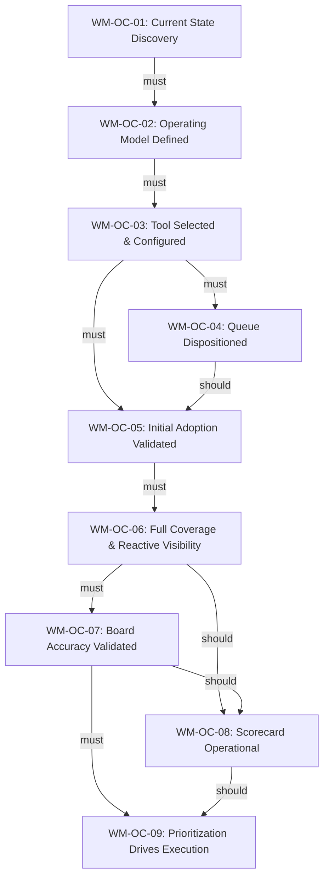

# WM-WBS: Work Management -- Outcome-Based Work Breakdown Structure

**Dynamo Consulting | DMSi Software**
**March 2026 | v1.1**
**Classification: Dynamo Confidential**

---

## 1. Purpose and Approach

This document defines the Work Management capability implementation using an outcome-based work breakdown structure. It replaces the sequential stage-gate model (WM-S0 through WM-S6) with a structure organized around measurable outcomes with target dates, non-linear dependencies, and explicit handling of iterative validation cycles.

### Why Outcome-Based

The original WBS organized work into 7 sequential stages with exit gates. In practice, several structural issues emerged:

- Stage 2 (Work Taxonomy Defined) carried copy/pasted prerequisites from Stage 4 (Team Using the System). The actual taxonomy work -- workflow states, work categories, product attribution, triage design, WIP limits, capacity allocation -- was not reflected in WM-S2's prereqs.
- Queue disposition (the 559 open cases in 360) is a distinct deliverable with its own success criteria, but was not represented in any stage. It can run in parallel with late tool configuration and early adoption work.
- The implementation plan identifies work that spans stages or has no stage equivalent: mixed pipeline handling, side-door capture policy, break-fix tagging, commitment tiers, and reference estimates by work type.
- Scorecard and flow metrics connection (Phase 4.4) can begin with partial data before full board accuracy is validated. The stage-gate model forces this to wait.
- The implementation plan reframes tool selection as a fit-to-process exercise that depends on the operating model, not on a tool comparison.

This structure makes those realities explicit. Every piece of work traces to an outcome. Dependencies are typed (must, should, contingent). Parallel execution is visible. Iterative cycles have defined policies.

### Resource and Timeline Constraints

- **Start date:** February 15, 2026 (Week 1 = Feb 16)
- **Deadline:** End of May 2026 (Week 15 = May 29)
- **Staffing:** 1 FTE Dynamo. DMSi contributes part-time participation from Bryan, Andy, Casora, and Brent at decision points.
- **Total estimated duration:** ~18 weeks (completion ~Jun 19, 2026)
- **Gap:** The realistic 18-week timeline extends approximately 3 weeks past the end-of-May deadline. WM-OC-01 through WM-OC-06 and WM-OC-08 fit within May. WM-OC-07 (Board Accuracy Validated) and WM-OC-09 (Prioritization Drives Execution) extend into June.
- **Current status (as of Mar 15, Week 4):** WM-OC-01 and WM-OC-02 are both complete.

**Options for stakeholder discussion:**

1. **Accept the ~3 week overshoot.** WM-OC-07 and WM-OC-09 close in June. The system is operational and producing data by end of May; the final validation and capstone outcomes land shortly after.
2. **Compress iterative validation periods.** Reduce WM-OC-05, WM-OC-06, and WM-OC-07 validation windows from 3-4 weeks to 2 weeks each. Recovers ~4 weeks but increases the risk of false-positive validation and rework.
3. **Reduce WM-OC-09 scope.** Prioritization compliance validation can be simplified to a 2-week observation period instead of 4 weeks, with the flow retrospective process documented but not yet proven.

### How to Read This Document

Each outcome follows a standard template:

- **Category**: Baseline (single-pass), Iterative (validation cycles), or Conditional (trigger-activated)
- **Target Date**: When the outcome should be complete (TBD placeholders for dates not yet set)
- **Success Criteria**: Measurable conditions that must be met to close the outcome
- **Deliverables**: Specific artifacts or completed actions (these become Jira Stories)
- **Dependencies**: What must/should be complete before this outcome can start or finish
- **Iteration Policy**: For Iterative outcomes, defines the validation period, cadence, max cycles, and fallback
- **Risks and Decisions**: Attached to the specific outcome they affect

---

## 2. Outcome Map

| ID | Outcome | Category | Target Date | Calendar | Milestone Alignment | Within May? |
|----|---------|----------|-------------|----------|---------------------|-------------|
| WM-OC-01 | Current State Discovery Complete | Baseline | Weeks 1-2 | Feb 16 - Feb 27 | -- | Yes (COMPLETE) |
| WM-OC-02 | Operating Model and Process Design Complete | Baseline | Weeks 2-3 | Feb 23 - Mar 6 | WM-M-2 (designed) | Yes (COMPLETE) |
| WM-OC-03 | Tool Selected and System Configured | Baseline | Weeks 3-5 | Mar 2 - Mar 20 | WM-M-2 (designed) | Yes |
| WM-OC-04 | Existing Queue Dispositioned | Baseline | Weeks 4-6 | Mar 9 - Mar 27 | -- | Yes |
| WM-OC-05 | Initial Adoption Validated | Iterative | Weeks 5-9 | Mar 16 - Apr 17 | WM-M-2 (implemented) | Yes |
| WM-OC-06 | Full Category Coverage and Reactive Visibility | Iterative | Weeks 9-14 | Apr 13 - May 22 | WM-M-2 (Scorecard input) | Yes |
| WM-OC-07 | Board Accuracy Validated | Iterative | Weeks 12-16 | May 4 - Jun 5 | -- | **No (+1 wk)** |
| WM-OC-08 | Flow Metrics and Scorecard Operational | Baseline | Weeks 10-14 | Apr 20 - May 22 | WM-M-2 (Scorecard operational) | Yes |
| WM-OC-09 | Prioritization Drives Execution | Baseline | Weeks 14-18 | May 18 - Jun 19 | -- | **No (+3 wks)** |

### Parallel Execution Summary

The following outcomes can run concurrently once their dependencies are met:

- **WM-OC-04** (Queue Disposition) can begin as soon as WM-OC-03 tool configuration is underway. It does not depend on WM-OC-03 being fully complete -- it needs the tool to exist, not to be finished. WM-OC-04 can also overlap with early WM-OC-05 adoption work.
- **WM-OC-08** (Scorecard) has a `should` dependency on WM-OC-07, not `must`. Scorecard design and initial metric wiring can begin during WM-OC-06 with partial data. Full validation happens after WM-OC-07 confirms board accuracy.

---

## 3. Dependency Graph

### Dependency Type Legend

- **must** (solid arrow): Hard prerequisite. The dependent outcome cannot start until the prerequisite is complete.
- **should** (solid arrow, labeled): Recommended sequence. Can proceed with documented risk acceptance.

---

## 4. Outcomes

---

### WM-OC-01: Current State Discovery Complete

**Category:** Baseline
**Target Date:** Weeks 1-2 (Feb 16 - Feb 27)
**Owner:** Dynamo (1 FTE) + Bryan + Andy (part-time)
**Status:** Complete
**Source:** WM-S0 (Access and Engagement), WM-S1 (Current State Documented)

#### Success Criteria

- [ ] Engineering team access established; discovery sessions conducted
- [ ] Work intake channels mapped (email, Teams, 360 tickets, hallway conversations)
- [ ] Existing tracking mechanisms identified (spreadsheets, personal lists, 360, nothing)
- [ ] Pain points documented (what gets lost, what causes confusion, single-point-of-failure routing)
- [ ] Volume and mix understood (reactive vs. planned work ratio, approximate weekly inflow)
- [ ] 360 case data evaluated (559 open cases analyzed for age, status, and relevance patterns)
- [ ] Side-door work patterns identified and quantified where possible

#### Deliverables

| ID | Deliverable | Owner | Due |
|----|-------------|-------|-----|
| WM-OC-01.1 | Discovery Sessions with Engineering Team | Dynamo + Bryan + Andy | [TBD] |
| WM-OC-01.2 | Workflow Mapping and Documentation | Dynamo | [TBD] |
| WM-OC-01.3 | 360 Case Evaluation | Dynamo + Bryan | [TBD] |
| WM-OC-01.4 | Current State Assessment Document | Dynamo | [TBD] |

**WM-OC-01.1: Discovery Sessions with Engineering Team**

- Conduct interviews and shadowing sessions with engineering team members
- Frame engagement as "fix the system" not "evaluate the people"
- Establish trust that the work is about helping, not judging
- Document how work actually enters, flows through, and exits (or stalls in) the team
- Identify the routing function owner (Casora) and document the current single-point-of-failure pattern

**WM-OC-01.2: Workflow Mapping and Documentation**

- Map all work intake channels: 360 cases, email, Teams messages, hallway conversations, incident follow-up
- Document which channels produce visible work vs. invisible work
- Quantify the approximate split between planned and reactive work based on team interviews
- Identify the five structural gaps: no formal triage, push-based assignment, no WIP discipline, meaningless priority, no feedback loop to staffing

**WM-OC-01.3: 360 Case Evaluation**

- Export and analyze the 559 open cases in 360
- Categorize by age, status, work type, and apparent relevance
- Identify patterns: how many are stale, how many are duplicates, how many represent real outstanding work
- Produce a disposition recommendation (feeds WM-OC-04)

**WM-OC-01.4: Current State Assessment Document**

- Consolidate findings into a single assessment document
- Document the five structural gaps with evidence from discovery
- Include the design criteria that the implementation must satisfy
- This document becomes the foundation for WM-OC-02 operating model design

#### Dependencies

| Depends On | Type | Description |
|------------|------|-------------|
| None | -- | This is the starting outcome |

#### Risks

| Risk ID | Severity | Description | Mitigation |
|---------|----------|-------------|------------|
| WM-R-01 | MEDIUM | Team provides "polished answers" rather than honest assessment of how work actually flows | Frame as system improvement, not evaluation; demonstrate value through early quick wins |
| WM-R-02 | LOW | Discovery reveals more complexity than expected (additional shadow systems, undocumented processes) | Budget flexibility in weeks 1-2; document what is found and adjust operating model scope |

---

### WM-OC-02: Operating Model and Process Design Complete

**Category:** Baseline
**Target Date:** Weeks 2-3 (Feb 23 - Mar 6)
**Owner:** Dynamo (1 FTE) + Bryan + Andy (part-time)
**Status:** Complete
**Source:** WM-S2 (Work Taxonomy Defined -- with corrected prereqs), Phase 1

This is the highest-leverage outcome in the implementation. It produces the operating agreement that the tool will enforce. Getting this wrong means configuring a system nobody has agreed to use, or building workflows before the team understands why the current approach isn't working.

#### Success Criteria

- [ ] Workflow states defined and agreed (Submitted, Triaged, Queued, In Progress, Blocked, Complete, Deferred)
- [ ] Work categories defined with product attribution model
- [ ] Mixed pipeline handling designed (planned work vs. break-fix two-track triage path)
- [ ] Side-door capture mechanism designed
- [ ] Triage ceremony designed (attendees, cadence, agenda, decision framework)
- [ ] WIP limits set (per-engineer and team-level)
- [ ] Capacity allocation model documented (reactive/planned/improvement percentages)
- [ ] One-page operating agreement reviewed and committed to by the team

#### Deliverables

| ID | Deliverable | Owner | Due |
|----|-------------|-------|-----|
| WM-OC-02.1 | Workflow State Design | Dynamo + Bryan + Andy | [TBD] |
| WM-OC-02.2 | Work Category Taxonomy and Product Attribution | Dynamo + Bryan | [TBD] |
| WM-OC-02.3 | Mixed Pipeline and Side-Door Policy | Dynamo + Bryan + Andy | [TBD] |
| WM-OC-02.4 | Triage Ceremony Design | Dynamo + Bryan + Andy | [TBD] |
| WM-OC-02.5 | WIP Limits and Capacity Allocation Model | Dynamo + Bryan + Andy | [TBD] |
| WM-OC-02.6 | Operating Agreement Document | Dynamo | [TBD] |

**WM-OC-02.1: Workflow State Design**

- Define mutually exclusive, collectively exhaustive status transitions
- Starting point from discovery: Submitted, Triaged, Queued, In Progress, Blocked, Complete, Deferred
- Critical distinction: Queued vs. In Progress (this is what makes WIP limits possible)
- Validate with Bryan and Andy that states reflect how work actually moves through the team
- Document transition rules (who can move items between states, what triggers each transition)

**WM-OC-02.2: Work Category Taxonomy and Product Attribution**

- Define initial work categories: customer environment configuration, infrastructure/platform maintenance, tooling improvements, escalation follow-up, internal requests, improvement/automation projects
- Include break-fix as a category for counting purposes even though it follows a fast-track path
- Define product field (Agility, Framework, etc.) as a separate dimension from work type
- Product list drawn from existing 360 taxonomy, cleaned up if needed
- Sub-product granularity deferred until top-level data proves useful
- Define priority criteria that replace the current "71% Normal" meaningless priority model

**WM-OC-02.3: Mixed Pipeline and Side-Door Policy**

- Design two-track triage path: planned/plannable work follows full triage flow; break-fix gets tagged and fast-tracked
- Break-fix standing agenda item at triage: "What came in as break-fix since last session?" -- tag, count, move on (target: 5 minutes)
- Design lightweight "capture after the fact" mechanism for side-door work: what it was, how long it took, tag indicating it arrived outside normal intake
- Standing triage question: "What did you work on this week that isn't on the board?"
- Define the metric: planned vs. unplanned work ratio -- baseline measurement, not a performance target initially

**WM-OC-02.4: Triage Ceremony Design**

- Define attendees: Bryan, Andy, and routing function owner (Casora)
- Initial cadence: twice weekly during adoption (Phase 3/WM-OC-05), moving to weekly once habit is formed (WM-OC-06)
- Agenda: new submissions, break-fix fast-track, blocked items, aging items, side-door check
- Decision framework: accept into queue, defer with reason, or reject
- Key question at triage: "What does this displace, and is that the right trade?"
- Target: 30 minutes, hard stop
- Define how decisions get communicated back to requesters

**WM-OC-02.5: WIP Limits and Capacity Allocation Model**

- Set initial per-engineer WIP limits: 3-5 items in "In Progress" simultaneously
- Set team-level WIP visibility on the board
- Define capacity allocation starting point based on discovery data: reactive/unplanned 60-70%, planned work 20-30%, improvement work 10-15%
- Document that these are honest starting points, not aspirational targets
- Define pull model: engineers pull from prioritized queue when below WIP limit, not push-based assignment
- Within a priority band, engineers can influence sequencing for efficiency (batching similar work, leveraging context)

**WM-OC-02.6: Operating Agreement Document**

- One-page operating agreement consolidating all Phase 1 deliverables
- Reviewed and committed to by Bryan, Andy, and the engineering team
- This document is the configuration specification for WM-OC-03 (tool setup)

#### Dependencies

| Depends On | Type | Description |
|------------|------|-------------|
| WM-OC-01 | must | Current state assessment must be complete before designing the operating model; otherwise we design for how we imagine work flows, not how it actually flows |

#### Risks

| Risk ID | Severity | Description | Mitigation |
|---------|----------|-------------|------------|
| WM-R-03 | MEDIUM | Team over-designs the taxonomy (too many categories, too many fields, too much granularity) | Start minimal; iterate after 90 days of data. Every additional field is friction at intake that reduces adoption |
| WM-R-04 | LOW | Disagreement on WIP limits stalls the operating model | WIP limits will be wrong initially and that's fine. The conversation about limits is more valuable than the specific number. Set initial limits and agree to adjust based on data |

#### Decisions Required

| ID | Type | Decision | Owner | Required By |
|----|------|----------|-------|-------------|
| WM-D-01 | TYPE 2 | Does the routing function formalize into the triage ceremony, or does Casora's role continue as a pre-triage screening step? | Bryan + Andy | WM-OC-02.4 |
| WM-D-02 | TYPE 2 | What is the right triage group? Bryan + Andy + routing function owner, or smaller? | Bryan | WM-OC-02.4 |
| WM-D-03 | TYPE 2 | Should Progress Engineering (Bob Dixon's side) be included in initial rollout or phased in after Systems Engineering adopts? | Bryan + Brent | WM-OC-02.6 |

---

### WM-OC-03: Tool Selected and System Configured

**Category:** Baseline
**Target Date:** Weeks 3-5 (Mar 2 - Mar 20)
**Owner:** Dynamo (1 FTE) + Bryan + Andy (part-time)
**Status:** Not Started
**Source:** WM-S3 (System Configured and Ready), Phase 2.1-2.2

Tool selection is a fit-to-process exercise, not a feature comparison. The operating agreement from WM-OC-02 defines what the tool must support. The decision is driven by which tool best supports the workflow the team just defined.

#### Success Criteria

- [ ] Tool evaluated against WM-OC-02 operating agreement requirements
- [ ] Tool selected and decision documented
- [ ] Board configured to match agreed workflow states exactly
- [ ] Work category and product fields configured
- [ ] Intake mechanism configured (low friction, minimal required fields)
- [ ] Priority field configured with defined criteria
- [ ] System ready for the team to start using
- [ ] No over-configuration (no custom fields beyond the operating agreement, no complex automation, no advanced dashboards)

#### Deliverables

| ID | Deliverable | Owner | Due |
|----|-------------|-------|-----|
| WM-OC-03.1 | Tool Evaluation Against Requirements | Dynamo + Bryan + Andy | [TBD] |
| WM-OC-03.2 | Tool Selection Decision | Bryan + Andy + Brent | [TBD] |
| WM-OC-03.3 | System Configuration | Dynamo + Bryan | [TBD] |

**WM-OC-03.1: Tool Evaluation Against Requirements**

- Evaluate candidate tools against non-negotiable requirements from WM-OC-02: simple intake, kanban visualization, WIP limits (visible at minimum, enforced ideally), flexible categorization, product field support, basic flow reporting (cycle time, throughput, aging), clear ownership with explicit status transitions
- Evaluate nice-to-haves: intake forms for single front door, workload view per person, PagerDuty integration path, API access for Engineering Scorecard
- Candidate tools: Jira Service Management, GitHub Projects, Teamwork, monday.com (Kanban mode), Shortcut
- Resolve the relationship between the work management system and 360: does 360 remain the intake point with items promoted, or does the new system replace 360 for engineering work entirely? (WM-D-04)

**WM-OC-03.2: Tool Selection Decision**

- Document the decision with rationale tied to operating agreement fit
- Include Brent in the decision for budget and strategic alignment

**WM-OC-03.3: System Configuration**

- Board columns matching the agreed workflow states from WM-OC-02.1
- Work category field with categories from WM-OC-02.2
- Product field (Agility, Framework, etc.) from WM-OC-02.2
- Owner field (populated when an engineer pulls the item, not at triage)
- Submission date (automatic)
- Priority field with defined criteria from WM-OC-02.2
- Do NOT configure: custom fields beyond the above, complex automation rules, integrations beyond basic SSO, advanced reporting dashboards

#### Dependencies

| Depends On | Type | Description |
|------------|------|-------------|
| WM-OC-02 | must | Operating model must be defined before tool can be selected or configured; this prevents the common failure mode of configuring a system nobody has agreed to use |

#### Risks

| Risk ID | Severity | Description | Mitigation |
|---------|----------|-------------|------------|
| WM-R-05 | HIGH | Tool over-configuration during initial setup. Temptation to add fields, automations, and workflow branches | Hard rule: no configuration beyond the operating agreement during setup. Iteration comes after adoption (WM-OC-06+) |
| WM-R-06 | MEDIUM | Tool selection delayed by stakeholder disagreement or procurement process | Frame as fit-to-process, not feature comparison. The operating agreement makes the evaluation criteria objective. Escalate to Brent if decision stalls beyond 1 week |
| WM-R-07 | MEDIUM | 360 relationship question (WM-D-04) unresolved, creating confusion about where work lives | Resolve WM-D-04 before configuration begins. Dual systems with unclear boundaries will undermine adoption |

#### Decisions Required

| ID | Type | Decision | Owner | Required By |
|----|------|----------|-------|-------------|
| WM-D-04 | TYPE 1 | What is the relationship between the work management system and 360? Does 360 remain intake with promotion, or does the new system replace 360 for engineering work? | Bryan + Andy + Brent | WM-OC-03.1 |
| WM-D-05 | TYPE 2 | Tool selection (Jira, GitHub Projects, Teamwork, monday.com, Shortcut, or other) | Bryan + Andy + Brent | WM-OC-03.2 |

---

### WM-OC-04: Existing Queue Dispositioned

**Category:** Baseline
**Target Date:** Weeks 4-6 (Mar 9 - Mar 27)
**Owner:** Dynamo (1 FTE) + Bryan + Andy + Casora (part-time)
**Status:** Not Started
**Source:** Phase 2.3

The 559 open cases in 360 need a disposition decision, not a bulk migration. A mass import of stale items would poison the new system on day one. This outcome produces a curated backlog of known, triaged items -- itself a material improvement in visibility.

#### Success Criteria

- [ ] All 559 open cases reviewed and categorized: still relevant, closeable, or needs investigation
- [ ] "Still relevant" items migrated to the new system with minimal cleanup
- [ ] "Closeable" items closed in 360 with documented rationale
- [ ] "Needs investigation" items triaged in the first 2-3 triage ceremonies
- [ ] Net result: curated backlog of known, triaged items in the new system

#### Deliverables

| ID | Deliverable | Owner | Due |
|----|-------------|-------|-----|
| WM-OC-04.1 | Queue Review and Categorization | Dynamo + Bryan + Andy + Casora | [TBD] |
| WM-OC-04.2 | Migration of Relevant Items | Dynamo + Bryan | [TBD] |
| WM-OC-04.3 | Stale Item Closure | Bryan + Casora | [TBD] |

**WM-OC-04.1: Queue Review and Categorization**

- Review all 559 open cases with Bryan, Andy, and Casora
- Categorize each case: still relevant (migrate), can be closed (close in 360), needs investigation (flag for triage)
- Use the analysis from WM-OC-01.3 as the starting point

**WM-OC-04.2: Migration of Relevant Items**

- Migrate "still relevant" items into the new system with minimal cleanup
- Apply work category and product tags from WM-OC-02 taxonomy
- Do not enrich beyond minimum fields -- the team will update items as they work them

**WM-OC-04.3: Stale Item Closure**

- Close stale and resolved items in 360 with brief documented rationale
- Use the first 2-3 triage ceremonies to work through "needs investigation" items

#### Dependencies

| Depends On | Type | Description |
|------------|------|-------------|
| WM-OC-03 | must | Tool must exist before items can be migrated into it |
| WM-OC-01.3 | should | 360 case evaluation provides the starting analysis for disposition decisions |

#### Risks

| Risk ID | Severity | Description | Mitigation |
|---------|----------|-------------|------------|
| WM-R-08 | MEDIUM | Queue cleanup consumes disproportionate energy if treated as a migration project | Triage the queue, don't migrate it wholesale. Most items are likely closeable or already resolved. Timebox the review sessions |

---

### WM-OC-05: Initial Adoption Validated

**Category:** Iterative
**Target Date:** Weeks 5-9 (Mar 16 - Apr 17)
**Owner:** Dynamo (1 FTE) + Bryan + Andy (part-time)
**Status:** Not Started
**Source:** WM-S4 (Team Using the System), Phase 3

This is the "training wheels" stage. The primary focus is planned work starting with one category (customer environment configuration), but the system accounts for break-fix and side-door work from day one through tagging and counting. Ignoring reactive work during initial adoption creates a board that doesn't match reality.

#### Success Criteria

- [ ] Engineering team consistently entering planned work into the system for the initial category (customer environment configuration)
- [ ] Triage ceremony running twice weekly with consistent attendance
- [ ] WIP limits respected (or consciously adjusted with rationale)
- [ ] Break-fix tagging operational (cases tagged and counted at triage)
- [ ] Side-door capture operational (after-the-fact entries being created)
- [ ] Board reflects current reality for the initial work category
- [ ] Bryan and Andy can open the board and trust what they see
- [ ] Adoption metrics meeting targets (see iteration policy)

#### Deliverables

| ID | Deliverable | Owner | Due |
|----|-------------|-------|-----|
| WM-OC-05.1 | Team Orientation | Dynamo + Bryan | [TBD] |
| WM-OC-05.2 | Break-Fix and Side-Door Capture Established | Dynamo + Bryan | [TBD] |
| WM-OC-05.3 | First Category Adoption (Customer Environment Configuration) | Bryan + Andy | [TBD] |
| WM-OC-05.4 | First Triage Ceremonies | Bryan + Andy + Casora | [TBD] |
| WM-OC-05.5 | Adoption Measurement Report | Dynamo | [TBD] |

**WM-OC-05.1: Team Orientation**

- Walk the engineering team through the system with emphasis on: how to submit, how to pull from the queue, what workflow states mean, how WIP limits work, what happens at triage
- Frame as "making your work visible" rather than "tracking your work." The first framing creates value for the engineer; the second creates overhead
- Dynamo co-facilitates the first 4-6 weeks of triage sessions

**WM-OC-05.2: Break-Fix and Side-Door Capture Established**

- Break-fix cases arriving through 360 get tagged at triage and counted, not sequenced
- Engineers capture side-door work after the fact: what it was, roughly how long, tag indicating it came outside normal path
- Framed as "help us understand the real demand picture" not "justify your time"
- These two practices produce the data that makes the capacity allocation model honest

**WM-OC-05.3: First Category Adoption (Customer Environment Configuration)**

- Start with highest-volume category: customer environment configuration (70-80% of noise per Bryan and Andy)
- Run the first 2-3 triage ceremonies focused on this category
- Let the team build the habit on contained scope before expanding in WM-OC-06

**WM-OC-05.4: First Triage Ceremonies**

- Bryan (or Andy) facilitates; Dynamo co-facilitates first 4-6 weeks
- Walk through every new submission; make explicit accept/defer/reject decisions with rationale
- Check WIP limits against what engineers currently have in progress
- Review blocked items; keep to 30 minutes
- Even if only three new items, hold the meeting. The cadence is the muscle being built

**WM-OC-05.5: Adoption Measurement Report**

- Measure adoption indicators, NOT performance indicators during this phase
- Metrics: % of actual work captured (target: 80%+ within 60 days), average time from submission to triage, WIP limit adherence, board freshness (% items updated in last 5 business days), side-door capture rate, planned vs. reactive ratio (baseline only)
- Do NOT measure cycle time or throughput yet. Data won't be meaningful until at least one full cycle

#### Dependencies

| Depends On | Type | Description |
|------------|------|-------------|
| WM-OC-03 | must | System must be configured and ready before team can start using it |
| WM-OC-04 | should | Queue disposition should be substantially complete so the team starts with a curated backlog, not 559 stale items |

#### Iteration Policy

- **Validation period:** 4 weeks of consistent adoption
- **Review cadence:** Weekly adoption metric review (Dynamo + Bryan)
- **Max iterations:** 2 cycles (if adoption metrics are not met after first 4-week cycle, diagnose root cause, adjust, and re-measure)
- **Fallback:** If adoption fails after 2 cycles, conduct a retrospective to determine whether the issue is process design (fix WM-OC-02), tool friction (fix WM-OC-03), or cultural resistance (escalate to Brent)

#### Risks

| Risk ID | Severity | Description | Mitigation |
|---------|----------|-------------|------------|
| WM-R-09 | HIGH | Adoption resistance. The team has operated without formal work management for a long time | Start with one category; frame as "making your work visible"; demonstrate value in the first triage ceremonies by resolving items that have been stuck |
| WM-R-10 | HIGH | Triage ceremony decay. Twice-weekly triage starts strong then gets skipped or becomes perfunctory | Bryan owns the ceremony. If Bryan treats it as non-negotiable, the team will too. Dynamo co-facilitates first 4-6 weeks |
| WM-R-11 | MEDIUM | Side-door work capture is ignored because it feels like overhead | Frame as "two-minute entry that makes the capacity picture honest." Track capture rate as a leading indicator. If capture declines, investigate friction |

---

### WM-OC-06: Full Category Coverage and Reactive Visibility

**Category:** Iterative
**Target Date:** Weeks 9-14 (Apr 13 - May 22)
**Owner:** Dynamo (1 FTE) + Bryan + Andy (part-time)
**Status:** Not Started
**Source:** Phase 4.1-4.3

Once the team is reliably using the system for one category, expand to full coverage. The shift for reactive work tracking moves from "capture after the fact so we can count it" to "route it through the system so we can analyze it."

#### Success Criteria

- [ ] All planned work categories in the system (not just customer environment configuration)
- [ ] PagerDuty integration operational: incidents auto-create follow-up work items when resolved
- [ ] Commitment tiers in use (committed this cycle, targeted next, backlog)
- [ ] Capacity ratio visible: planned vs. reactive work by week, by engineer, by category
- [ ] Break-fix and side-door volume trending: ratio of planned vs. unplanned shifting toward planned
- [ ] Triage cadence evaluated for transition to weekly

#### Deliverables

| ID | Deliverable | Owner | Due |
|----|-------------|-------|-----|
| WM-OC-06.1 | Remaining Work Category Adoption | Bryan + Andy | [TBD] |
| WM-OC-06.2 | PagerDuty Integration for Reactive Work | Dynamo + Bryan | [TBD] |
| WM-OC-06.3 | Commitment Tier Implementation | Dynamo + Bryan + Andy | [TBD] |
| WM-OC-06.4 | Triage Cadence Evaluation | Bryan + Dynamo | [TBD] |

**WM-OC-06.1: Remaining Work Category Adoption**

- Extend beyond customer environment configuration to include: infrastructure/platform maintenance, tooling improvements, escalation follow-up, internal requests, improvement/automation projects
- By this point the team has muscle memory for intake, triage, and status updates, so extending is habit extension, not behavior change

**WM-OC-06.2: PagerDuty Integration for Reactive Work**

- Connect PagerDuty incidents to the work management system
- PagerDuty still owns the incident lifecycle -- the integration creates work items when incidents resolve to capture follow-up work and time spent
- This replaces manual break-fix tagging from WM-OC-05.2 and improves data quality
- With several weeks of data, engineering leadership now has a real capacity ratio view

**WM-OC-06.3: Commitment Tier Implementation**

- Introduce three commitment tiers: committed this cycle (small set, high confidence), targeted next (planned but could shift), backlog (acknowledged, not scheduled)
- Gives stakeholders a clear answer to "where does my request stand?" without status meetings
- Configure in the tool as board swimlanes, labels, or custom field depending on tool selected in WM-OC-03

**WM-OC-06.4: Triage Cadence Evaluation**

- Evaluate whether twice-weekly can move to weekly
- Signals the team is ready: queue inflow predictable, mid-session expedites rare (once a week or less), team pulling from queue consistently, triage sessions finishing under 30 minutes
- If conditions aren't met, stay at twice weekly. Weekly is the target, not a deadline

#### Dependencies

| Depends On | Type | Description |
|------------|------|-------------|
| WM-OC-05 | must | Team must be consistently using the system for the initial category before expanding scope |

#### Iteration Policy

- **Validation period:** 4 weeks of full-category data flowing
- **Review cadence:** Biweekly review of category coverage and data quality
- **Max iterations:** 2 cycles (if new categories aren't being used after first cycle, investigate whether the issue is awareness, friction, or relevance)
- **Fallback:** If specific categories have persistently low adoption, investigate whether those categories belong in this system or represent a different workflow

#### Risks

| Risk ID | Severity | Description | Mitigation |
|---------|----------|-------------|------------|
| WM-R-12 | MEDIUM | PagerDuty integration creates noise -- auto-generated work items for trivial incidents | Configure integration with severity threshold; only P1/P2 incidents auto-create follow-up items initially |
| WM-R-13 | LOW | Commitment tier adoption adds complexity that slows the team | Introduce tiers only after triage is running smoothly. If tiers create confusion, simplify to two tiers (committed vs. backlog) |

#### Decisions Required

| ID | Type | Decision | Owner | Required By |
|----|------|----------|-------|-------------|
| WM-D-06 | TYPE 2 | PagerDuty integration scope: all incidents or severity threshold? | Bryan + Andy | WM-OC-06.2 |
| WM-D-07 | TYPE 2 | Commitment tier model: three tiers (committed/targeted/backlog) or two (committed/backlog)? | Bryan | WM-OC-06.3 |

---

### WM-OC-07: Board Accuracy Validated

**Category:** Iterative
**Target Date:** Weeks 12-16 (May 4 - Jun 5) -- extends ~1 week past end-of-May
**Owner:** Dynamo (1 FTE) + Bryan + Andy (part-time)
**Status:** Not Started
**Source:** WM-S5 (Work Visible and Current), Phase 4.5

The system reflects reality. What's in progress is actually in progress. What's blocked is marked blocked. Updates happen without chasing. This is the trust gate -- until the board is accurate, no downstream decision-making (WM-OC-09) or metrics (WM-OC-08) can be fully trusted.

#### Success Criteria

- [ ] Team habit formed: updating status is part of the workflow, not a separate task
- [ ] Staleness caught and corrected quickly (no items >5 business days without update)
- [ ] Work items have enough detail to be actionable by someone other than the creator
- [ ] Blocked items surface with clear blockers identified
- [ ] No competing "shadow" spreadsheets or personal tracking systems
- [ ] Board freshness sustained at 90%+ (items updated within 5 business days) for 3 consecutive weeks
- [ ] Bryan and Andy confirm: "When we open the board, we trust what we see"

#### Deliverables

| ID | Deliverable | Owner | Due |
|----|-------------|-------|-----|
| WM-OC-07.1 | Board Freshness Monitoring | Dynamo | [TBD] |
| WM-OC-07.2 | Staleness Detection and Correction Process | Bryan + Dynamo | [TBD] |
| WM-OC-07.3 | Board Trust Validation | Bryan + Andy | [TBD] |

**WM-OC-07.1: Board Freshness Monitoring**

- Implement automated or manual board freshness tracking: % of items with status update in last 5 business days
- Surface stale items at each triage ceremony
- Track freshness trend over time

**WM-OC-07.2: Staleness Detection and Correction Process**

- Define what "stale" means (>5 business days without update is the starting threshold)
- Establish lightweight correction process: stale items flagged at triage, owner asked to update or explain
- If staleness persists for specific engineers, investigate whether the issue is habit, tool friction, or workload

**WM-OC-07.3: Board Trust Validation**

- Informal validation: Bryan and Andy confirm the board reflects reality
- Check for shadow systems: are there spreadsheets, personal lists, or email threads that contain work information not on the board?
- If shadow systems exist, determine why (friction, missing features, habit) and address root cause

#### Dependencies

| Depends On | Type | Description |
|------------|------|-------------|
| WM-OC-06 | must | Full category coverage must be in place before board accuracy can be meaningfully validated across all work types |

#### Iteration Policy

- **Validation period:** 3 consecutive weeks at 90%+ board freshness
- **Review cadence:** Weekly freshness review
- **Max iterations:** 3 cycles (if freshness target not met, investigate root cause: tool friction, unclear expectations, or workload preventing updates)
- **Fallback:** If board freshness cannot sustain 90% after 3 cycles, reduce the threshold to 80% and schedule a retrospective to identify systemic barriers

#### Risks

| Risk ID | Severity | Description | Mitigation |
|---------|----------|-------------|------------|
| WM-R-14 | HIGH | Board accuracy erodes over time as initial enthusiasm fades | Make freshness a standing triage metric; Bryan reinforces as a team norm |
| WM-R-15 | MEDIUM | Shadow spreadsheets persist because they serve a need the board doesn't (e.g., personal task tracking, customer-specific views) | Investigate what shadow systems provide that the board doesn't; add those features to the tool if justified |

---

### WM-OC-08: Flow Metrics and Scorecard Operational

**Category:** Baseline
**Target Date:** Weeks 10-14 (Apr 20 - May 22)
**Owner:** Dynamo (1 FTE) + Bryan + Brent (part-time)
**Status:** Not Started
**Source:** Phase 4.4, Phase 4.6

The work management system produces the flow metrics that feed the Engineering Scorecard and provide the evidence base for staffing conversations. This outcome can begin design work during WM-OC-06 with partial data, finalizing after WM-OC-07 confirms board accuracy.

#### Success Criteria

- [ ] Cycle time for planned work measurable by category
- [ ] Throughput (items completed per cycle) tracked and trending
- [ ] Planned vs. reactive work ratio visible and tracked over time
- [ ] Queue depth and aging visible (how many items waiting, for how long)
- [ ] WIP limit adherence tracked
- [ ] Initial reference estimates documented for high-volume work types (empirical baselines from historical actuals)
- [ ] Metrics flowing to Engineering Scorecard (Workstream D dependency)
- [ ] Brent has the visibility needed for strategic capacity and investment decisions

#### Deliverables

| ID | Deliverable | Owner | Due |
|----|-------------|-------|-----|
| WM-OC-08.1 | Flow Metrics Configuration | Dynamo | [TBD] |
| WM-OC-08.2 | Reference Estimates by Work Type | Dynamo + Bryan | [TBD] |
| WM-OC-08.3 | Scorecard Integration | Dynamo + Bryan + Brent | [TBD] |

**WM-OC-08.1: Flow Metrics Configuration**

- Configure cycle time, throughput, aging, and queue depth reporting in the selected tool
- Build views that show planned vs. reactive ratio by week, by engineer, by category
- Ensure metrics are accessible without requiring manual compilation

**WM-OC-08.2: Reference Estimates by Work Type**

- Pull cycle time data by category after several months of categorized work has flowed through the system
- Identify clusters: customer environment builds average X hours, infrastructure tickets average Y days
- Document as reference ranges, not promises
- These baselines feed the capacity model: if a customer environment build takes ~3 hours and the team averages 8 per week, that's 24 hours of known demand against known capacity

**WM-OC-08.3: Scorecard Integration**

- Connect flow metrics to the Engineering Scorecard (Workstream D alignment)
- Ensure Brent has access to capacity ratio view without attending operational ceremonies
- Metrics feed staffing conversations with numbers behind them, not qualitative assertions

#### Dependencies

| Depends On | Type | Description |
|------------|------|-------------|
| WM-OC-06 | should | Full category data should be flowing for metrics to be meaningful across all work types |
| WM-OC-07 | should | Board accuracy should be validated so metrics reflect reality, not stale data |

#### Risks

| Risk ID | Severity | Description | Mitigation |
|---------|----------|-------------|------------|
| WM-R-16 | MEDIUM | Measuring too early -- pressure to show cycle time and throughput improvements before enough data exists | WM-M-2 success criteria should be adoption metrics, not performance metrics. Reference estimates require 90+ days of categorized data |
| WM-R-17 | LOW | Reference estimates create a perception of "time tracking" and engineer pushback | Frame as team reference ranges from historical data, not individual performance measurement |

---

### WM-OC-09: Prioritization Drives Execution

**Category:** Baseline
**Target Date:** Weeks 14-18 (May 18 - Jun 19) -- extends ~3 weeks past end-of-May
**Owner:** Bryan + Andy + Brent (Dynamo advisory)
**Status:** Not Started
**Source:** WM-S6 (Prioritization Drives Execution)

This is the capstone outcome. Decisions made in the system are reflected in what the team actually works on. The backlog is authoritative. The system governs, not just informs.

#### Success Criteria

- [ ] Team pulls planned work from the system, not from side channels
- [ ] Priority changes in the system change what gets worked on
- [ ] Engineering leadership can reallocate capacity and see it happen
- [ ] Competing requests get triaged through the system, not around it
- [ ] Side-door work ratio declining (measured against WM-OC-05/WM-OC-06 baseline)
- [ ] Stakeholders use the system to check status rather than asking individuals
- [ ] Bryan and Andy confirm: "When we change priorities, the team responds through the system"

#### Deliverables

| ID | Deliverable | Owner | Due |
|----|-------------|-------|-----|
| WM-OC-09.1 | Prioritization Compliance Validation | Bryan + Andy + Dynamo | [TBD] |
| WM-OC-09.2 | Flow Retrospective Process | Bryan + Dynamo | [TBD] |

**WM-OC-09.1: Prioritization Compliance Validation**

- Observe patterns over 2-3 weeks: when priorities change in the system, does the team's actual work change?
- Measure side-door ratio trend: is invisible work declining?
- Validate that competing requests flow through triage, not around it
- Document any persistent bypasses and determine root cause

**WM-OC-09.2: Flow Retrospective Process**

- Introduce biweekly or monthly retrospectives focused on flow
- Key question: "Where did work get stuck and why?" rather than "Did we finish everything?"
- This separates teams that stay disciplined from teams that regress
- Document the retrospective format for ongoing use after Dynamo engagement

#### Dependencies

| Depends On | Type | Description |
|------------|------|-------------|
| WM-OC-07 | must | Board must be accurate and trusted before it can govern behavior |
| WM-OC-08 | should | Flow metrics should be operational so retrospectives and prioritization decisions are data-informed |

#### Risks

| Risk ID | Severity | Description | Mitigation |
|---------|----------|-------------|------------|
| WM-R-18 | HIGH | System exists but doesn't govern. Engineering leaders have visibility but not control. Individual decisions still override the board | Bryan must enforce that priority changes go through the system. Brent reinforces at leadership level. Dynamo observes and flags bypass patterns |
| WM-R-19 | MEDIUM | Regression after Dynamo engagement ends. Without external accountability, discipline fades | Build the retrospective habit before engagement ends. Flow metrics provide self-correcting signal. Brent's Scorecard visibility creates ongoing accountability |

---

## 5. Cross-Cutting Risks

The following risks apply across multiple outcomes and are tracked at the engagement level.

| Risk ID | Description | Probability | Impact | Owner | Mitigation |
|---------|-------------|-------------|--------|-------|------------|
| WM-R-09 | Adoption resistance -- team has operated without formal work management for a long time | HIGH | HIGH | Bryan + Dynamo | Start with one category; frame as value creation not tracking; demonstrate quick wins in first triage |
| WM-R-10 | Triage ceremony decay -- twice-weekly starts strong then gets skipped | MEDIUM | HIGH | Bryan | Bryan owns and treats as non-negotiable; Dynamo co-facilitates first 4-6 weeks |
| WM-R-05 | Tool over-configuration -- adding complexity before adoption is established | MEDIUM | HIGH | Dynamo | Hard rule: no config changes during WM-OC-05 unless team requests them |
| WM-R-18 | System doesn't govern -- visibility without control, individual decisions override the board | MEDIUM | HIGH | Bryan + Brent | Brent reinforces at leadership level; retrospective habit provides self-correcting signal |
| WM-R-07 | 360 relationship unclear -- dual systems with ambiguous boundaries | MEDIUM | MEDIUM | Bryan + Andy | Resolve WM-D-04 before WM-OC-03 configuration begins |
| WM-R-16 | Measuring too early -- pressure to show performance improvements before data exists | LOW | MEDIUM | Dynamo + Brent | WM-M-2 success criteria focused on adoption metrics, not performance metrics |

---

## 6. Decision Register

Each decision is classified using the Type 1 / Type 2 framework. Type 1 decisions are one-way doors (irreversible) and require deliberate process. Type 2 decisions are two-way doors (reversible) and should be made quickly.

| ID | Type | Decision | Owner | Required By | Status |
|----|------|----------|-------|-------------|--------|
| WM-D-04 | TYPE 1 | Relationship between work management system and 360 (replace vs. promote) | Bryan + Andy + Brent | WM-OC-03.1 | OPEN |
| WM-D-01 | TYPE 2 | Does routing function formalize into triage, or does Casora pre-screen? | Bryan + Andy | WM-OC-02.4 | OPEN |
| WM-D-02 | TYPE 2 | Triage group composition | Bryan | WM-OC-02.4 | OPEN |
| WM-D-03 | TYPE 2 | Progress Engineering (Bob Dixon) in initial rollout or phased? | Bryan + Brent | WM-OC-02.6 | OPEN |
| WM-D-05 | TYPE 2 | Tool selection | Bryan + Andy + Brent | WM-OC-03.2 | OPEN |
| WM-D-06 | TYPE 2 | PagerDuty integration scope (all incidents vs. severity threshold) | Bryan + Andy | WM-OC-06.2 | OPEN |
| WM-D-07 | TYPE 2 | Commitment tier model (three tiers vs. two) | Bryan | WM-OC-06.3 | OPEN |

---

## 7. Open Questions

### Feeding Type 1 Decisions -- Answer Before Acting

- **WM-Q-01** [feeds WM-D-04]: What is the current contractual or organizational commitment to 360? Can engineering work be moved off 360, or must it remain there? Owner: Bryan + Brent. Required: before WM-OC-03.

### Feeding Type 2 Decisions -- Answer Quickly, Correct If Wrong

- **WM-Q-02** [feeds WM-D-01]: How much pre-triage screening does Casora currently do? Is it purely routing, or does she make accept/defer decisions? Owner: Bryan. Required: before WM-OC-02.4.
- **WM-Q-03** [feeds WM-D-03]: What is the current workload and process maturity of Bob Dixon's Progress Engineering team? Are they candidates for immediate inclusion or would they benefit from seeing Systems Engineering adopt first? Owner: Bryan + Brent.
- **WM-Q-04** [feeds WM-D-05]: Does DMSi have existing licenses for any candidate tools (Jira, GitHub Enterprise, etc.)? Owner: Andy + Brent.
- **WM-Q-05** [feeds WM-D-06]: What is the current PagerDuty incident volume by severity? How many P1/P2 incidents per week generate follow-up engineering work? Owner: Bryan + Andy.
- **WM-Q-06**: What is the current weekly inflow of new cases into 360 for the engineering team? This directly affects triage ceremony load and cadence decisions. Owner: Bryan + Casora.
- **WM-Q-07**: Are there existing SLAs or commitments tied to 360 case response times that the new system must honor? Owner: Bryan + Brent.

---

## 8. Cross-Workstream Dependencies

| Dep ID | External Workstream | External Outcome | Internal Outcome | Type | Coordination |
|--------|--------------------|--------------------|-------------------|------|--------------|
| WM-CW-01 | Workstream D (Strategic Visibility) | Engineering Scorecard (WSD S1) | WM-OC-08 | must | Scorecard design must align with flow metrics the work management system can produce. Joint session with WSD lead to confirm metric definitions |
| WM-CW-02 | Workstream B (Customer Support Operating Model) | Escalation Framework (WSB S5) | WM-OC-06 | should | Escalation follow-up work category in WM-OC-06 should align with WSB's escalation handoff protocol. If WSB defines the handoff, WM captures the follow-up |
| WM-CW-03 | Workstream C (Support & Engineering Tooling) | Tool Selection (WSC S3) | WM-OC-03 | contingent | If WSC selects a platform that includes work management capabilities, WM-OC-03 tool decision may be affected. Coordinate timing with WSC evaluation |
| WM-CW-04 | WSA Visibility Infrastructure | Dashboards (VI OC-10) | WM-OC-08 | should | Engineering dashboards in VI should reference work management data where relevant (e.g., linking incidents to follow-up work items) |

---

## 9. Jira Mapping

| Outcome Model Element | Jira Issue Type | Relationship |
|-----------------------|-----------------|--------------|
| Capability (Work Management) | Initiative | [TBD -- WSA-XXX] |
| Outcome (WM-OC-XX) | Epic | Parent = Initiative |
| Deliverable (WM-OC-XX.Y) | Story | Epic Link = parent Outcome |
| Task | Sub-task | Parent = parent Deliverable |

**Labels:** `work-management` + `wm-oc-XX`
**Component:** Work Management

---

## 10. Stage-to-Outcome Mapping

For teams referencing the original constraint model (WM-S0 through WM-S6), this table shows how each stage maps to the outcome model.

| Stage | Stage Name | Mapping Type | Outcome(s) | Notes |
|-------|-----------|-------------|------------|-------|
| WM-S0 | Access and Engagement | MERGED | WM-OC-01 | Combined with WM-S1; discovery and access serve one purpose |
| WM-S1 | Current State Documented | MERGED | WM-OC-01 | Combined with WM-S0 |
| WM-S2 | Work Taxonomy Defined | 1:1 (with fix) | WM-OC-02 | Prereqs corrected; now contains actual operating model work |
| WM-S3 | System Configured and Ready | SPLIT | WM-OC-03, WM-OC-04 | Queue disposition broken out as separate outcome with parallel execution |
| WM-S4 | Team Using the System | 1:1 | WM-OC-05 | Maps directly to initial adoption |
| WM-S5 | Work Visible and Current | 1:1 | WM-OC-07 | Maps directly to board accuracy validation |
| WM-S6 | Prioritization Drives Execution | 1:1 | WM-OC-09 | Maps directly to capstone |
| -- | (No stage equivalent) | NEW | WM-OC-06 | Full category expansion and reactive visibility from implementation plan Phase 4 |
| -- | (No stage equivalent) | NEW | WM-OC-08 | Scorecard and flow metrics from implementation plan Phase 4.4/4.6 |

---

## 11. Document Change Log

Substantive edits to this WBS — **newest first.** See `.cursor/skills/wbs-update-pattern/SKILL.md`.

| Date | Summary |
|------|---------|
| 2026-04-09 | Initialized end-of-document **Document Change Log** (process change); no WM outcome/deliverable text changed on this date. |
