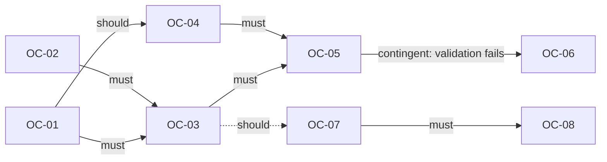
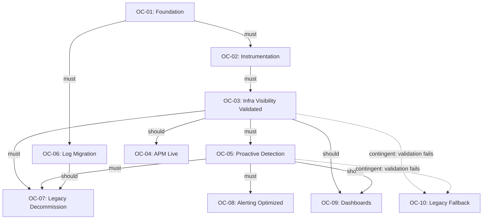

# Outcome-Based Project Model

**Dynamo Consulting -- Reusable Framework**
**March 2026 | v1.0**
**Classification: Dynamo Confidential**

---

## 1. Framework Overview

### Why Outcome-Based Planning

Traditional stage-gate models (S0, S1, S2...) imply that work flows in a straight line: finish one stage, open the next gate, move forward. In practice, implementation work is rarely linear. Constraints form a graph, not a chain:

- Some work packages can run in parallel across "stages."
- Validation gates create iterative loops -- if the gate fails, you cycle back and try again.
- Risk events trigger conditional work that may never execute at all.
- Cross-workstream dependencies mean external teams control your timeline on specific deliverables.
- Decisions (especially Type 1 irreversible decisions) can block multiple unrelated work streams simultaneously.

An outcome-based model addresses this by organizing work around **what you need to achieve** (outcomes with target dates) rather than **what order to do things in** (sequential stages). Dependencies between outcomes are explicit, typed, and non-linear. Work packages become deliverables that serve one or more outcomes.

### Core Principle

Every piece of work must trace to a measurable outcome. If it doesn't, it either belongs somewhere else or shouldn't be done.

---

## 2. Outcome Categories

Every outcome falls into one of three categories. The category determines how the outcome is planned, tracked, and closed.

### 2.1 Baseline Outcomes

Single-pass deliverables. You do the work, confirm the exit criteria, and move on. These are the simplest outcomes and typically correspond to foundational, planning, or procurement activities.

**Characteristics:**
- One execution cycle
- Clear, binary success criteria (done or not done)
- No validation period required

**Example:** "Environment inventory documented and signed off."

### 2.2 Iterative Outcomes

Outcomes that require one or more validation cycles before they can be closed. The work is done, then observed under real conditions for a defined period. If the validation gate fails, the team loops back, addresses gaps, and re-validates.

**Characteristics:**
- Execution + validation cycle(s)
- Success criteria include a measurable threshold (e.g., "coverage exceeds 95%")
- Maximum iteration count defined upfront to prevent infinite loops
- Legacy/fallback systems remain active until the outcome is closed
- Each iteration has a defined review cadence

**Example:** "Dynatrace infrastructure visibility exceeds CheckMK baseline (30-day validation)."

### 2.3 Conditional Outcomes

Outcomes that only activate if a specific trigger condition is met. These are planned but not scheduled. They sit in a "ready" state until the trigger fires, at which point they enter the active backlog with a target date.

**Characteristics:**
- Trigger condition defined upfront
- Work packages pre-planned but not staffed until triggered
- May never execute if the trigger condition is not met
- Often tied to risk mitigation or fallback scenarios

**Example:** "Legacy fallback activated if 60-day validation gate fails."

---

## 3. Outcome Definition Template

Use this template for every outcome in the project. Copy and fill in for each.

```
### [OC-XX]: [Outcome Name]

**Category:** Baseline | Iterative | Conditional
**Target Date:** YYYY-MM-DD
**Owner:** [Named individual]
**Status:** Not Started | In Progress | Validating | Blocked | Complete

#### Success Criteria
- [ ] [Measurable criterion 1]
- [ ] [Measurable criterion 2]

#### Deliverables
| ID | Deliverable | Owner | Due |
|----|-------------|-------|-----|
| OC-XX.1 | [Deliverable name] | [Owner] | [Date] |
| OC-XX.2 | [Deliverable name] | [Owner] | [Date] |

#### Dependencies
| Depends On | Type | Description |
|------------|------|-------------|
| OC-YY | must | [Why this is a hard prerequisite] |
| OC-ZZ | should | [Why this sequence is recommended] |
| OC-WW | contingent | [Condition under which this dependency applies] |

#### Iteration Policy (Iterative outcomes only)
- **Validation period:** [e.g., 30 days]
- **Review cadence:** [e.g., weekly during validation]
- **Max iterations:** [e.g., 2 cycles before escalation]
- **Fallback:** [What happens if max iterations are exhausted]

#### Trigger Condition (Conditional outcomes only)
- **Trigger:** [Specific event or decision that activates this outcome]
- **Activation window:** [How quickly work must begin after trigger]

#### Risks
| Risk ID | Severity | Description | Mitigation |
|---------|----------|-------------|------------|
| R-XX | HIGH/MED/LOW | [Risk description] | [Mitigation approach] |

#### Decisions Required
| ID | Type | Decision | Owner | Required By |
|----|------|----------|-------|-------------|
| D-XX | TYPE 1/2 | [Decision description] | [Owner] | [Deadline or deliverable] |
```

---

## 4. Dependency Model

### 4.1 Dependency Types

Dependencies between outcomes are not all equal. Using a single "blocked by" relationship hides important nuance. This model uses three dependency types:

**must** -- Hard prerequisite. The dependent outcome cannot start until the prerequisite outcome is complete. Violating this creates real risk (e.g., deploying agents before the environment inventory exists).

**should** -- Recommended sequence. The dependent outcome can technically start without the prerequisite, but doing so increases risk or rework. The team can proceed if they formally accept the risk and document the decision.

**contingent** -- Conditional dependency. This dependency only applies if a specific condition is true. If the condition is false, the dependency is ignored. Contingent dependencies are how the model handles branching paths without creating phantom blockers.

### 4.2 Dependency Graph

Dependencies form a directed acyclic graph (DAG), not a linear chain. Multiple outcomes can depend on the same prerequisite. A single outcome can have dependencies of different types. The graph may have multiple independent subgraphs that can execute in parallel.

**Mermaid-compatible dependency notation:**



### 4.3 Parallel Execution

Any outcomes whose dependency graphs do not intersect can run in parallel. The model makes this explicit: if two outcomes share no `must` dependencies, they can be staffed and scheduled independently. This is a key advantage over sequential gating, where "Stage 3" implicitly waits for all of "Stage 2" even when specific work packages have no actual dependency.

---

## 5. Mapping to Existing WBS Elements

For teams migrating from a stage-gate WBS to this model, here is how the elements translate:

| Stage-Gate WBS Element | Outcome Model Element | Notes |
|------------------------|-----------------------|-------|
| Stage (S0, S1, ...) | One or more Outcomes | A single stage often contains work for multiple independent outcomes. Split them. |
| Work Package (WP X.Y) | Deliverable under an Outcome | Work packages become rows in the Deliverables table. |
| Subtask (X.Y.Z) | Task under a Deliverable | Tracked in Jira as sub-tasks. |
| Exit Gate | Success Criteria | The conditions move from "gate to pass through" to "criteria to satisfy." |
| Validation Gate | Iteration Policy | 30-day and 60-day gates become validation periods on Iterative outcomes. |
| Stage Risks | Outcome Risks | Risks attach to the outcome they affect, not the stage they happen to fall in. |
| Cross-Workstream Dep | Dependency (any type) | Cross-workstream dependencies become explicit `must` or `contingent` dependencies on external outcomes. |
| Decision (D-XX) | Decision Required | Decisions attach to the outcome that needs them, with the same Type 1/Type 2 classification. |
| Known Unknowns | Outcome-level notes | Acknowledged uncertainty lives at the outcome level, with confidence ranges. |

**Key insight:** A stage-gate model forces you to group work by time period. An outcome model lets you group work by purpose. Work that was previously split across stages 0, 1, and 3 (because of timing) can now live under a single outcome (because it serves one purpose).

---

## 6. Jira Mapping

| Outcome Model Element | Jira Issue Type | Relationship |
|-----------------------|-----------------|--------------|
| Capability | Initiative | Top-level container (e.g., WSA-120) |
| Outcome (OC-XX) | Epic | Parent = Initiative |
| Deliverable (OC-XX.Y) | Story | Epic Link = parent Outcome |
| Task | Sub-task | Parent = parent Deliverable |

**Labels convention:** `[capability-slug]` + `[outcome-id]` (e.g., `visibility-infrastructure oc-01`)

**Component:** Set to the capability name (e.g., "Visibility Infrastructure")

**Custom fields (recommended):**
- `Outcome Category`: Baseline / Iterative / Conditional
- `Target Date`: The outcome's target completion date
- `Dependency Type`: must / should / contingent (on Story links)
- `Validation Status`: Not Started / In Validation / Passed / Failed (for Iterative outcomes)

---

## 7. Worked Examples

Two capabilities have been implemented using this model. Both started as stage-gate WBS documents and were migrated to outcome-based planning. The full implementations are in their respective WSB documents; this section provides simplified summaries.

### 7.1 Visibility Infrastructure (VI-WSB)

The Dynatrace Visibility Infrastructure implementation (previously structured as S0-S9) was mapped into 15 outcomes. The simplified view below shows the core 10-outcome structure; the full VI-WSB.md expands this with 5 additional outcomes identified during elaboration (Host Fleet Instrumented, External Availability Monitoring, A2W Monitoring Readiness, Predictive Operations, and a more detailed Legacy Fallback).

**Summary:** 15 outcomes (6 Baseline, 6 Iterative, 3 Conditional), 4 Type 1 decisions, 16 Type 2 decisions, ~60 deliverables.

### Outcome Map (Simplified)

| ID | Outcome | Category | Target Date | Key Dependencies |
|----|---------|----------|-------------|------------------|
| OC-01 | Foundation and Licensing Resolved | Baseline | [TBD] | None |
| OC-02 | Environment Fully Instrumented | Baseline | [TBD] | OC-01 (must) |
| OC-03 | Infrastructure Visibility Validated | Iterative | [TBD] | OC-02 (must) |
| OC-04 | Application Performance Monitoring Live | Iterative | [TBD] | OC-03 (should), D-04 resolved (must) |
| OC-05 | Proactive Detection Operational | Iterative | [TBD] | OC-03 (must) |
| OC-06 | Log Management Migrated to Dynatrace | Baseline | [TBD] | OC-01 (must), D-17 resolved (must) |
| OC-07 | Legacy Monitoring Decommissioned | Baseline | [TBD] | OC-03 (must), OC-05 (must), OC-06 (should) |
| OC-08 | Alerting and Escalation Optimized | Iterative | [TBD] | OC-05 (must) |
| OC-09 | Self-Service Dashboards and Reporting | Baseline | [TBD] | OC-03 (should), OC-05 (should) |
| OC-10 | Legacy Fallback Activated | Conditional | [TBD] | Trigger: OC-03 or OC-05 validation fails after max iterations |

### Dependency Graph



### What Changes from the Stage-Gate Model

**Parallel execution unlocked:**
- OC-06 (Log Migration) depends only on OC-01 (Foundation). In the stage-gate model, log migration sat in S5 and couldn't start until S4 was complete. In the outcome model, log migration can begin as soon as licensing and access are resolved, running in parallel with instrumentation and validation work.
- OC-09 (Dashboards) has only `should` dependencies on OC-03 and OC-05. Teams can begin dashboard design and template work early, finishing integration after validation.

**Iterative loops made explicit:**
- OC-03 and OC-05 are Iterative outcomes with 30-day and 60-day validation periods respectively. If validation fails, the team loops back within the same outcome rather than "re-entering a previous stage." The iteration policy caps the number of cycles and defines what happens if the cap is reached (trigger OC-10).

**Conditional paths clarified:**
- OC-10 (Legacy Fallback) only activates if a validation outcome fails after maximum iterations. It is planned but not scheduled. This replaces the vague "legacy tools remain available" language with a concrete conditional outcome.

**Cross-workstream dependencies as typed dependencies:**
- Instead of a separate "Cross-Workstream Dependencies" appendix, external dependencies are first-class entries in each outcome's dependency table with explicit types. For example, if the Network & Security workstream must complete firewall rules before OC-02 can instrument servers in the DMZ, that appears as a `must` dependency on OC-02 referencing the external workstream's outcome ID.

### Detailed Outcome: OC-03 (Infrastructure Visibility Validated)

```
### OC-03: Infrastructure Visibility Validated

**Category:** Iterative
**Target Date:** [TBD -- Week 6 estimate]
**Owner:** [Named individual]
**Status:** Not Started

#### Success Criteria
- [ ] Dynatrace host coverage >= 95% of inventory
- [ ] Infrastructure dashboards replicate all CheckMK visibility
- [ ] Alert fidelity: zero missed critical events over 30-day window
- [ ] Team sign-off that Dynatrace meets or exceeds CheckMK baseline

#### Deliverables
| ID | Deliverable | Owner | Due |
|----|-------------|-------|-----|
| OC-03.1 | Coverage gap analysis report | [Owner] | [Date] |
| OC-03.2 | Dashboard parity matrix (Dynatrace vs. CheckMK) | [Owner] | [Date] |
| OC-03.3 | 30-day validation report | [Owner] | [Date] |

#### Dependencies
| Depends On | Type | Description |
|------------|------|-------------|
| OC-02 | must | All hosts must be instrumented before validation can begin |

#### Iteration Policy
- **Validation period:** 30 days
- **Review cadence:** Weekly during validation
- **Max iterations:** 2 cycles before escalation to project sponsor
- **Fallback:** If 2 cycles fail, trigger OC-10 (Legacy Fallback) and escalate

#### Risks
| Risk ID | Severity | Description | Mitigation |
|---------|----------|-------------|------------|
| R-03 | HIGH | CheckMK provides visibility that Dynatrace cannot replicate | Identify gaps in OC-03.1; maintain CheckMK for those specific hosts |
| R-04 | MEDIUM | 30-day window insufficient for seasonal workload patterns | Extend to 45 days if initial data is inconclusive |

#### Decisions Required
| ID | Type | Decision | Owner | Required By |
|----|------|----------|-------|-------------|
| D-05 | TYPE 2 | Accept 95% threshold or require 100% | [Owner] | OC-03.1 |
```

### 7.2 Pipeline Automation (PP-WSB)

The Pipeline Automation capability (previously structured as S0-S8) was mapped into 12 outcomes. The key structural difference from the stage-gate model: S4 (Config Pipeline Operational) contained 4 work packages serving 3 distinct purposes (build, deploy, drift detection, and reliability validation). In the outcome model, these become 4 separate outcomes with explicit parallel execution.

**Summary:** 12 outcomes (7 Baseline, 2 Iterative, 3 Conditional), 5 Type 1 decisions, 8 Type 2 decisions, ~28 deliverables.

### Outcome Map

| ID | Outcome | Category | Target Date | Key Dependencies |
|----|---------|----------|-------------|------------------|
| OC-01 | Foundation Access and Security Baseline | Baseline | [TBD] | None |
| OC-02 | Config Inventory and Credential Mapping | Baseline | [TBD] | OC-01 (must) |
| OC-03 | Migration Path and Runner Infra Defined | Baseline | [TBD] | OC-02 (must) |
| OC-04 | Configs in Version Control | Baseline | [TBD] | OC-03 (must) |
| OC-05 | Build Pipeline Operational | Baseline | [TBD] | OC-04 (must) |
| OC-06 | Deploy Pipeline Operational | Baseline | [TBD] | OC-03 (must), OC-05 (should) |
| OC-07 | Drift Detection Operational | Baseline | [TBD] | OC-04 (must) |
| OC-08 | Pipeline Reliability Validated | Iterative | [TBD] | OC-05 + OC-06 + OC-07 (must) |
| OC-09 | Config-as-Code Enforced | Iterative | [TBD] | OC-08 (must) |
| OC-10 | Application Code in VCS | Conditional | [TBD] | Trigger: POC validates + leadership decision |
| OC-11 | CI/CD Pipeline for Application Code | Conditional | [TBD] | OC-10 (must) |
| OC-12 | Pipeline Fallback | Conditional | [TBD] | Trigger: OC-08 reliability fails after 3 cycles |

### What Changes from the Stage-Gate Model

**Parallel execution unlocked:** OC-07 (Drift Detection) depends only on configs being in VCS (OC-04). In the stage-gate model, drift detection was bundled with build and deploy pipelines inside S4. In the outcome model, drift detection can begin as soon as configs are committed, running in parallel with build and deploy pipeline development.

**Iterative validation made explicit:** OC-08 (Pipeline Reliability) has a 2-week validation window with max 3 cycles. The stage-gate model had a single exit criterion ("90%+ success rate") that implied a binary check. The outcome model makes the validation loop explicit with defined fallback.

**Conditional scope clarified:** Application code pipeline work (OC-10, OC-11) was previously at "intent level" in S6-S8. The outcome model makes this conditional on POC validation, eliminating false timeline commitments for work that may never happen.

### Lessons from Both Implementations

**Outcome count evolves during elaboration.** Both capabilities started with fewer outcomes in the initial mapping and expanded during detailed elaboration. VI went from 10 to 15 outcomes; PP went from an implied 9 (one per stage) to 12. This is expected -- the initial pass groups by purpose, and detailed analysis reveals work serving distinct purposes that was previously bundled.

**Stage-to-outcome is not 1:1.** Some stages map to multiple outcomes (S4 -> OC-05, OC-06, OC-07, OC-08). Some outcomes pull work from multiple stages (security work from S0 and S1 into OC-01 and OC-02). The mapping table in each WSB appendix makes this traceable.

**Security and compliance outcomes tend to be cross-cutting.** Both capabilities have security/compliance work that spans multiple outcomes. The outcome model handles this better than the stage-gate model because security requirements attach to the specific outcomes they gate, rather than being a vague "S0 deliverable" that everything depends on.

---

## 8. Implementation Register

Capabilities using this model:

| Capability | Initiative | WSB Document | Outcome Map | Outcomes | Status |
|-----------|-----------|-------------|-------------|----------|--------|
| Visibility Infrastructure | WSA-120 | VI-WSB.md | VI-WSB-Outcome-Map.html | 15 | Active |
| Pipeline Automation | WSA-121 | PP-WSB.md | PP-Outcome-map.html | 12 | Active |

---

## 9. Status Reporting Template

Use this table for weekly or biweekly status reports. One row per outcome.

| ID | Outcome | Category | Owner | Target Date | Status | % Complete | Risk Flag | Notes |
|----|---------|----------|-------|-------------|--------|------------|-----------|-------|
| OC-01 | Foundation and Licensing | Baseline | [Owner] | [Date] | Complete | 100% | -- | -- |
| OC-02 | Environment Instrumented | Baseline | [Owner] | [Date] | In Progress | 60% | -- | 45 of 75 hosts done |
| OC-03 | Infra Visibility Validated | Iterative | [Owner] | [Date] | Validating (Cycle 1) | 80% | AMBER | 3 weeks into 30-day window |
| OC-04 | APM Live | Iterative | [Owner] | [Date] | Blocked | 0% | RED | Waiting on D-04 |
| OC-10 | Legacy Fallback | Conditional | [Owner] | -- | Ready (not triggered) | 0% | -- | Activates if OC-03/OC-05 fail |

**Status values:** Not Started, In Progress, Validating (Cycle N), Blocked, Complete, Ready (conditional only)

**Risk flags:** GREEN (on track), AMBER (at risk, mitigation in place), RED (behind, needs escalation), -- (not applicable)

---

## 10. Decision Framework Integration

Decisions use the Bezos/Amazon Type 1 / Type 2 framework, but attach to outcomes rather than stage gates.

**Type 1 (One-Way Door):** Irreversible decisions. These block the outcomes that depend on them. They appear in the Decisions Required table with a hard deadline tied to a specific deliverable. Type 1 decisions should be identified early and escalated aggressively.

**Type 2 (Two-Way Door):** Reversible decisions. These should be made quickly (within one working day if possible). Delaying Type 2 decisions is the most common failure mode -- teams treat them like Type 1 and create unnecessary blockers.

**Decision Register:** Maintain a centralized register across all outcomes:

| ID | Type | Decision | Owner | Required By (Outcome) | Status |
|----|------|----------|-------|-----------------------|--------|
| D-01 | TYPE 1 | SaaS vs. Managed deployment | [Owner] | OC-01 | OPEN |
| D-04 | TYPE 1 | APM ownership model | [Owner] | OC-04 | OPEN |
| D-17 | TYPE 2 | Log retention policy | [Owner] | OC-06 | OPEN |

---

## 11. Cross-Workstream Coordination

Cross-workstream dependencies are modeled as dependencies on external outcomes. Each external dependency gets an entry in the relevant outcome's dependency table, plus a coordination record:

| Dep ID | External Workstream | External Outcome | Internal Outcome | Type | Coordination Action |
|--------|--------------------|--------------------|-------------------|------|---------------------|
| CW-01 | Network & Security | Firewall rules configured | OC-02 | must | Biweekly sync with N&S lead |
| CW-02 | Change Management | Training program launched | OC-07 | should | Monthly alignment review |
| CW-03 | Vendor Management | Dynatrace licensing finalized | OC-01 | must | Escalate if not resolved by [date] |

This replaces the separate "Cross-Workstream Dependencies" appendix from the stage-gate model. Dependencies are visible both in context (on the outcome that needs them) and in aggregate (in this coordination table).

---

## 12. How to Use This Model

### For a New Capability

1. **Identify outcomes.** Review the capability's scope and break it into 6-12 measurable outcomes. Ask: "What does 'done' look like?" for each distinct piece of value.
2. **Categorize each outcome.** Baseline, Iterative, or Conditional.
3. **Map dependencies.** For each outcome, identify what it needs from other outcomes (must/should/contingent). Draw the dependency graph.
4. **Assign target dates.** Work backward from external deadlines or forward from dependency chains. Iterative outcomes need buffer for validation cycles.
5. **Define deliverables.** Each outcome gets 2-5 deliverables. These become Jira Stories.
6. **Identify decisions and risks.** Attach to the specific outcomes they affect.
7. **Set up Jira.** Create the Initiative, Epics (outcomes), Stories (deliverables), and link dependencies.
8. **Report weekly.** Use the status reporting template.

### For Migrating an Existing Stage-Gate WBS

1. List all work packages from all stages.
2. Group them by the outcome they serve (not the stage they're in).
3. Identify which groupings are Baseline, Iterative, or Conditional.
4. Map the stage exit gates to outcome success criteria.
5. Convert stage-to-stage dependencies into outcome-to-outcome dependencies with explicit types.
6. Validate that every original work package appears under at least one outcome.

---

## Appendix: Glossary

| Term | Definition |
|------|-----------|
| Outcome | A measurable result with a target date, owner, and success criteria. The primary unit of planning. |
| Deliverable | A specific artifact or completed action that contributes to an outcome. Maps to a Jira Story. |
| Baseline Outcome | An outcome achieved through a single execution cycle with binary success criteria. |
| Iterative Outcome | An outcome requiring one or more validation cycles with measurable thresholds. |
| Conditional Outcome | An outcome that activates only when a specific trigger condition is met. |
| must dependency | A hard prerequisite that blocks the dependent outcome from starting. |
| should dependency | A recommended sequence that can be bypassed with documented risk acceptance. |
| contingent dependency | A dependency that only applies when a specific condition is true. |
| Type 1 Decision | An irreversible (one-way door) decision. Requires careful analysis before committing. |
| Type 2 Decision | A reversible (two-way door) decision. Should be made quickly to avoid unnecessary delays. |
| Validation Period | A defined time window during which an Iterative outcome is observed under real conditions. |
| Trigger Condition | The specific event or decision result that activates a Conditional outcome. |
| DAG | Directed Acyclic Graph. The shape of the dependency model -- outcomes point forward, no circular dependencies. |
