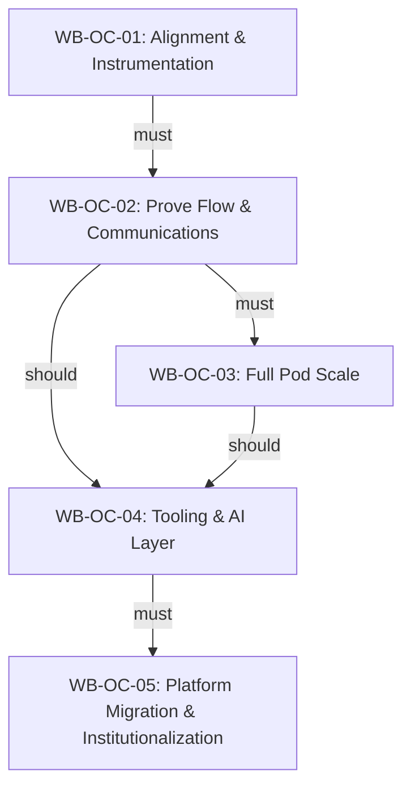

# WB-WBS: Customer Support Transformation -- Outcome-Based Work Breakdown Structure

**Dynamo Consulting | DMSi Software**
**March 2026 | v1.0 | R0**
**Classification: Dynamo Confidential**

**Source:** [`WSB-WSC/WSB/Customer Support Implementation Plan.docx`](../WSB/Customer%20Support%20Implementation%20Plan.docx) (Implementation Plan & Execution Roadmap, Phase: Execution). This WBS translates that phased plan into the same outcome-based structure used by `PA/PA-WBS.md`.

**Canonical path:** `WSB-WSC/WB/WB-WBS.md` (Workstream B — Customer Support). Optional outcome registry: [`wb-outcomes.json`](wb-outcomes.json).

---

## 1. Purpose and Approach

This document defines the **DMSi Customer Support Transformation** using an outcome-based work breakdown structure. The source implementation plan organizes work into **five phases** (Phase 0–4) over roughly **12 months**, with explicit governance, workstreams, exit criteria, risks, and success metrics. This WBS maps each phase to **outcomes** so work traces to measurable closure, dependencies are explicit, and parallel tracks (e.g., scaling vs. tooling) are visible.

### Executive intent (from source plan)

- **Target outcomes:** Recurring annual savings of **$794k–$970k** through **25–30%** handling-effort reduction; **MTTR P50/P75** for Enterprise cases reduced from days to hours; migration to a **modern SaaS support platform** with **integrated AI**; **formal customer segmentation** with differentiated SLOs by tier.
- **Investment summary (indicative):** One-time **~$350k**; annual **~$90k** (SaaS platform, Agentic AI layer, change management & training — see source document for line items).

### Why outcome-based

The source plan already mixes **sequential phases** with **overlapping timelines** (e.g., Phase 3 tooling vs. Phase 2 scale). An outcome-based view makes **must / should / contingent** dependencies explicit and preserves **exit criteria** as **success criteria** per outcome.

### How to read this document

Each outcome follows the same template as `PA-WBS.md`:

- **Category:** Baseline (single-pass), Iterative (validation cycles), or Conditional (trigger-activated)
- **Target Date:** Placeholder **[TBD]** where the source uses sprint/month bands without fixed calendar dates
- **Success Criteria:** Derived from **phase exit criteria** and workstream objectives
- **Deliverables:** Activities from the source plan, numbered **WB-OC-XX.Y**
- **Dependencies:** Prerequisites between outcomes
- **Risks and decisions:** Outcome-level tables where applicable; cross-cutting risks in §5

### Program governance (summary)

| Role | Responsibility | Assignment / name (per source) |
|------|----------------|--------------------------------|
| Executive Sponsor | Budget authority, escalation resolution | VP Customer Experience — Jared Plucknett |
| Transformation Lead (workstream lead) | End-to-end implementation program management | Dynamo — Adam Saad / Dynamo Team |
| Support Change Lead | Program management, agent communication, training | Senior Support Supervisor — Amanda Briggs |
| Engineering Lead | Incident process, tooling integration | Engineering Manager — Bryan and Andy |
| Internal Product Lead | Roadmap alignment, triad participation | Product Manager — confirm assignee (source note: “Jason Niemi”??) |

**Meeting cadences:** Workstream standups **2x/week**; **Control Room** each sprint (biweekly); **Steering Committee** monthly; **Agility Triad** monthly (Support / Eng / Product).

### Scope

**In scope:** Operating model changes (pods, routing, MIM, SLOs), segmentation, scorecard instrumentation, SaaS platform selection and migration, Agentic AI layer, training and institutionalization.

**Out of scope for this WBS document:** Detailed procurement legal terms, vendor-specific configuration steps beyond the activity list in the source plan — those remain in vendor statements of work and runbooks.

### Definition of done

Outcomes are **complete when exit criteria and deliverables for that phase are satisfied** per the source plan, with evidence suitable for **Control Room** and **Steering Committee** reporting.

### Systems of record and planning views

- **Jira (authoritative backlog):** **[TBD]** — Link the Customer Support / WSB capability root and outcome Epics when issued. Reconcile Stories to **WB-OC-XX** and deliverable IDs **WB-OC-XX.Y**.
- **Change log (planning ↔ source):**
  - **2026-03-26** — **Filename:** `WB-WBS.md` created from `Customer Support Implementation Plan.docx`, aligned to `PA-WBS.md` outcome-based patterns (outcome map, dependency graph, per-outcome sections, registers).
  - **2026-03-26** — **Location:** canonical WBS under **`WSB-WSC/WB/WB-WBS.md`** for `wbs-load-prep.js WB` (resolved via `Scripts/wbs-capability-folder.js`); source `.docx` remains under `WSB-WSC/WSB/`. Added `WB-Outcome-Map.html`, `WB-kanban.html`, `wb-outcomes.json`, `Output/WB-WBS-Jira-Import.json` seed.
  - **2026-03-27** — **Folder:** capability folder **`WB/`** moved from repo root to **`WSB-WSC/WB/`**; scripts and docs updated to match.
- **This document (WB-WBS):** Normative outcome definitions, success criteria, deliverable IDs, dependencies, risks, and decisions derived from the source implementation plan.
- **Planning HTML:** [`WB-Outcome-Map.html`](WB-Outcome-Map.html), [`WB-kanban.html`](WB-kanban.html). Combined WSB+WSC view: [`WSB-WSC-Outcome-Map.html`](../WSB-WSC-Outcome-Map.html).

---

## 2. Outcome Map

| ID | Outcome | Category | Target Date | Milestone alignment |
|----|---------|----------|-------------|---------------------|
| WB-OC-01 | Alignment & Instrumentation Complete | Baseline | [TBD -- Weeks 1-4; source Phase 0] | Foundation, scorecard v0, segmentation, team formed |
| WB-OC-02 | Prove Flow & Communications Complete | Baseline | [TBD -- Months 1-3; source Phase 1] | MIM live, initial pods, Enterprise SLOs, early efficiency lift |
| WB-OC-03 | Full Pod Scale Complete | Baseline | [TBD -- Month 3+; source Phase 2] | All Agility pods operational; ~15% handling reduction |
| WB-OC-04 | Tooling Selection & AI Layer Complete | Baseline | [TBD -- Months 3-8+; source Phase 3] | SaaS & AI vendors selected, contracts signed, migration blueprint approved |
| WB-OC-05 | Platform Migration & Institutionalization Complete | Iterative | [TBD -- Months 9-18; source Phase 4] | New platform live, 360 frozen for Support, benefits realization |

**Note:** The source **Implementation Phases Overview** labels Phase 1 as “Months 1-2” while **§5 Phase 1** header says “Months 1-3”; this WBS uses the **detailed section** (Months 1-3) for narrative consistency. Resolve any calendar conflict in governance forums.

### Parallel execution summary

Once prerequisites are met:

- **WB-OC-03** (scale) and **WB-OC-04** (tooling) can **overlap** — the source plan places Phase 2 and Phase 3 on parallel month bands.
- **Agentic AI** workstreams can produce **pilot value** before **WB-OC-05** completes; full migration still **depends** on vendor selection, blueprint, and pilot stabilization.

---

## 3. Dependency graph

### Dependency type legend

- **must** (solid arrow): Hard prerequisite for safe sequencing.
- **should** (solid arrow): Strongly recommended overlap/sequence; may proceed with documented risk acceptance.
- **contingent** (dashed arrow): Not used on the summary graph; use outcome notes for conditional branches (e.g., pilot rollback).

---

## 4. Outcomes

---

### [WB-OC-01] Alignment & Instrumentation Complete

**Category:** Baseline  
**Target Date:** [TBD -- Weeks 1-4]  
**Owner:** Transformation Lead + Sponsor + Support Change Lead (+ Eng/Product counterparts per governance)  
**Status:** [TBD]  
**Source:** Phase 0 — Alignment & Instrumentation (Weeks 1-4)

#### Objective

Establish foundation through **leadership alignment**, **instrumentation**, and **team formation**.

#### Success criteria

- [ ] Transformation Lead assigned and operating  
- [ ] Governance charter signed by all leads  
- [ ] Support **Scorecard v0** published with baseline metrics  
- [ ] All customer accounts **tagged with segment** (Enterprise vs Commercial)  
- [ ] Current **incident process** documented  

#### Deliverables

| ID | Deliverable | Owner | Due |
|----|-------------|-------|-----|
| WB-OC-01.1 | Governance charter & kickoff | Trans Lead, Sponsor | [TBD -- S1] |
| WB-OC-01.2 | Baseline scorecard (v0) | Trans Lead | [TBD -- S1] |
| WB-OC-01.3 | Customer segmentation setup | Trans Lead, Support Lead | [TBD -- S1-S2] |

**WB-OC-01.1: Governance charter & kickoff**

- Kick-off meeting; agree governance cadences  
- Identify Engineering and Product counterparts  

**WB-OC-01.2: Baseline scorecard (v0)**

- Publish current baseline **Scorecard v0** to leadership  

**WB-OC-01.3: Customer segmentation setup**

- Finalize Enterprise vs Commercial criteria  
- Create segment attribute in **360**  
- Tag all customer accounts with segment  
- Validate with Account Management (top 50) — validation sign-off  

#### Dependencies

| Depends on | Type | Description |
|------------|------|-------------|
| None | -- | Program entry outcome |

#### Risks

| Risk ID | Severity | Description | Mitigation |
|---------|----------|-------------|------------|
| WB-R-01 | MEDIUM | Governance drift if charter is not signed or cadences slip | Treat charter sign-off as hard gate; escalate in Control Room |

#### Decisions required

| ID | Type | Decision | Owner | Required by |
|----|------|----------|-------|-------------|
| WB-D-01 | TYPE 2 | Enterprise vs Commercial segmentation rules (final criteria) | Trans Lead + Sponsor | WB-OC-01 exit |

---

### [WB-OC-02] Prove Flow & Communications Complete

**Category:** Baseline  
**Target Date:** [TBD -- Months 1-3]  
**Owner:** Trans Lead, Support Lead, Eng Lead (per workstream)  
**Status:** [TBD]  
**Source:** Phase 1 — Prove Flow & Communications

#### Objective

Demonstrate early wins through **incident communications** (MIM), **initial pods**, and **SLO adoption**.

#### Success criteria

- [ ] **MIM** operational with **P1 first update** trending toward **≤60 min**  
- [ ] **Agility Core** pod and **Other Products** desk routing cases  
- [ ] Enterprise vs Commercial **SLOs** published and measured  
- [ ] **FCR** tracking enabled with baseline  
- [ ] **5-8%** handling effort reduction visible  

#### Deliverables

| ID | Deliverable | Owner | Due |
|----|-------------|-------|-----|
| WB-OC-02.1 | Major Incident Management (MIM) | Trans Lead, Support Lead, Eng Lead | [TBD -- M1-M3] |
| WB-OC-02.2 | Initial pod structure | Trans Lead, Support Lead | [TBD -- M1-M3] |
| WB-OC-02.3 | SLO adoption | Trans Lead, Support Lead | [TBD -- M1-M3+] |

**WB-OC-02.1: Major Incident Management (MIM)**

- Define MIM role and escalation criteria  
- Create incident communication templates and communication plan  
- Configure paging for Sev-1/2 to MIM rotation  
- Train 2-3 agents on MIM responsibilities  
- Launch MIM function (15-30 min first update target per source)  
- Define RCA SLO (draft 48-72h, final 5 business days)  
- Track RCA coverage %; target **80%+** Sev-1/2; RCA in Scorecard  

**WB-OC-02.2: Initial pod structure**

- Design **Agility Core** pod (agents, scope)  
- Design **Other Products** desk  
- Create product/module routing tags in 360  
- Assign agents to Agility Core (8-10)  
- Implement routing for Agility Core cases  
- Stand up Other Products desk (4-6)  

**WB-OC-02.3: SLO adoption**

- Publish Enterprise vs Commercial SLOs internally  
- Configure SLA clocks in 360 by segment  
- Train supervisors on SLO expectations  
- Measure first response by segment  
- Weekly SLO review in Control Room (establish cadence)  

#### Dependencies

| Depends on | Type | Description |
|------------|------|-------------|
| WB-OC-01 | must | Segmentation, scorecard v0, governance operating |

#### Risks

| Risk ID | Severity | Description | Mitigation |
|---------|----------|-------------|------------|
| WB-R-02 | HIGH | Cultural resistance from Eng/Product slows paging, routing, or RCA | Exec sponsorship; quick wins; Agility Triad escalation |

#### Decisions required

| ID | Type | Decision | Owner | Required by |
|----|------|----------|-------|-------------|
| WB-D-02 | TYPE 2 | MIM rotation model and paging integration approach | Eng Lead + Support Lead | WB-OC-02 entry |
| WB-D-03 | TYPE 2 | SLO matrix definitions by segment | Trans Lead + Support Lead | WB-OC-02 mid |

---

### [WB-OC-03] Full Pod Scale Complete

**Category:** Baseline  
**Target Date:** [TBD -- Month 3+]  
**Owner:** Trans Lead, Supervisors, Support Ops  
**Status:** [TBD]  
**Source:** Phase 2 — Scaling

#### Objective

Scale the operating model across **all Agility modules** via full pod expansion and routing refinements.

#### Success criteria

- [ ] All **Agility pods** operational  
- [ ] **~15%** handling reduction (**~$518k** annualized per source)  

#### Deliverables

| ID | Deliverable | Owner | Due |
|----|-------------|-------|-----|
| WB-OC-03.1 | Full pod expansion | Trans Lead, Supervisors | [TBD -- M3-M6] |
| WB-OC-03.2 | Enterprise fast-lane & routing optimization | Trans Lead, Support Ops | [TBD -- M5-M6] |

**WB-OC-03.1: Full pod expansion**

- Design Reporting & Printing pod  
- Design WMS & Integrations pod  
- Stand up Reporting & Printing pod  
- Stand up WMS & Integrations pod  

**WB-OC-03.2: Enterprise fast-lane & routing optimization**

- Implement Enterprise fast-lane overlay  
- Refine severity-based routing  

#### Dependencies

| Depends on | Type | Description |
|------------|------|-------------|
| WB-OC-02 | must | Initial pods and routing patterns proven |

#### Risks

| Risk ID | Severity | Description | Mitigation |
|---------|----------|-------------|------------|
| WB-R-03 | MEDIUM | **360 limitations** block routing or segmentation progress | Layer capabilities; accelerate SaaS track (see WB-R-X3) |

---

### [WB-OC-04] Tooling Selection & AI Layer Complete

**Category:** Baseline  
**Target Date:** [TBD -- Months 3-8+]  
**Owner:** Trans Lead, Sponsor, Committee, Eng Lead  
**Status:** [TBD]  
**Source:** Phase 3 — Tooling

#### Objective

Select and contract **SaaS support platform** and **Agentic AI** vendors; approve **migration blueprint**.

#### Success criteria

- [ ] SaaS & AI vendors **selected** with **signed contracts**  
- [ ] **Migration blueprint** approved  

#### Deliverables

| ID | Deliverable | Owner | Due |
|----|-------------|-------|-----|
| WB-OC-04.1 | SaaS platform selection | Trans Lead, Committee, Sponsor | [TBD -- M4-M9] |
| WB-OC-04.2 | Agentic AI layer | Trans Lead, Sponsor, Eng Lead | [TBD -- M3-M8] |

**WB-OC-04.1: SaaS platform selection**

- Complete SaaS Support Suite RFP  
- Vendor demos and scoring  
- Reference checks  
- TCO analysis and recommendation  
- Steering Committee decision  
- Contract negotiation  
- Design migration blueprint  

**WB-OC-04.2: Agentic AI layer**

- Complete Agentic AI vendor RFP  
- Contract negotiation and procurement  
- Integration design (API to 360, KB)  
- Pilot with Agility Core pod (10 agents)  
- Measure pilot impact  
- Refine prompts and workflows  
- Full rollout to all pods  

#### Dependencies

| Depends on | Type | Description |
|------------|------|-------------|
| WB-OC-02 | should | Process and segmentation stable enough to score tooling fit |
| WB-OC-03 | should | Scale constraints inform routing/skills requirements for RFP |

#### Risks

| Risk ID | Severity | Description | Mitigation |
|---------|----------|-------------|------------|
| WB-R-04 | MEDIUM | **AI layer underperforms** expectations | Pilot subset; human review; fallback workflows |

#### Decisions required

| ID | Type | Decision | Owner | Required by |
|----|------|----------|-------|-------------|
| WB-D-04 | TYPE 1 | SaaS support platform vendor selection | Sponsor (Steering Committee) | WB-OC-04.1 exit |
| WB-D-05 | TYPE 1 | Agentic AI vendor selection | Sponsor | WB-OC-04.2 entry |
| WB-D-06 | TYPE 2 | RFP scoring model and committee membership | Trans Lead | WB-OC-04 entry |

---

### [WB-OC-05] Platform Migration & Institutionalization Complete

**Category:** Iterative  
**Target Date:** [TBD -- Months 9-18]  
**Owner:** Vendor/Ops, Support Lead, Eng Lead, Trans Lead, Sponsor  
**Status:** [TBD]  
**Source:** Phase 4 — Platform Migration

#### Objective

Implement the new SaaS platform, **migrate Support off 360**, and institutionalize changes (scorecard, benefits).

#### Iteration policy

- **Pilot migration** with monitoring and issue remediation before full cutover  
- **Hypercare** and operational readiness treated as part of exit criteria (see source risk register R4)  

#### Success criteria

- [ ] New platform **live** for Support operations  
- [ ] **360 frozen** for new Support tickets (per source timeline band)  
- [ ] **25-30%** efficiency target reflected in operational metrics trajectory (aligned to program goals)  
- [ ] Scorecard updated for new platform  
- [ ] Benefits realization assessment complete  
- [ ] Transformation program formally closed  

#### Deliverables

| ID | Deliverable | Owner | Due |
|----|-------------|-------|-----|
| WB-OC-05.1 | Platform configuration | Vendor/Ops, Support SMEs, Eng Lead | [TBD -- M5-M7] |
| WB-OC-05.2 | Migration execution | Support Lead, Eng Lead, Trans Lead | [TBD -- M7-M12] |
| WB-OC-05.3 | Institutionalization | Trans Lead, Support Lead, Sponsor | [TBD -- M12] |

**WB-OC-05.1: Platform configuration**

- Configure segments and entitlements  
- Configure skills-based routing  
- Configure SLA clocks  
- Migrate knowledge base content  
- Configure guided flows  
- Integrate SSO, customer data  
- Integrate monitoring/incident tools  

**WB-OC-05.2: Migration execution**

- Train pilot group  
- Execute pilot migration  
- Monitor pilot performance  
- Address issues, refine config  
- Train remaining agents  
- Execute full migration  
- Freeze 360 for new Support tickets  

**WB-OC-05.3: Institutionalization**

- Update Scorecard for new platform  
- Benefits realization assessment  
- Close transformation program  

#### Dependencies

| Depends on | Type | Description |
|------------|------|-------------|
| WB-OC-04 | must | Vendor contracts and migration blueprint approved |

#### Risks

| Risk ID | Severity | Description | Mitigation |
|---------|----------|-------------|------------|
| WB-R-05 | HIGH | **SaaS migration disrupts service** | Pilot first; hypercare period; controlled cutover |

---

## 5. Cross-cutting risks

Risks below are adapted from the source **Risk Register** and program narrative.

| Risk ID | Description | Probability | Impact | Owner | Mitigation |
|---------|-------------|-------------|--------|-------|------------|
| WB-R-X1 | Under-resourcing transformation | Medium | High | Sponsor + Trans Lead | Dedicated Trans Lead; backfill Support |
| WB-R-X2 | Cultural resistance from Eng/Product | Medium | High | Sponsor | Exec sponsorship; quick wins |
| WB-R-X3 | 360 limitations block progress | High | Medium | Trans Lead + Eng Lead | Layer capabilities; accelerate SaaS |
| WB-R-X4 | SaaS migration disrupts service | Medium | High | Eng Lead + Support Lead | Pilot first; hypercare period |
| WB-R-X5 | AI layer underperforms | Medium | Medium | Trans Lead | Pilot subset; human review; fallback |
| WB-R-X6 | Strategic customer dissatisfaction | Low | High | Support leadership | Named TAMs; proactive comms |

---

## 6. Decision register

| ID | Type | Decision | Owner | Required by | Status |
|----|------|----------|-------|-------------|--------|
| WB-D-04 | TYPE 1 | SaaS support platform vendor | Sponsor / Steering Committee | WB-OC-04 exit | OPEN |
| WB-D-05 | TYPE 1 | Agentic AI vendor | Sponsor | WB-OC-04 exit | OPEN |
| WB-D-01 | TYPE 2 | Segmentation criteria (Enterprise vs Commercial) | Trans Lead + Sponsor | WB-OC-01 exit | OPEN |
| WB-D-02 | TYPE 2 | MIM paging and rotation design | Eng Lead + Support Lead | WB-OC-02 entry | OPEN |
| WB-D-03 | TYPE 2 | SLO matrix by segment | Trans Lead + Support Lead | WB-OC-02 | OPEN |
| WB-D-06 | TYPE 2 | RFP evaluation model and committee | Trans Lead | WB-OC-04 entry | OPEN |

---

## 7. Open questions

### Feeding Type 1 decisions

- **WB-Q-01** [feeds WB-D-04]: What non-negotiable requirements (security, data residency, integrations) constrain SaaS selection? Owner: Eng Lead + Legal. Required: before RFP issuance.
- **WB-Q-02** [feeds WB-D-05]: What AI governance (PII, logging, human review) is required before enterprise rollout? Owner: Sponsor + Eng Lead. Required: before AI pilot expansion.

### Feeding Type 2 decisions

- **WB-Q-03** [feeds WB-D-01]: Confirm **Internal Product Lead** assignee (source ambiguity: “Jason Niemi”??). Owner: Sponsor. Required: WB-OC-01.
- **WB-Q-04**: Reconcile **Phase 1** timeline wording (Overview “Months 1-2” vs §5 “Months 1-3”) for official reporting. Owner: Trans Lead. Required: WB-OC-02 planning lock.

---

## 8. Cross-workstream dependencies

| Dep ID | External workstream | External dependency | Internal outcome | Type | Coordination |
|--------|---------------------|---------------------|------------------|------|--------------|
| WB-CW-01 | Work Management | Work intake / case workflow alignment | WB-OC-02, WB-OC-05 | should | Ensure routing, SLOs, and migration plans align with WM operating model |
| WB-CW-02 | Engineering / platform | SSO, integrations, monitoring | WB-OC-05 | must | Eng Lead coordinates integration milestones with infrastructure |
| WB-CW-03 | Product | Triad roadmap alignment | WB-OC-01, WB-OC-02 | should | Internal Product Lead participates per governance model |

**Note:** Replace placeholders with **WSA** capability/issue keys when the Jira hierarchy for Customer Support is of record.

---

## 9. Constraint summary

| Gate | Outcome transition | Key constraint |
|------|-------------------|----------------|
| Governance charter + scorecard v0 + segmentation | WB-OC-01 → WB-OC-02 | Leadership alignment and instrumentation complete |
| MIM + pods + SLO measurement live | WB-OC-02 → WB-OC-03 | Prove flow before full scale |
| Pod designs stable | WB-OC-03 → WB-OC-04 | RFP requirements reflect real routing and skills model |
| Contracts + migration blueprint | WB-OC-04 → WB-OC-05 | No full migration without selected vendors and approved plan |
| Pilot success | Within WB-OC-05 | Pilot assessment before broad cutover |

---

## 10. Success metrics (from source plan)

### Financial metrics

| Metric | Baseline | Phase 1 target | Phase 3 target |
|--------|----------|----------------|----------------|
| $/case (labor) | $105 | $92 (-12%) | $74 (-30%) |
| Handling reduction | 0% | 15% | 25-30% |
| FTE capacity freed | 0 | 7.2 | 12-14 |

### Flow metrics

| Metric | Baseline | Phase 1 target | Phase 3 target |
|--------|----------|----------------|----------------|
| MTTR P50 (Enterprise) | ~57 hours | 36 hours | 8 hours |
| P1 first update median | ~3.2 hours | ≤60 min | ≤30 min |
| FCR% | TBD | +5 pts | +10 pts |

### Reliability metrics

| Metric | Baseline | Phase 1 target | Phase 3 target |
|--------|----------|----------------|----------------|
| RCA coverage (Sev-1/2) | 84.6% | 90% | 95% |
| RCA coverage (All) | 44.8% | 60% | 80% |

---

## 11. Jira mapping

| Outcome model element | Jira issue type | Key / relationship |
|-----------------------|-----------------|---------------------|
| Capability (Customer Support Transformation) | Capability | **[TBD]** — capability of record once created (mirror in `wb-outcomes.json`) |
| Outcome (WB-OC-01 … WB-OC-05) | Epic | **Parent = [TBD]**; Epic summary matches `[WB-OC-XX] …` titles in this WBS |
| Deliverable (WB-OC-XX.Y) | Story | Under the Epic for that outcome |
| Task-level work | Sub-task | Parent = Story |

**Labels (suggested):** `Customer-Support`, `WSB`, plus per-outcome `wb-oc-01` … `wb-oc-05` when conventions are agreed.

---

## 12. Status reporting template

| ID | Outcome | Category | Owner | Target date | Status | % complete | Risk flag | Notes |
|----|---------|----------|-------|-------------|--------|------------|-----------|-------|
| WB-OC-01 | Alignment & Instrumentation | Baseline | Trans Lead + Sponsor | [TBD] | Not started | 0% | -- | Phase 0 |
| WB-OC-02 | Prove Flow & Communications | Baseline | Trans Lead + Support + Eng | [TBD] | Not started | 0% | -- | Phase 1 |
| WB-OC-03 | Full Pod Scale | Baseline | Trans Lead + Supervisors | [TBD] | Not started | 0% | -- | Phase 2 |
| WB-OC-04 | Tooling & AI Layer | Baseline | Trans Lead + Sponsor | [TBD] | Not started | 0% | -- | Phase 3 |
| WB-OC-05 | Platform Migration & Institutionalization | Iterative | Vendor/Ops + Eng + Support | [TBD] | Not started | 0% | -- | Phase 4 |

**Status values:** Not started, In progress, Validating (cycle N), Blocked, Complete, Ready (conditional only)  
**Risk flags:** GREEN, AMBER, RED, --

---

## Appendix: Source phase → outcome mapping

| Source phase | Timeline (source) | Outcome ID | Notes |
|--------------|-------------------|------------|-------|
| Phase 0: Alignment | Weeks 1-4 | WB-OC-01 | Includes governance, scorecard v0, segmentation |
| Phase 1: Prove Flow | Months 1-3 (detail header) | WB-OC-02 | MIM, pods, SLOs |
| Phase 2: Scale | Month 3+ | WB-OC-03 | Full pods, fast-lane, routing |
| Phase 3: Tooling | Months 2-5+ (overview) / detail M3-M9 | WB-OC-04 | SaaS RFP through blueprint; AI RFP through rollout |
| Phase 4: Deploy & Migrate | Months 5-12 (overview) / Months 9-18 (detail §8) | WB-OC-05 | Config, migration, 360 freeze, institutionalization |

---

*Document derived March 2026 from DMSi Customer Support Implementation Plan & Execution Roadmap. Outcome structure aligned to `PA/PA-WBS.md` conventions.*
